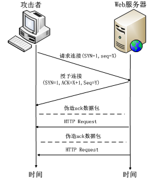

<!-- START doctoc generated TOC please keep comment here to allow auto update -->
<!-- DON'T EDIT THIS SECTION, INSTEAD RE-RUN doctoc TO UPDATE -->

**Table of Contents** _generated with [DocToc](https://github.com/thlorenz/doctoc)_

- [浏览器](#%E6%B5%8F%E8%A7%88%E5%99%A8)
  - [OSI 七层与 TCP/IP 五层模型](#osi-%E4%B8%83%E5%B1%82%E4%B8%8E-tcpip-%E4%BA%94%E5%B1%82%E6%A8%A1%E5%9E%8B)
  - [应用层的协议哪些是基于 TCP 协议的，哪些是基于 UDP 协议的](#%E5%BA%94%E7%94%A8%E5%B1%82%E7%9A%84%E5%8D%8F%E8%AE%AE%E5%93%AA%E4%BA%9B%E6%98%AF%E5%9F%BA%E4%BA%8E-tcp-%E5%8D%8F%E8%AE%AE%E7%9A%84%E5%93%AA%E4%BA%9B%E6%98%AF%E5%9F%BA%E4%BA%8E-udp-%E5%8D%8F%E8%AE%AE%E7%9A%84)
    - [基于 TCP 协议的](#%E5%9F%BA%E4%BA%8E-tcp-%E5%8D%8F%E8%AE%AE%E7%9A%84)
    - [基于 UDP 协议的](#%E5%9F%BA%E4%BA%8E-udp-%E5%8D%8F%E8%AE%AE%E7%9A%84)
    - [基于 TCP 和 UDP 协议的](#%E5%9F%BA%E4%BA%8E-tcp-%E5%92%8C-udp-%E5%8D%8F%E8%AE%AE%E7%9A%84)
  - [HTTP 状态码](#http-%E7%8A%B6%E6%80%81%E7%A0%81)
  - [HTTP1.0 和 HTTP1.1 和 HTTP2.0 的区别](#http10-%E5%92%8C-http11-%E5%92%8C-http20-%E7%9A%84%E5%8C%BA%E5%88%AB)
    - [HTTP1.0 和 HTTP1.1](#http10-%E5%92%8C-http11)
    - [http2.0 与 http1.X 区别](#http20-%E4%B8%8E-http1x-%E5%8C%BA%E5%88%AB)
  - [HTTP 与 HTTPS 的区别](#http-%E4%B8%8E-https-%E7%9A%84%E5%8C%BA%E5%88%AB)
  - [HTTPS 协议的工作原理](#https-%E5%8D%8F%E8%AE%AE%E7%9A%84%E5%B7%A5%E4%BD%9C%E5%8E%9F%E7%90%86)
  - [TCP 和 UDP 之间的区别](#tcp-%E5%92%8C-udp-%E4%B9%8B%E9%97%B4%E7%9A%84%E5%8C%BA%E5%88%AB)
  - [TCP 的三次握手](#tcp-%E7%9A%84%E4%B8%89%E6%AC%A1%E6%8F%A1%E6%89%8B)
  - [TCP 的四次挥手](#tcp-%E7%9A%84%E5%9B%9B%E6%AC%A1%E6%8C%A5%E6%89%8B)
  - [对称加密和非对称加密的区别](#%E5%AF%B9%E7%A7%B0%E5%8A%A0%E5%AF%86%E5%92%8C%E9%9D%9E%E5%AF%B9%E7%A7%B0%E5%8A%A0%E5%AF%86%E7%9A%84%E5%8C%BA%E5%88%AB)
  - [WebSocket 协议](#websocket-%E5%8D%8F%E8%AE%AE)
  - [什么是浏览器的同源政策](#%E4%BB%80%E4%B9%88%E6%98%AF%E6%B5%8F%E8%A7%88%E5%99%A8%E7%9A%84%E5%90%8C%E6%BA%90%E6%94%BF%E7%AD%96)
  - [HTTP 请求的方式](#http-%E8%AF%B7%E6%B1%82%E7%9A%84%E6%96%B9%E5%BC%8F)
  - [GET 和 POST 的区别](#get-%E5%92%8C-post-%E7%9A%84%E5%8C%BA%E5%88%AB)
  - [浏览器输入 URL 之后发生了什么](#%E6%B5%8F%E8%A7%88%E5%99%A8%E8%BE%93%E5%85%A5-url-%E4%B9%8B%E5%90%8E%E5%8F%91%E7%94%9F%E4%BA%86%E4%BB%80%E4%B9%88)
  - [DNS 的具体过程](#dns-%E7%9A%84%E5%85%B7%E4%BD%93%E8%BF%87%E7%A8%8B)
  - [Cookie 和 WebStorage(SessionStorage 和 LocalStorage)的区别](#cookie-%E5%92%8C-webstoragesessionstorage-%E5%92%8C-localstorage%E7%9A%84%E5%8C%BA%E5%88%AB)
  - [cookie 和 session 的区别](#cookie-%E5%92%8C-session-%E7%9A%84%E5%8C%BA%E5%88%AB)
  - [能设置或读取子域的 cookie 吗](#%E8%83%BD%E8%AE%BE%E7%BD%AE%E6%88%96%E8%AF%BB%E5%8F%96%E5%AD%90%E5%9F%9F%E7%9A%84-cookie-%E5%90%97)
  - [客户端设置 cookie 与服务端设置 cookie 有什么区别](#%E5%AE%A2%E6%88%B7%E7%AB%AF%E8%AE%BE%E7%BD%AE-cookie-%E4%B8%8E%E6%9C%8D%E5%8A%A1%E7%AB%AF%E8%AE%BE%E7%BD%AE-cookie-%E6%9C%89%E4%BB%80%E4%B9%88%E5%8C%BA%E5%88%AB)
  - [同域/跨域 ajax 请求到底会不会带上 cookie](#%E5%90%8C%E5%9F%9F%E8%B7%A8%E5%9F%9F-ajax-%E8%AF%B7%E6%B1%82%E5%88%B0%E5%BA%95%E4%BC%9A%E4%B8%8D%E4%BC%9A%E5%B8%A6%E4%B8%8A-cookie)
  - [网络安全](#%E7%BD%91%E7%BB%9C%E5%AE%89%E5%85%A8)
    - [DOS(Denial of Service)攻击](#dosdenial-of-service%E6%94%BB%E5%87%BB)
    - [跨站点脚本 XSS (cross-site script)攻击](#%E8%B7%A8%E7%AB%99%E7%82%B9%E8%84%9A%E6%9C%AC-xss-cross-site-script%E6%94%BB%E5%87%BB)
    - [跨站请求伪造 CSRF (cross site request forgery)攻击](#%E8%B7%A8%E7%AB%99%E8%AF%B7%E6%B1%82%E4%BC%AA%E9%80%A0-csrf-cross-site-request-forgery%E6%94%BB%E5%87%BB)
    - [SQL 注入攻击](#sql-%E6%B3%A8%E5%85%A5%E6%94%BB%E5%87%BB)
  - [浏览器缓存机制](#%E6%B5%8F%E8%A7%88%E5%99%A8%E7%BC%93%E5%AD%98%E6%9C%BA%E5%88%B6)
  - [强缓存 Expires 和 Cache-Control 的使用](#%E5%BC%BA%E7%BC%93%E5%AD%98-expires-%E5%92%8C-cache-control-%E7%9A%84%E4%BD%BF%E7%94%A8)
    - [Expires](#expires)
      - [Cache-Control](#cache-control)
  - [协商缓存](#%E5%8D%8F%E5%95%86%E7%BC%93%E5%AD%98)
    - [Etag 和 If-None-Match](#etag-%E5%92%8C-if-none-match)
    - [Last-Modify / If-Modify-Since](#last-modify--if-modify-since)
    - [为什么要有 Etag](#%E4%B8%BA%E4%BB%80%E4%B9%88%E8%A6%81%E6%9C%89-etag)
  - [进程与线程的区别](#%E8%BF%9B%E7%A8%8B%E4%B8%8E%E7%BA%BF%E7%A8%8B%E7%9A%84%E5%8C%BA%E5%88%AB)

<!-- END doctoc generated TOC please keep comment here to allow auto update -->

# 浏览器

## OSI 协议七层模型与 TCP/IP 协议五层模型

- OSI（Open System Interconnect）开放式系统互连

  ```txt
  应用层
  表示层
  会话层
  传输层
  网络层
  数据链路层
  物理层
  ```

- TCP/IP 五层模型

  ```txt
  应用层：TFTP，HTTP，SNMP，FTP，SMTP，DNS，Telnet
  传输层：TCP，UDP
  网络层：IP，ICMP，RIP，OSPF，BGP，IGMP
  数据链路层：SLIP，CSLIP，PPP，ARP，RARP，MTU
  物理层
  ```

  

## 应用层的协议哪些是基于 TCP 协议的，哪些是基于 UDP 协议的

### 基于 TCP 协议的

- FTP（文件传输协议）：定义了文件传输协议，使用 21 端口。
- TELNET（远程登陆协议）：一种用于远程登陆的端口，使用 23 端口，用户可以以自己的身份远程连接到计算机上，可提供基于 DOS 模式下的通信服务。
- SMTP（简单邮件传输协议）：邮件传送协议，用于发送邮件。服务器开放的是 25 号端口。
- POP3（邮件读取协议）：它是和 SMTP 对应，POP3 用于接收邮件。POP3 协议所用的是 110 端口。
- HTTP（超文本传输协议）：是从 Web 服务器传输超文本到本地浏览器的传送协议。
- HTTPS（超文本传输安全协议）

### 基于 UDP 协议的

- TFTP（简单文件传输协议）：该协议在熟知端口 69 上使用 UDP 服务。
- SNMP（简单网络管理协议）：使用 161 号端口，是用来管理网络设备的。由于网络设备很多，无连接的服务就体现出其优势。
- BOOTP（引导程序协议，DHCP 的前身）：应用于无盘设备
- DHCP（动态主机配置协议）：是一个局域网的网络协议
- RIP（路由信息协议）：基于距离矢量算法的路由协议，利用跳数来作为计量标准。
- IGMP（Internet 组管理协议）

### 基于 TCP 和 UDP 协议的

- DNS（域名系统）：DNS 区域传输的时候使用 TCP 协议。域名解析时使用 UDP 协议。DNS 用的是 53 号端口。
- ECHO（回绕协议）

## TCP 和 UDP 之间的区别

TCP：传输控制协议 UDP：用户数据报协议

1. TCP 是面向连接的，UDP 是无连接的即发送数据前不需要先建立链接；
2. TCP 提供可靠的服务。也就是说，通过 TCP 连接传送的数据，无差错，不丢失，不重复，且按序到达；UDP 尽最大努力交付，即不保证可靠交付。
3. TCP 是面向字节流，UDP 面向报文；
4. TCP 只能是 1 对 1 的，UDP 支持 1 对 1,1 对多；
5. TCP 的首部较大为 20 字节，而 UDP 只有 8 字节；

## TCP 的三次握手

https://juejin.cn/post/6844903834708344840

1. 第一次握手：客户端向服务端发送建立连接的请求，里面包含`SYN(Syncchronize Sequence Numbers)`同步序列编号，指明客户端的初始化序列号`ISN`，此时客户端处于`SYN_Send`状态。
2. 第二次握手：服务器收到客户端的`SYN`报文之后，会以自己的`SYN`报文作为应答，并且也是指定了自己的初始化序列号`ISN`，同时会把客户端的`ISN + 1` 作为`ACK` 的值，表示自己已经收到了客户端的`SYN`，此时服务器处于`_SYN_REVD`的状态。
3. 第三次握手：客户端收到`SYN`报文之后，会发送一个`ACK`报文，当然也是一样把服务器的`ISN + 1`作为`ACK`的值，表示已经收到了服务端的 `SYN`报文，此时客户端处于`establised`状态。
4. 服务器收到 ACK 报文之后，也处于`establised`状态，此时双方以建立起了链接。

- 第一次握手：客户端发送网络包，服务端收到了。这样服务端就能得出结论：客户端的发送能力、服务端的接收能力是正常的。

- 第二次握手：服务端发包，客户端收到了。这样客户端就能得出结论：服务端的接收、发送能力，客户端的接收、发送能力是正常的。不过此时服务器并不能确认客户端的接收能力是否正常。

- 第三次握手：客户端发包，服务端收到了。这样服务端就能得出结论：客户端的接收、发送能力正常，服务器自己的发送、接收能力也正常。

- 如果没有第三次握手，就会出现一些丢包的情况，如果只握手 2 次，第二次握手时如果服务端发给客户端的确认报文段丢失，此时服务端已经准备好了收发数(可以理解服务端已经连接成功)据，而客户端一直没收到服务端的确认报文，所以客户端就不知道服务端是否已经准备好了(可以理解为客户端未连接成功)，这种情况下客户端不会给服务端发数据，也会忽略服务端发过来的数据。如果是三次握手，即便发生丢包也不会有问题，比如如果第三次握手客户端发的确认 ack 报文丢失，服务端在一段时间内没有收到确认 ack 报文的话就会重新进行第二次握手，也就是服务端会重发 SYN 报文段，客户端收到重发的报文段后会再次给服务端发送确认 ack 报文。

## TCP 的四次挥手

刚开始双方都处于`establised`状态，假如是客户端先发起关闭请求，则：

1、第一次挥手：客户端发送一个`FIN`报文，报文中会指定一个序列号。此时客户端处于`FIN_WAIT1`状态。

2、第二次握手：服务端收到`FIN`之后，会发送`ACK`报文，且把客户端的序列号值 + 1 作为`ACK`报文的序列号值，表明已经收到客户端的报文了，此时服务端处于`CLOSE_WAIT`状态。

3、第三次挥手：如果服务端也想断开连接了，和客户端的第一次挥手一样，发给`FIN`报文，且指定一个序列号。此时服务端处于`LAST_ACK`的状态。

4、第四次挥手：客户端收到`FIN`之后，一样发送一个`ACK`报文作为应答，且把服务端的序列号值 + 1 作为自己`ACK`报文的序列号值，此时客户端处于`TIME_WAIT`状态。需要过一阵子以确保服务端收到自己的`ACK`报文之后才会进入`CLOSED`状态

5、服务端收到`ACK`报文之后，就处于关闭连接了，处于`CLOSED`状态。

为什么客户端发送 ACK 之后不直接关闭，而是要等一阵子才关闭。这其中的原因就是，要确保服务器是否已经收到了我们的 ACK 报文，如果没有收到的话，服务器会重新发 FIN 报文给客户端，客户端再次收到 ACK 报文之后，就知道之前的 ACK 报文丢失了，然后再次发送 ACK 报文。

## HTTP 状态码

1. 1XX 信息性状态码
   - 100 继续
   - 101 切换协议
2. 2XX 成功状态码
   - 200 OK 成功处理了请求
   - 204 No Content 请求处理成功，但没有资源可返回
   - 206 Partial Content 请求资源的某一部分
3. 3XX 重定向状态码
   - 301 永久性重定向，表示请求的资源已被分配了新的 URI，比如启用了新域名、服务器切换到了新机房、网站目录层次重构，这些都算是“永久性”的改变。响应的 Location 首部中应该包含 资源现在所处的 URL
   - 302 临时性重定向，资源的 URL 已临时定位到其他位置，客户端应该使用 Location 首部给出的 URL 来临时定位资源。将来的请求仍应使用老的 URL
   - 303 告诉客户端应该用另一个 URL 获取资源
   - 304 表示自从上一次请求以来页面的内容没有改变，使用缓存数据
4. 4XX 客户端错误状态码
   - 400 表示请求报文中存在语法错误
   - 401 未授权，客户端没有带认证信息或者带了错误的认证信息, 这时客户端可以修改认证信息进行重试
   - 403 服务器拒绝了请求，客户端带了正确的认证信息, 但服务器认为这个认证信息对应的用户是没有对应资源的访问权限的, 因此, 在向管理员获取相关权限之前, 是没有重试的必要的
   - 404 服务器无法找到所请求的 URL
5. 5XX 服务器错误状态码
   - 500 内部服务器错误
   - 502 错误网关
   - 503 服务器暂时处于超负载或正在进行停机维护，现在无法处理请求。
   - 504 响应超时

## HTTP1.0 和 HTTP1.1 和 HTTP2.0 的区别

超文本传输协议（HTTP）用于浏览器与服务器之间的通信

### HTTP1.0 和 HTTP1.1

1. 缓存处理

- 1.0 的 header 中主要是通过 If-Modified-Since（比较资源的最后的更新时间是否一致），expires(资源的过期时间，取决于客户端本地时间)
- 1.1 引入了其他的 If-Match(比较 ETag 是否一致), If-None-Match(比较 ETag 是否不一致), If-Unmodified-Since(比较资源最后的更新时间是否不一致), Entity tag(资源的匹配信息)

2. 带宽优化

- 1.0 存在一些浪费带宽的现象，例如客户端只需要某个对象的一部分，但是服务器将整个对象返回。
- 1.1 则在请求头引入了 range 头域，它允许只请求资源的某个部分，即返回码是 206（Partial Content）

3. Host 头处理

- 1.0 中认为每个服务器都有一个唯一的 Ip，因此请求的 url 中并没有传递主机名（hostname）
- 随着虚拟化技术的发展，一台物理机上可以有多个虚拟机，共享同一个 ip，1.1 中的请求消息和响应消息都支持 Host，请求消息中如果没有 Host 头域会报告一个错误（400 Bad Request）

4. 长连接

- http 是基于 TCP/IP 协议的，创建一个 TCP 连接是需要经过三次握手的,有一定的开销，如果每次通讯都要重新建立连接的话，对性能有影响。因此最好能维持一个长连接，可以用个长连接来发多个请求。
- 1.0 中每次需要使用 keep-alive 参数来告知服务器端要建立一个长连接
- 1.1 默认支持长连接，一定程度上弥补了 HTTP1.0 每次请求都要创建连接的缺点

5. 新增状态码

- 1.1 中新增了 24 个错误状态响应码，如 409（Conflict）表示请求的资源与资源的当前状态发生冲突；410（Gone）表示服务器上的某个资源被永久性的删除

6. 新增请求方式

- PUT，DELETE，OPTIONS 等

### http2.0 与 http1.X 区别

> 参考链接：[HTTP/2 相比 1.0 有哪些重大改进？](https://www.zhihu.com/question/34074946)

1. header 压缩: header 头部带有大量的信息，而且每次使用报头压缩，降低开销，对于相同的 header 数据，不再通过每次请求和响应发送，差量更新 HTTP 头部，既避免了重复 header 的传输，又减小了需要传输的大小
2. 多路复用: 在一个连接里，客户端和浏览器都可以同时发送多个请求或回应，而且不用按照顺序
3. 二进制分帧: 消息由一个或多个帧组成。多个帧之间可以乱序发送
4. 服务端推送: HTTP2 引入服务器推送，允许服务端推送资源给客户端, 服务器会顺便把一些客户端需要的资源一起推送到客户端

## HTTP 与 HTTPS 的区别

1. HTTP 传输的数据都是未加密的，也就是明文的，HTTPS 协议是由 HTTP 和 SSL 协议构建的可进行加密传输和身份认证的网络协议，比 HTTP 协议的安全性更高。
2. HTTPS 协议需要 CA 证书；
3. 使用不同的链接方式，端口也不同，一般而言，HTTP 协议的端口为 80，HTTPS 的端口为 443；

## 对称加密和非对称加密的区别

1. 对称加密（symmetrcic encryption）：密钥只有一个，加密解密为同一个密码，且加解密速度快，典型的对称加密算法有 DES、AES，RC5，3DES 等；例如我们使用 WinRAR 创建一个带密码（口令）的加密压缩包。当你下次要把这个压缩文件解开的时候，你需要输入【同样的】密码。在这个例子中，密码/口令就如同刚才说的“密钥”。
   对称加密主要问题是共享秘钥，除你的计算机（客户端）知道另外一台计算机（服务器）的私钥秘钥，否则无法对通信流进行加密解密。解决这个问题的方案非对称秘钥。

2. 非对称加密：使用两个秘钥：公共秘钥和私有秘钥。私有秘钥由一方密码保存（一般是服务器保存），另一方任何人都可以获得公共秘钥。一般来说指:加密时使用公钥,解密时使用私钥。
   这种密钥成对出现（且根据公钥无法推知私钥，根据私钥也无法推知公钥），加密解密使用不同密钥（公钥加密需要私钥解密，私钥加密需要公钥解密），相对对称加密速度较慢，典型的非对称加密算法有 RSA、DSA 等。

## https 的单向认证通信过程

非对称加密很耗时，不可能对实际的数据都非对称加密来传输。HTTPS 采用的是处理信息的方式是：结合对称加密+非对称加密这两种方式。用非对称加密的方式来传输对称加密过程中的密钥，采取对称加密的方式来传输数据("握手阶段"的所有通信都是明文的)。

1. 客户端发出 TSL 请求（ClientHello）

   由于客户端(如浏览器)对一些加解密算法的支持程度不一样，但是在 TLS 协议传输过程中必须使用同一套加解密算法才能保证数据能够正常的加解密。在 TLS 握手阶段，客户端首先要告知服务端，自己支持哪些加密算法，所以客户端需要将本地支持的加密套件(Cipher Suite)的列表传送给服务端。除此之外，客户端还要产生一个随机数，这个随机数需要保存在客户端，并且传送给服务端，客户端的随机数需要跟服务端产生的随机数结合起来产生后面要讲到的 Master Secret

   > 支持 TLS/SSL 协议版本，比如 TLS 1.0 版
   >
   > 一个客户端生成的随机数 ClientRnd (第 1 个随机数)，稍后用于生成”对话密钥”
   >
   > 支持的加密算法列表，比如 RSA 公钥加密

2. 服务器回应

   服务端在接收到客户端的 Client Hello 之后，服务端需要将自己的证书发送给客户端。这个证书是对于服务端的一种认 证。例如，客户端收到了一个来自于称自己是www.aliyun.com的数据，但是如何证明对方是合法的aliyun呢？这就是证书 的作用，aliyun 的证书可以证明它是 aliyun，而不是其他云。证书是需要申请，并由专门的数字证书认证机构(CA)通过非 常严格的审核之后颁发的电子证书。颁发证书的同时会产生一个私钥和公钥。私钥由服务端自己保存，不可泄漏。公钥则是 附带在证书的信息中，可以公开的。证书本身也附带一个证书电子签名，这个签名用来验证证书的完整性和真实性，可以防止证书被串改。另外，证书还有个有效期。

   在服务端向客户端发送的证书中没有提供足够的信息（证书公钥）的时候，还可以向客户端发送一个 Server Key Exchange，此外，对于非常重要的保密数据，服务端还需要对客户端进行验证，以保证数据传送给了安全的合法的客户端。服务端可以向客户端发出 Cerficate Request 消息，要求客户端发送证书对客户端的合法性进行验证。比如，金融机构往往只允许认证客户连入自己的网络，就会向正式客户提供 USB 密钥，里面就包含了一张客户端证书。

   跟客户端一样，服务端也需要产生一个随机数发送给客户端。客户端和服务端都需要使用这两个随机数来产生 Master Secret。最后服务端会发送一个 Server Hello Done 消息给客户端，表示 Server Hello 消息结束了。

   > 确认使用的加密通信协议版本，比如 TLS 1.0 版本。如果浏览器与服务器支持的版本不一致，服务器关闭加密通信
   >
   > 一个服务器生成的随机数 ServerRnd(第 2 个随机数)，稍后用于生成”对话密钥”
   >
   > 确认使用的加密算法，比如 RSA 公钥加密
   >
   > 服务器证书：证书包含服务器信息：域名/服务地址、公钥、证书的 CA

3. 客户端回应（Certificate Verify）

   Client Key Exchange：
   如果服务端需要对客户端进行验证，在客户端收到服务端的 Server Hello 消息之后，首先需要向服务端发送客户端的证书，让服务端来验证客户端的合法性。

   Certificate Verify （验证证书的合法性）：
   接着客户端需要对服务端的证书进行验，颁发证书的机构是否合法、证书中的域名与实际域名不一致、证书已经过期等等。如果客户端是浏览器，若证书受信任则浏览器栏里面会显示一个小锁头，否则会给出证书不受信的提示。

   如果证书没有问题，客户端就会从服务器证书中取出服务器的公钥。然后向服务器发送下面几项项信息：

   > 生成随机数(对称秘钥 PreMasterSecret ，第 3 个随机数): 客户端并使用证书带的公钥将 PreMasterSecret 进行加密. 它是客户端使用一些加密算法(例如：RSA, Diffie-Hellman)产生一个 48 个字节的 Key，这个 Key 叫 PreMaster Secret，很多材料上也被称作 PreMaster Key。
   >
   > 编码改变通知 ChangeCipherSpec: 表示随后的信息都将用双方商定的加密算法和密钥发送
   >
   > ClientHash 值： 通过之前交换的数据(前面发送的所有内容)生成一个 ClientHash 值,用来供服务器校验。
   >
   > 客户端握手结束通知，表示客户端的握手阶段已经结束。

   此时客户端已经获取全部的计算协商密钥需要的信息：两个明文随机数 ClientRnd 和 ServerRnd 与自己计算产生的 PreMasterSecret ，计算得到协商密钥;
   `enc_key（SessionSecret）=Fuc(ClientRnd, ServerRnd, PreMasterSecret )`

4. 服务器的最后回应（Server Finish）

   4.1. 使用自己证书的私钥解密出 PreMasterSecret

   4.2. 生成 SessionSecret：服务端根据之前的随机数（ClientRnd ，ServerRnd，PreMasterSecret ）和约定的加密算法，生成用于加密后续传输数据的会话密钥 SessionSecret。

   `enc_key=Fuc(ClientRnd, ServerRnd, PreMasterSecret )`

   4.3.校验 clientHash (确认不是假的客户端）和密钥 SessionSecret 正确性：
   计算之前所有接收信息的 hash 值，即为 serverHash。然后解密客户端发送 encrypted_handshake_message 的 ClientHash，验证数据和密钥正确性（即 serverHash ==ClientHash 是否为 true）；

   4.4. Change Cipher Spec 确认变更编码: 会给客户端发送一个 ChangeCipherSpec，告知客户端已经切换到协商过的加密套件状态，准备使用加密套件和 Session Secret 加密数据了。

   4.5. Encrypted Handshake Message Finish 信息：服务器也结合所有当前的通信参数信息生成一段 Finish 消息数据，并采用协商密钥 SessionSecret 与算法加密并发送到客户端， 以验证之前通过握手建立起来的加解密通道是否成功。

5. 握手结束
   客户端计算所有接收信息的 hash 值，并采用协商密钥解密 encrypted_handshake_message，验证服务器发送的数据和密钥，验证通过则握手完成;

总结

- 客户端（告知服务端支持的加密配置）
  1. 客户端支持的加密协议版本；
  2. 客户端支持的加密套件；
  3. 第一个客户端随机数 clientRnd;
- 服务端（协商需要使用的加密配置，可能需要验证客户端合法性）
  1. 服务端选用的加密套件和加密协议版本；
  2. 服务端的证书（服务器域名、公钥、证书颁发机构等信息）；
  3. 服务端随机数 serverRnd;
- 客户端（证书验证，生成对称秘钥后私钥加密，生成会话秘钥）
  1. 校验服务端的证书信息；
  2. 生成第三个随机数 preMasterSecret，并使用证书中的公钥进行非对称加密，生成会话密钥
  3. 通信的数据生成客户端哈希值 clientHash；
- 服务端(私钥解密得到对称秘钥，生成会话秘钥，验证客户端的内容 hash)
  1. 使用私钥对 preMasterSecret 进行非对称解密，生成会话密钥
  2. 服务端使用通信数据生成一个服务端哈希值 serverHash，用于校验客户端的 clientHash；

> 参考[HTTP 详解(1)-工作原理](https://guisu.blog.csdn.net/article/details/8680808)

## WebSocket 协议

> 参考链接：[HTML5 WebSocket](https://www.runoob.com/html/html5-websocket.html)

WebSocket 是 HTML5 开始提供的一种在单个 TCP 连接上进行全双工通讯的协议。

WebSocket 使得客户端和服务器之间的数据交换变得更加简单，允许服务端主动向客户端推送数据。在 WebSocket API 中，浏览器和服务器只需要完成一次握手，两者之间就直接可以创建持久性的连接，并进行双向数据传输。

现在，很多网站为了实现推送技术，所用的技术都是 Ajax 轮询。轮询是在特定的的时间间隔（如每 1 秒），由浏览器对服务器发出 HTTP 请求，然后由服务器返回最新的数据给客户端的浏览器。这种传统的模式带来很明显的缺点，即浏览器需要不断的向服务器发出请求，然而 HTTP 请求可能包含较长的头部，其中真正有效的数据可能只是很小的一部分，显然这样会浪费很多的带宽等资源。


应用场景:实现即时通讯:如股票交易行情分析、聊天室、在线游戏等，替代轮询和长轮询

## 什么是浏览器的同源政策

```txt
我对浏览器的同源政策的理解是，一个域下的 js 脚本在未经允许的情况下，不能够访问另一个域的内容。这里的同源的指的是两个
域的协议、域名、端口号必须相同，否则则不属于同一个域。

同源政策主要限制了三个方面

第一个是当前域下的 js 脚本不能够访问其他域下的 cookie、localStorage 和 indexDB。

第二个是当前域下的 js 脚本不能够操作访问其他域下的 DOM。

第三个是当前域下 ajax 无法发送跨域请求。

同源政策的目的主要是为了保证用户的信息安全，它只是对 js 脚本的一种限制，并不是对浏览器的限制，对于一般的 img、或者
script 脚本请求都不会有跨域的限制，这是因为这些操作都不会通过响应结果来进行可能出现安全问题的操作。
```

## HTTP 请求的方式

1. GET：请求指定的页面信息，并返回实体主体。
2. HEAD：类似于 GET 请求，只不过返回的响应中没有具体的内容，用于获取报头
3. POST：向指定资源提交数据进行处理请求（例如提交表单或者上传文件）。数据被包含在请求体中。POST 请求可能会导致新的资源的建立和/或已有资源的修改。
4. PUT：从客户端向服务器传送的数据取代指定的文档的内容。
5. DELETE：请求服务器删除指定的页面。
6. CONNECT：HTTP/1.1 协议中预留给能够将连接改为管道方式的代理服务器。
7. OPTIONS：允许客户端查看服务器的支持的通信方式；CORS 中的预检请求（检测某个接口是否支持跨域）。
8. TRACE：回显服务器收到的请求，主要用于测试或诊断。

## GET 和 POST 的区别

两者本质上都是 TCP 链接

1. get 参数通过 url 传递，post 放在请求体 (request body) 中。
2. get 请求在 url 中传递的参数是有长度限制的（该限制是由浏览器和服务器限制的），而 post 没有。
3. get 请求只能进行 url 编码，而 post 支持多种编码方式。
4. get 请求参数会被完整保留在浏览历史记录里，而 post 中的参数不会被保留。
5. get 产生一个 TCP 数据包；post 产生两个 TCP 数据包。
   对于 get 方式的请求，浏览器会把 http header 和 data 一并发送出去，服务器响应 200（返回数据）；
   而对于 post，浏览器先发送 header，服务器响应 100 continue，浏览器再发送 data，服务器响应 200 ok（返回数据）。

## 浏览器输入 URL 之后发生了什么

> 参考链接：[在浏览器输入 URL 回车之后发生了什么（超详细版）](https://4ark.me/post/b6c7c0a2.html)

1. DNS 解析
2. TCP 连接
3. 发送 HTTP 请求
4. 服务器处理请求并返回 HTTP 报文
5. 浏览器解析渲染页面
6. 连接结束

## DNS 的具体过程

1. 输入 IP，此时电脑发送一个 DNS 请求到本地 DNS 服务器（一般是网络接入服务商提供 eg:电信，移动）
2. 本地 DNS 服务器会首先查询它的缓存记录，若有，则直接返回结果，若没有，本地 DNS 服务器还要向 DNS 根服务器进行查询；
3. DNS 根服务器没有记录具体域名和 IP 地址的对应关系，而是告诉本地 DNS 服务器，可到域服务器上继续查询，并给出域服务器地址
4. 本地服务器继续向域服务器发出请求，返回域名的解析服务器地址
5. 本地 DNS 向域名解析服务器发出请求，收到域名与 IP 地址对应关系
6. 本地 DNS 服务器将 IP 地址返回电脑，且保存副本到缓存已备下次查询

## Cookie 和 WebStorage(SessionStorage 和 LocalStorage)的区别

1. 都会在浏览器端保存，有大小限制，同源限制
2. cookie 会在请求时发送到服务器，作为会话标识，服务器可修改 cookie；web storage 不会发送到服务器
3. cookie 有 path 概念，子路径可以访问父路径 cookie，父路径不能访问子路径 cookie
4. 有效期：cookie 在设置的有效期内有效，默认为浏览器关闭；sessionStorage 在窗口关闭前有效；localStorage 长期有效，直到用户删除
5. 作用域不同：sessionStorage 不在不同的浏览器窗口中共享，即使是同一个页面；localStorage：在所有同源窗口都是共享的；cookie 也是在所有同源窗口中共享的
6. 存储大小不同：cookie 数据不能超过 4K；webStorage 虽然也有存储大小的限制，但是比 cookie 大得多，可以达到 5M 或更大

## cookie 和 session 的区别

1. 存储位置不同：

   > cookie 数据存放在客户的浏览器上
   >
   > session 数据放在服务器上。

2. 存储容量不同：

   > 单个 cookie 保存的数据不能超过 4K，一个站点最多保存 20 个 cookie。
   >
   > 对于 session 来说并没有上限，但出于对服务器端的性能考虑，session 内不要存放过多的东西，并且设置 session 删除机制。

3. 存储方式不同：

   > cookie 中只能保管 ASCII 字符串，并需要通过编码方式存储为 Unicode 字符或者二进制数据。
   >
   > session 中能够存储任何类型的数据，包括且不限于 string，integer，list，map 等。

4. 隐私策略不同

   > cookie 对客户端是可见的，别有用心的人可以分析存放在本地的 cookie 并进行 cookie 欺骗，所以它是不安全的。
   >
   > session 存储在服务器上，不存在敏感信息泄漏的风险。

5. 有效期不同

   > cookie 保管在客户端，不占用服务器资源。对于并发用户十分多的网站，cookie 是很好的选择。cookie 的有效期（expire/max-age）
   >
   > session 是保管在服务器端的，每个用户都会产生一个 session。假如并发访问的用户十分多，会产生十分多的 session，耗费大量的内存。

## 能设置或读取子域的 cookie 吗

> 不行! 只能向当前域或者更高级域设置 cookie
>
> 例如 client.com 不能向 a.client.com 设置 cookie, 而 a.client.com 可以向 client.com 设置 cookie
>
> 读取 cookie 情况同上

## 客户端设置 cookie 与服务端设置 cookie 有什么区别

> 无论是客户端还是服务端, 都只能向自己的域或者更高级域设置 cookie，例如 client.com 不能向 server.com 设置 cookie, 同样 server.com 也不能向 client.com 设置 cookie
>
> 服务端可以设置 `httpOnly: true`, 带有该属性的 cookie 客户端无法读取
>
> 客户端只会带上与请求同域的 cookie, 例如 client.com/index.html 会带上 client.com 的 cookie，server.com/app.js 会带上 server.com 的 cookie, 并且也会带上 httpOnly 的 cookie

## 同域/跨域 ajax 请求到底会不会带上 cookie

> fetch 在默认情况下, 不管是同域还是跨域 ajax 请求都不会带上 cookie, 只有当设置了 credentials 时才会带上该 ajax 请求所在域的 cookie, 服务端需要设置响应头`Access-Control-Allow-Credentials: true`, 否则浏览器会因为安全限制而报错, 拿不到响应
>
> axios 和 jQuery 在同域 ajax 请求时会带上 cookie, 跨域请求不会, 跨域请求需要设置 `withCredentials` 和服务端响应头`Access-Control-Allow-Credentials`

- fetch 设置 credentials 使 fetch 带上 cookie

  ```js
  fetch(url, {
    credentials: "include", // include, same-origin, omit
  });
  ```

- axios 设置 withCredentials 使 axios 带上 cookie

  ```js
  axios.get("http://server.com", { withCredentials: true });
  ```

- jQuery 设置 withCredentials

  ```js
  $.ajax({
    method: "get",
    url: "http://server.com",
    xhrFields: {
      withCredentials: true,
    },
  });
  ```

## 网络安全

### DOS(Denial of Service)攻击

Client 发送连接请求报文，Server 接受连接后回复 ACK 报文，并为这次连接分配资源。Client 接收到 ACK 报文后也向 Server 发送 ACK 报文，并分配资源，这样 TCP 连接就建立了。前两次握手，是为了保证服务端能收接受到客户端的信息并能做出正确的应答；后两次握手，是为了保证客户端能够接收到服务端的信息并能做出正确的应答。建立完 TCP 三次握手后，Client 就可以和 Web 服务器进行通信了。
在 DoS 攻击中，攻击者通过伪造客户端的 ACK 数据包，希望 Server 重传某些数据包，Server 根据 TCP 重转机制，进行数据重传。攻击者利用 TCP 协议缺陷，通过发送大量的半连接请求，耗费 CPU 和内存资源



Web 服务器在未收到客户端的确认包时，会重发请求包一直到连接超时，才将此条目从未连接队列删除。攻击者再配合 IP 欺骗，SYN 攻击会达到很好的效果。通常攻击者在短时间内伪造大量不存在的 IP 地址，向服务器不断地发送 SYN 包，服务器回复确认包，并等待客户的确认，由于源地址是不存在的，服务器需要不断的重发直至超时，这些伪造的 SYN 包将长时间占用未连接队列，正常的 SYN 请求被丢弃，目标系统运行缓慢，严重者引起网络堵塞甚至系统瘫痪。

如何防范：

- 缩短 SYN Timeout 时间，及时将超时请求丢弃，释放被占用 CPU 和内存资源。
- 限制同时打开的 SYN 半连接数目，关闭不必要的服务。
- 设置 SYN Cookie，给每一个请求连接的 IP 地址分配一个 Cookie。如果短时间内连续受到某个 IP 的重复 SYN 报文，就认定是受到了攻击，以后从这个 IP 地址来的包会被一概丢弃。

### 跨站点脚本 XSS (cross-site script)攻击

攻击者往 Web 页面里注入恶意 Script 代码，当用户浏览这些网页时，就会执行其中的恶意代码，可对用户进行盗取 cookie 信息、会话劫持等各种攻击。XSS 是常见的 Web 攻击技术之一，由于跨站脚本漏洞易于出现且利用成本低，所以被 OWASP 列为当前的头号 Web 安全威胁。

XSS 跨站脚本攻击本身对 Web 服务器没有直接的危害，它借助网站进行传播，使网站上大量用户受到攻击。攻击者一般通过留言、电子邮件或其他途径向受害者发送一个精心构造的恶意 URL，当受害者在 Web 中打开该 URL 的时候，恶意脚本会在受害者的计算机上悄悄执行。

根据 XSS 攻击的效果，可以将 XSS 分为 3 类：

1. 反射型 XSS(Non-persistent XSS)，主要是将恶意的脚本附加到 URL 地址的参数中。服务器接受客户端的请求包，不会存储请求包的内容，只是简单的把用户输入的数据“反射”给浏览器。例如：`http://www.a.com/xss.php?name=<script>alert(document.cookie)</script>`, 访问这个链接如果存在 xss 漏洞则会弹出页面的 cookie 内容。
   ```html
   //前端 1.html：
   <html>
     <head lang="en">
       <meta charset="UTF-8" />
       <title>反射型XSS</title>
     </head>
     <body>
       <!-- <form>表示文档的服务器区域，此区域中包含一个Web站点的信息控件，用于向Web服务器区域提交 -->
       <form action="action.php" method="post">
         <input type="text" name="name" />
         <input type="submit" value="提交" />
       </form>
     </body>
   </html>
   ```
   // 后端
   ```php
   // action.php：
   <?php
     $name=$_POST["name"];
     echo $name;
   ?>
   ```
   这里有一个用户提交的页面，用户可以在此提交数据，数据提交之后给后台处理, 当我们提交 name 的是一个脚本时，`echo $name` 脚本会立即执行，这就是最基本的反射型 XSS 漏洞 ，这种漏洞数据流向是： 前端–>后端–>前端。
2. 存储型 XSS(Persistent XSS)，这类 XSS 攻击会把用户输入的数据“存储”在服务器端，具有很强的稳定性。多发生在富文本编辑器、日志、留言、评论、配置系统等数据库保存用户输入内容的业务场景。即用户的注入脚本保存到了数据库里，其他用户进行访问涉及到包含恶意脚本的链接都会中招。由于这段恶意的脚本被上传保存到了服务器，这种 XSS 攻击就叫做“存储型 XSS”。

   // 前端

   ```html
   <html>
     <head lang="en">
       <meta charset="UTF-8" />
       <title>存储型XSS</title>
     </head>
     <body>
       <form action="action2.php" method="post">
         输入你的ID： <input type="text" name="id" /> <br />
         输入你的Name：<input type="text" name="name" /> <br />
         <input type="submit" value="提交" />
       </form>
     </body>
   </html>
   ```

   // 后端

   ```php
   // action2.php
   <?php
     $id=$_POST["id"];
     $name=$_POST["name"];
     mysql_connect("localhost","root","root");
     mysql_select_db("test");

     $sql="insert into xss value ($id,'$name')";
     $result=mysql_query($sql);
   ?>
   // show2.php
   <?php
     mysql_connect("localhost","root","root");
     mysql_select_db("test");
     $sql="select * from xss where id=1";
     $result=mysql_query($sql);
     while($row=mysql_fetch_array($result)){
       echo $row['name'];
     }
   ?>
   ```

   用户提交的页面，数据提交给后端之后，后端存储在数据库中,当其他用户访问另一个页面的时候，后端调出该数据，显示给另一个用户，XSS 代码就被执行了。存储型 XSS 的数据流向是：前端–>后端–>数据库–>后端–>前端

3. DOM based XSS(Document Object Model XSS)，这类 XSS 攻击者将攻击脚本注入到 DOM 结构里。

   ```html
   <html>
     <head lang="en">
       <meta charset="UTF-8" />
       <title>DOM型XSS</title>
     </head>
     <body>
       <form action="action3.php" method="post">
         <input type="text" name="name" />
         <input type="submit" value="提交" />
       </form>
     </body>
   </html>
   ```

   // 后端 action3.php

   ```php
      <?php
        $name=$_POST["name"];
      ?>
      <input id="text" type="text" value="<?php echo $name; ?>"/>
      <div id="print"></div>
      <script type="text/javascript">
        var text=document.getElementById("text");
        var print=document.getElementById("print");
        print.innerHTML=text.value;  // 获取 text的值，并且输出在print内。这里是导致 xss 的主要原因。
      </script>
   ```

   我们可以输入``, 页面直接弹出了 hack 的页面，插入的语句被页面给执行了。
   这就是 DOM 型 XSS 漏洞，这种漏洞数据流向是： 前端–>浏览器

xss 如何执行：

> 标签法：`<script>alert(123)</script>`
>
> 伪协议：`<a href=javascript:alert(555)>555</a>`
>
> 事件法 onerror|onload|oninput：``

如何防范：

- 输入过滤。永远不要相信用户的输入，对用户输入的数据做一定的过滤。如输入的数据是否符合预期的格式，比如日期格式，Email 格式，电话号码格式等等。这样可以初步对 XSS 漏洞进行防御。过滤可以用正则，通过替换标签的方式进行转码或解码，例如`<> 空格 & '' ""`等替换成 html 编码

  ```js
  htmlEncodeByRegExp:function (str) {
    var s = "";
    if(str.length == 0) return "";
      s = str.replace(/&/g,"&amp;");
      s = s.replace(/</g,"&lt;");
      s = s.replace(/>/g,"&gt;");
      s = s.replace(/ /g,"&nbsp;");
      s = s.replace(/\'/g,"&#39;");
      s = s.replace(/\"/g,"&quot;");
      return s;
    }
  ```

- 输入/输出编码。服务器端输出到浏览器的数据，可以使用系统的安全函数来进行编码或转义来防范 XSS 攻击。相应的 JavaScript 的编码方式可以使用`encodeURI <-> decodeURI, encodeURIComponent <-> decodeURIComponent`
- cookie 中设置 HttpOnly 属性
- WAF(Web Application Firewall)Web 应用防火墙。主要的功能是防范诸如网页木马、XSS 以及 CSRF 等常见的 Web 漏洞攻击。由第三方公司开发，在企业环境中深受欢迎。

### 跨站请求伪造 CSRF (cross site request forgery)攻击


经典例子：用户登陆某银行网站，以 Get 请求的方式完成到另一银行的转账，如：http://www.mybank.com/Transfer.php?toBankId=11&money=1000 攻击者可构造另一危险链接 http://www.mybank.com/Transfer.php?toUserId=100&money=1000, 并把该链接通过一定方式发给受害者用户。受害者用户若在浏览器打开此链接，会将之前登陆后的 cookie 信息一起发送给银行网站，服务器在接收到该请求后，确认 cookie 信息无误，会完成改请求操作，造成攻击行为完成。攻击者可以构造 CGI 的每一个参数，伪造请求。这也是存在 CSRF 漏洞的最本质原因。

如何防范：

- 验证码。应用程序和用户进行交互过程中，特别是账户交易这种核心步骤，强制用户输入验证码，才能完成最终请求。在通常情况下，验证码够很好地遏制 CSRF 攻击。

- 验证 HTTP Referer 字段。在 HTTP 头中有 Referer 字段，他记录该 HTTP 请求的来源地址，如果跳转的网站与来源地址相符，那就是合法的，如果不符则可能是 csrf 攻击，拒绝该请求（可靠程度低）。

- 请求中添加 token 并验证。即发送请求时在 HTTP 请求中以参数的形式加入一个随机产生的 token，并在服务器建立一个拦截器来验证这个 token。服务器读取浏览器当前域 cookie 中这个 token 值，会进行校验该请求当中的 token 和 cookie 当中的 token 值是否都存在且相等，才认为这是合法的请求。否则认为这次请求是违法的，拒绝该次服务。

  ```js
  $.ajax({
      url: '/v1/api',
      dataType: 'json',
      data: param,
      type:'post',
      headers: { 'Accept':'application/json','token': tokenValue }
      success:function(res){
          console.log(res)
      }
  })
  ```

### SQL 注入攻击

SQL 注入(SQL Injection)，应用程序在向后台数据库传递 SQL(Structured Query Language，结构化查询语言)时，攻击者将 SQL 命令插入到 Web 表单提交或输入域名或页面请求的查询字符串，最终达到欺骗服务器执行恶意的 SQL 命令。

参考链接:

[Web 安全知多少](https://www.cnblogs.com/yzycoder/p/5741507.html)

[Web 安全 XSS 攻击详解](https://blog.csdn.net/weixin_44211968/article/details/124696627?spm=1001.2101.3001.6650.2&utm_medium=distribute.pc_relevant.none-task-blog-2%7Edefault%7ECTRLIST%7ERate-2-124696627-blog-126017006.pc_relevant_recovery_v2&depth_1-utm_source=distribute.pc_relevant.none-task-blog-2%7Edefault%7ECTRLIST%7ERate-2-124696627-blog-126017006.pc_relevant_recovery_v2&utm_relevant_index=5)

## 浏览器缓存机制

> 参考链接：[HTTP 强缓存和协商缓存](https://segmentfault.com/a/1190000008956069)

浏览器缓存分为：强缓存和协商缓存


根据上图，浏览器在第一次请求发生后，再次发送请求时：

- 浏览器请求某一资源时，会先获取该资源缓存的 header 信息，然后根据 header 中的 Cache-Control 和 Expires 来判断是否过期。若没过期则直接从缓存中获取资源信息，包括缓存的 header 的信息，所以此次请求不会与服务器进行通信。这里判断是否过期，是强缓存。
- 如果显示已过期，浏览器会向服务器端发送请求，这个请求会携带第一次请求返回的有关缓存的 header 字段信息，比如客户端会通过 If-None-Match 头将先前服务器端发送过来的 Etag 发送给服务器，服务会对比这个客户端发过来的 Etag 是否与服务器的相同，若相同，就将 If-None-Match 的值设为 false，返回状态 304，客户端继续使用本地缓存，不解析服务器端发回来的数据，若不相同就将 If-None-Match 的值设为 true，返回状态为 200，客户端重新请求服务器端返回的数据；客户端还会通过 If-Modified-Since 头将先前服务器端发过来的最后修改时间戳发送给服务器，服务器端通过这个时间戳判断客户端的页面是否是最新的，如果不是最新的，则返回最新的内容，如果是最新的，则返回 304，客户端继续使用本地缓存。

## 强缓存 Expires 和 Cache-Control 的使用

强缓存是利用 http 头中的 Expires 和 Cache-Control 两个字段来控制的，用来表示资源的缓存时间。强缓存中，普通刷新会忽略它，但不会清除它，需要强制刷新。浏览器强制刷新，请求会带上`Cache-Control:no-cache` 和 `Pragma:no-cache`

### Expires

Expires 的值是一个绝对时间的 GMT 格式的时间字符串。比如 Expires 值是：`expires:Fri, 14 Apr 2017 10:47:02 GMT`。这个时间代表这这个资源的失效时间，只要发送请求时间是在 Expires 之前，那么本地缓存始终有效，则在缓存中读取数据。

缺点：
由于失效的时间是一个绝对时间，所以当服务器与客户端时间偏差较大时，误差很大，就会导致缓存混乱。

#### Cache-Control

Cache-Control 主要是利用该字段的 `max-age` 值来进行判断，它是一个相对时间，例如`Cache-Control:max-age=3600`，代表着资源的有效期是 3600 秒。

cache-control 除了该字段外，还有下面几个比较常用的设置值：

- no-cache：不使用本地缓存。需要使用缓存协商，先与服务器确认返回的响应是否被更改，如果之前的响应中存在 ETag，那么请求的时候会与服务端验证，如果资源未被更改，则可以避免重新下载。
- no-store：直接禁止浏览器缓存数据，每次用户请求该资源，都会向服务器发送一个请求，每次都会下载完整的资源。
- public：可以被所有的用户缓存，包括终端用户和 CDN 等中间代理服务器。
- private：只能被终端用户的浏览器缓存，不允许 CDN 等中继缓存服务器对其缓存。

Cache-Control 与 Expires 可以在服务端配置同时启用，同时启用的时候 Cache-Control 优先级高。如：

```txt
cache-control:max-age=691200
expires:Fri, 15 May 2020 10:47:02 GMT
```

那么表示资源可以被缓存的最长时间为 691200 秒。

## 协商缓存

协商缓存就是由服务器来确定缓存资源是否可用，所以客户端与服务器端要通过某种标识来进行通信，从而让服务器判断请求资源是否可以缓存访问。

### Etag 和 If-None-Match

`Etag/If-None-Match`返回的是一个校验码。`Etag`可以保证每一个资源是唯一的，资源变化都会导致`Etag`变化。服务器根据浏览器发送的`If-None-Match`值来判断是否命中缓存。

与`Last-Modified`不一样的是，当服务器返回 304 (Not Modified) 的响应时，由于`Etag`重新生成过，response header 中还会把这个`Etag`返回，即使这个`Etag`跟之前的没有变化。

### Last-Modify / If-Modify-Since

浏览器第一次请求一个资源的时候，服务器返回的 header 中会加上 Last-Modify，Last-Modify 是一个时间标识该资源的最后修改时间，例如 Last-Modify: Thu,31 Dec 2037 23:59:59 GMT。当浏览器再次请求该资源时，request 的请求头中会包含 If-Modify-Since，该值为缓存之前返回 Last-Modify。服务器收到 If-Modify-Since 后，根据资源的最后修改时间判断是否命中缓存。如果命中缓存，则返回 304，并且不会返回资源内容，并且不会返回 Last-Modify。

### 为什么要有 Etag

> 两个都可以确定缓存资源的是否可用，有什么区别呢？

`Etag` 的出现主要是为了解决几个 `Last-Modified` 比较难解决的问题：

1. 一些文件也许会周期性的更改，但是他的内容并不改变(仅仅改变的修改时间)，这个时候我们并不希望客户端认为这个文件被修改了，而重新 GET；
2. 某些文件修改非常频繁，比如在秒以下的时间内进行修改，(比方说 1s 内修改了 N 次)，`If-Modified-Since` 能检查到的力度是秒级的，这种修改无法判断；
3. 某些服务器不能精确的得到文件的最后修改时间。

`Last-Modified` 与 `ETag` 是可以一起使用的，服务器会优先验证`ETag`，一致的情况下，才会继续比对 `Last-Modified`，最后才决定是否返回 304。

## 进程与线程的区别

```txt
官网定义：
进程是系统进行资源分配和调度的基本单位

线程是操作系统能够进行运算调度的最小单位

简单理解：
进程：指在系统中正在运行的一个应用程序；程序一旦运行就是进程；进程——资源分配的最小单位。

线程：系统分配处理器时间资源的基本单元，或者说进程之内独立执行的一个单元执行流。线程——程序执行的最小单位。


借助阮一峰老师的解释
1.计算机的核心是CPU，它承担了所有的计算任务。它就像一座工厂，时刻在运行。
2.假定工厂的电力有限，一次只能供给一个车间使用。也就是说，一个车间开工的时候，其他车间都必须停工。背后的含义就是，单个CPU一次只能运行一个任务。
3.进程就好比工厂的车间，它代表CPU所能处理的单个任务。任一时刻，CPU总是运行一个进程，其他进程处于非运行状态。
4.一个车间里，可以有很多工人。他们协同完成一个任务。
5.线程就好比车间里的工人。一个进程可以包括多个线程。
6.车间的空间是工人们共享的，比如许多房间是每个工人都可以进出的。这象征一个进程的内存空间是共享的，每个线程都可以使用这些共享内存。
7.可是，每间房间的大小不同，有些房间最多只能容纳一个人，比如厕所。里面有人的时候，其他人就不能进去了。
  这代表一个线程使用某些共享内存时，其他线程必须等它结束，才能使用这一块内存。
8.一个防止他人进入的简单方法，就是门口加一把锁。先到的人锁上门，后到的人看到上锁，就在门口排队，等锁打开再进去。
  这就叫"互斥锁"（Mutual exclusion，缩写 Mutex），防止多个线程同时读写某一块内存区域。
9.还有些房间，可以同时容纳n个人，比如厨房。也就是说，如果人数大于n，多出来的人只能在外面等着。这好比某些内存区域，只能供给固定数目的线程使用。
10.这时的解决方法，就是在门口挂n把钥匙。进去的人就取一把钥匙，出来时再把钥匙挂回原处。后到的人发现钥匙架空了，就知道必须在门口排队等着了。
  这种做法叫做"信号量"（Semaphore），用来保证多个线程不会互相冲突。

操作系统的设计，因此可以归结为三点：

（1）以多进程形式，允许多个任务同时运行；

（2）以多线程形式，允许单个任务分成不同的部分运行；

（3）提供协调机制，一方面防止进程之间和线程之间产生冲突，另一方面允许进程之间和线程之间共享资源。
```
