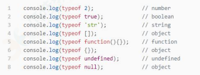

<!-- START doctoc generated TOC please keep comment here to allow auto update -->
<!-- DON'T EDIT THIS SECTION, INSTEAD RE-RUN doctoc TO UPDATE -->

- [JavaScript 有哪些数据类型，它们的区别？](#javascript-%E6%9C%89%E5%93%AA%E4%BA%9B%E6%95%B0%E6%8D%AE%E7%B1%BB%E5%9E%8B%E5%AE%83%E4%BB%AC%E7%9A%84%E5%8C%BA%E5%88%AB)
- [数据类型检测的方式有哪些？](#%E6%95%B0%E6%8D%AE%E7%B1%BB%E5%9E%8B%E6%A3%80%E6%B5%8B%E7%9A%84%E6%96%B9%E5%BC%8F%E6%9C%89%E5%93%AA%E4%BA%9B)
- [null 和 undefined 区别](#null-%E5%92%8C-undefined-%E5%8C%BA%E5%88%AB)
- [intanceof 操作符的实现原理及实现](#intanceof-%E6%93%8D%E4%BD%9C%E7%AC%A6%E7%9A%84%E5%AE%9E%E7%8E%B0%E5%8E%9F%E7%90%86%E5%8F%8A%E5%AE%9E%E7%8E%B0)
- [什么是 JavaScript 中的包装类型？](#%E4%BB%80%E4%B9%88%E6%98%AF-javascript-%E4%B8%AD%E7%9A%84%E5%8C%85%E8%A3%85%E7%B1%BB%E5%9E%8B)
- [const 对象的属性可以修改吗?](#const-%E5%AF%B9%E8%B1%A1%E7%9A%84%E5%B1%9E%E6%80%A7%E5%8F%AF%E4%BB%A5%E4%BF%AE%E6%94%B9%E5%90%97)
- [如果 new 一个箭头函数的会怎么样?](#%E5%A6%82%E6%9E%9C-new-%E4%B8%80%E4%B8%AA%E7%AE%AD%E5%A4%B4%E5%87%BD%E6%95%B0%E7%9A%84%E4%BC%9A%E6%80%8E%E4%B9%88%E6%A0%B7)
- [扩展运算符的作用及使用场景](#%E6%89%A9%E5%B1%95%E8%BF%90%E7%AE%97%E7%AC%A6%E7%9A%84%E4%BD%9C%E7%94%A8%E5%8F%8A%E4%BD%BF%E7%94%A8%E5%9C%BA%E6%99%AF)
- [Proxy 可以实现什么功能？](#proxy-%E5%8F%AF%E4%BB%A5%E5%AE%9E%E7%8E%B0%E4%BB%80%E4%B9%88%E5%8A%9F%E8%83%BD)
- [对 JSON 的理解](#%E5%AF%B9-json-%E7%9A%84%E7%90%86%E8%A7%A3)
- [JavaScript 脚本延迟加载的方式有哪些？](#javascript-%E8%84%9A%E6%9C%AC%E5%BB%B6%E8%BF%9F%E5%8A%A0%E8%BD%BD%E7%9A%84%E6%96%B9%E5%BC%8F%E6%9C%89%E5%93%AA%E4%BA%9B)
- [什么是 DOM 和 BOM？](#%E4%BB%80%E4%B9%88%E6%98%AF-dom-%E5%92%8C-bom)
- [escape、encodeURI、encodeURIComponent 的区别](#escapeencodeuriencodeuricomponent-%E7%9A%84%E5%8C%BA%E5%88%AB)
- [什么是尾调用，使用尾调用有什么好处？](#%E4%BB%80%E4%B9%88%E6%98%AF%E5%B0%BE%E8%B0%83%E7%94%A8%E4%BD%BF%E7%94%A8%E5%B0%BE%E8%B0%83%E7%94%A8%E6%9C%89%E4%BB%80%E4%B9%88%E5%A5%BD%E5%A4%84)
- [ES6 模块与 CommonJS 模块有什么异同？](#es6-%E6%A8%A1%E5%9D%97%E4%B8%8E-commonjs-%E6%A8%A1%E5%9D%97%E6%9C%89%E4%BB%80%E4%B9%88%E5%BC%82%E5%90%8C)
- [for...in 和 for...of 的区别](#forin-%E5%92%8C-forof-%E7%9A%84%E5%8C%BA%E5%88%AB)
- [ajax、axios、fetch 的区别](#ajaxaxiosfetch-%E7%9A%84%E5%8C%BA%E5%88%AB)
- [对原型、原型链的理解](#%E5%AF%B9%E5%8E%9F%E5%9E%8B%E5%8E%9F%E5%9E%8B%E9%93%BE%E7%9A%84%E7%90%86%E8%A7%A3)
- [对作用域、作用域链的理解](#%E5%AF%B9%E4%BD%9C%E7%94%A8%E5%9F%9F%E4%BD%9C%E7%94%A8%E5%9F%9F%E9%93%BE%E7%9A%84%E7%90%86%E8%A7%A3)
- [对 this 对象的理解](#%E5%AF%B9-this-%E5%AF%B9%E8%B1%A1%E7%9A%84%E7%90%86%E8%A7%A3)
- [异步编程的实现方式？](#%E5%BC%82%E6%AD%A5%E7%BC%96%E7%A8%8B%E7%9A%84%E5%AE%9E%E7%8E%B0%E6%96%B9%E5%BC%8F)
- [Generator 函数](#generator-%E5%87%BD%E6%95%B0)
- [对 Promise 的理解](#%E5%AF%B9-promise-%E7%9A%84%E7%90%86%E8%A7%A3)
- [对 async/await 的理解](#%E5%AF%B9-asyncawait-%E7%9A%84%E7%90%86%E8%A7%A3)
- [对象创建的方式有哪些？](#%E5%AF%B9%E8%B1%A1%E5%88%9B%E5%BB%BA%E7%9A%84%E6%96%B9%E5%BC%8F%E6%9C%89%E5%93%AA%E4%BA%9B)
- [对象继承的方式有哪些？](#%E5%AF%B9%E8%B1%A1%E7%BB%A7%E6%89%BF%E7%9A%84%E6%96%B9%E5%BC%8F%E6%9C%89%E5%93%AA%E4%BA%9B)
- [哪些情况会导致内存泄漏](#%E5%93%AA%E4%BA%9B%E6%83%85%E5%86%B5%E4%BC%9A%E5%AF%BC%E8%87%B4%E5%86%85%E5%AD%98%E6%B3%84%E6%BC%8F)

<!-- END doctoc generated TOC please keep comment here to allow auto update -->

# Javascript

## JavaScript 有哪些数据类型，它们的区别？

JavaScript 共有八种数据类型，分别是 Undefined、Null、Boolean、
Number、String、Object、Symbol、BigInt。

其中 Symbol 和 BigInt 是 ES6 中新增的数据类型：

- Symbol 代表创建后独一无二且不可变的数据类型，它主要是为了
  解决可能出现的全局变量冲突的问题。

- BigInt 是一种数字类型的数据，它可以表示任意精度格式的整数，
  使用 BigInt 可以安全地存储和操作大整数，即使这个数已经超出了
  Number 能够表示的安全整数范围。

这些数据可以分为原始数据类型和引用数据类型：

- 栈：原始数据类型（Undefined、Null、Boolean、Number、String）
- 堆：引用数据类型（对象、数组、函数等）

两种类型的区别在于存储位置的不同：

- 原始数据类型直接存储在栈（stack）中的简单数据段，占据空间
  小、大小固定，属于被频繁使用数据，所以放入栈中存储；

- 引用数据类型存储在堆（heap）中的对象，占据空间大、大小不固定。如果存储在栈中，将会影响程序运行的性能；**引用数据类型在栈中存储了指针，该指针指向堆中该实体的起始地址。当解释器寻找引用值时，会首先检索其在栈中的地址，取得地址后从堆中获得实体。**

堆和栈的概念存在于数据结构和操作系统内存中，在数据结构中：

- 在数据结构中，栈中数据的存取方式为先进后出。
- 堆是一个优先队列，是按优先级来进行排序的，优先级可以按照大
  小来规定。

在操作系统中，内存被分为栈区和堆区：

- 栈区内存由编译器自动分配释放，存放函数的参数值，局部变量的
  值等。其操作方式类似于数据结构中的栈。
- 堆区内存一般由开发着分配释放，若开发者不释放，程序结束时可
  能由垃圾回收机制回收。

## 数据类型检测的方式有哪些？

- typeof
  可以判断基础数据类型，无法判断引用类型（其中数组、对象、null 都会被判断为 object）

  

- instanceof
  instanceof 操作符用于检测构造函数的 prototype 属性是否出现在某个实例对象的原型链上，返回布尔值。instanceof 只能正确判断引用数据类型，而不能判断基本数据类型。

  

- constructor
  constructor 有两个作用，一是判断数据的类型，二是对象实例通过 constrcutor 对象访问它的构造函数。
  

  需要注意，如果创建一个对象来改变它的原型，constructor 就不能用来判断数据类型了

  

- Object.prototype.toString.call()
  Object.prototype.toString.call() 使用 Object 对象的原型方法 toString 来判断数据类型：
  

  同样是检测对象 obj 调用 toString 方法，obj.toString()的结果和 Object.prototype.toString.call(obj)的结果不一样，这是为什么？

  这是因为 toString 是 Object 的原型方法，而数组函数等类
  型作为 Object 的实例，都重写了 toString 方法。不同的对象类型调
  用 toString 方法时，根据原型链的知识，调用的是对应的重写之后的 toString 方法（function 类型返回内容为函数体的字符串，array
  类型返回元素组成的字符串…），而不会去调用 Object 上原型
  toString 方法（返回对象的具体类型），所以采用 obj.toString()
  不能得到其对象类型，只能将 obj 转换为字符串类型；因此，在想要
  得到对象的具体类型时，应该调用 Object 原型上的 toString 方法。

## null 和 undefined 区别

首先 Undefined 和 Null 都是基本数据类型，这两个基本数据类型
分别都只有一个值，就是 undefined 和 null。

undefined 代表的含义是未定义，null 代表的含义是空对象。

一般变量声明了但还没有定义的时候会返回 undefined，null 主要用于
赋值给一些可能会返回对象的变量，作为初始化。

## intanceof 操作符的实现原理及实现

instanceof 操作符用于检测构造函数的 prototype 属性是否出现在某个实例对象的原型链上，返回布尔值

如果 a instanceof B ，那么 a 必须要是个对象，而 B 必须是一个合法的函数。在这两个条件都满足的情况下：判断 B 的 prototype 属性指向的原型对象（ B.prototype ）是否在对象 a 的原型链上。如果在，则返回 true；如果不在，则返回 false。简而言之， instanceof 的原理其实就是一个查找原型链的过程。

```js
// 构造函数right的原型是否出现在实例left的原型链上
function _instanceof(left, right) {
  if (typeof left !== "object") return false;
  if (typeof right !== "function") return false;

  const proto_r = right.prototype;
  let proto_l = Object.getPrototypeOf(left);

  while (true) {
    if (!proto_l) return false;
    if (proto_l === proto_r) return true;
    proto_l = Object.getPrototypeOf(proto_l);
  }
}
```

## 什么是 JavaScript 中的包装类型？

在 JavaScript 中，基本类型是没有属性和方法的，但是为了便于操
作基本类型的值，在调用基本类型的属性或方法时 JavaScript 会在
后台隐式地将基本类型的值转换为对象。

基本类型转换为对象的过程，称为包装类型（Wrapper）。

基本类型转换成对象

```js
const str = "abc";
str.length; // 3
str.toUpperCase(); // ABC
```

在访问'abc'.length 时, JavaScript 将'abc'在后台转换成 String('abc')，然后再访问其 length 属性。
JavaScript 也可以使用 `Object` 函数显式地将基本类型转换为包装类

```js
const str = "abc";
Object(str); // String {0: "a", 1: "b", 2: "c", length: 3, ...}
```

也可以使用 `valueOf` 方法将包装类型倒转成基本类型

```js
const str = "abc";
const b = Object(str); // String {0: "a", 1: "b", 2: "c", length: 3, ...}
const c = b.valueOf(b); // 'abc'
```

## const 对象的属性可以修改吗?

`const` 保证的并不是变量的值不能改动，而是变量指向的那个内存地
址不能改动。

对于基本类型的数据（数值、字符串、布尔值），其值就保存在变量指向的那个内存地址，因此等同于常量。但对于引用类型的数据（主要是对象和数组）来说，变量指向数据的内存地址，保存的只是一个指针，const 只能保证这个指针是固定不变的，至于它指向的数据结构是不是可变的，就完全不能控制了。

## 如果 new 一个箭头函数的会怎么样?

箭头函数是 ES6 中的提出来的，它没有 prototype，也没有自己的 this
指向，更不可以使用 arguments 参数，所以不能 New 一个箭头函数。
new 操作符的实现步骤如下：

- 1.创建一个对象
- 2.将构造函数的作用域赋给新对象（也就是将对象的**proto**属性
  指向构造函数的 prototype 属性）
- 3.指向构造函数中的代码，构造函数中的 this 指向该对象（也就是
  为这个对象添加属性和方法）
- 4.返回新的对象
  所以，上面的第二、三步，箭头函数都是没有办法执行的。

## 扩展运算符的作用及使用场景

**对象扩展运算符**

对象的扩展运算符(...)用于取出参数对象中的所有可遍历属性，拷贝到当 前对象之中。 Object.assign 方法用于对象的合并，将源对象（source）的所有可
枚举属性，复制到目标对象（target）。Object.assign 方法的第一
个参数是目标对象，后面的参数都是源对象。(如果目标对象与源对
象有同名属性，或多个源对象有同名属性，则后面的属性会覆盖前面
的属性)。同样，如果用户自定义的属性，放在扩展运算符后面，则扩展运算符
内部的同名属性会被覆盖掉。

```js
const target = { a: 1, b: 2 };
const source = { ...target };
console.log(source); // { a: 1, b: 2 }
```

需要注意：扩展运算符对对象实例的拷贝属于浅拷贝。

**数组扩展运算符**  
数组的扩展运算符可以将一个数组转为用逗号分隔的参数序列，且每
次只能展开一层数组。
扩展运算符(…)用于取出参数对象中的所有可遍历属性，拷贝到当前对象之中，这里参数对象是个数组，数组里面的所有对象都是基础数据类型，将所有基础数据类型重新拷贝到新的数组中。
合并数组

```js
const target = [1, 2, 3];
const source = [...target, 4, 5];
console.log(source); //[1,2,3,4,5]
```

需要注意：如果将扩展运算符用于数组赋值，只能放在参数的最后一
位，否则会报错。

任何 Iterator 接口的对象，都可以用扩展运算符转为真正的数组

```js
const target = "hello";
const source = [...target];
console.log(source); // [ 'h', 'e', 'l', 'l', 'o' ]
```

## Proxy 可以实现什么功能？

在 Vue3.0 中通过 Proxy 来替换原本的 Object.defineProperty
来实现数据响应式。
Proxy 是 ES6 中新增的功能，它可以用来自定义对象中的操作。

`let p = new Proxy(target, handler)`

代表需要添加代理的对象，handler 用来自定义对象中的操作，比如
可以用来自定义 set 或者 get 函数。
下面来通过 Proxy 来实现一个数据响应式

```js
// 待更新
```

在上述代码中，通过自定义 `set` 和 `get` 函数的方式，在原本的逻辑
中插入了我们的函数逻辑，实现了在对对象任何属性进行读写时发出
通知。
当然这是简单版的响应式实现，如果需要实现一个 Vue 中的响应式，
需要在 get 中收集依赖，在 set 派发更新，之所以 Vue3.0 要使用
Proxy 替换原本的 API 原因在于 Proxy 无需一层层递归为每个属
性添加代理，一次即可完成以上操作，性能上更好，并且原本的实现
有一些数据更新不能监听到，但是 Proxy 可以完美监听到任何方式
的数据改变，唯一缺陷就是浏览器的兼容性不好。

## 对 JSON 的理解

JSON 是一种基于文本的轻量级的数据交换格式。它可以被任何的编
程语言读取和作为数据格式来传递。

- JSON.stringify 函数
  通过传入一个符合 JSON 格式的数据结构，
  将其转换为一个 JSON 字符串。如果传入的数据结构不符合 JSON 格
  式，那么在序列化的时候会对这些值进行对应的特殊处理，使其符合
  规范。在前端向后端发送数据时，可以调用这个函数将数据对象转化
  为 JSON 格式的字符串

  ```js
  JSON.stringify(value,replacer, space)
  value:
  必需， 要转换的 JavaScript 值（通常为对象或数组）。

  replacer:
  可选。用于转换结果的函数或数组。

  如果 replacer 为函数，则 JSON.stringify 将调用该函数，并传入每个成员的键和值。使用返回值而不是原始值。如果此函数返回 undefined，则排除成员。根对象的键是一个空字符串：""。

  如果 replacer 是一个数组，则仅转换该数组中具有键值的成员。成员的转换顺序与键在数组中的顺序一样。当 value 参数也为数组时，将忽略 replacer 数组。

  space:
  可选，文本添加缩进、空格和换行符，如果 space 是一个数字，则返回值文本在每个级别缩进指定数目的空格，如果 space 大于 10，则文本缩进 10 个空格。space 也可以使用非数字，如：\t。
  ```

- JSON.parse() 函数
  这个函数用来将 JSON 格式的字符串转换为一
  个 js 数据结构，如果传入的字符串不是标准的 JSON 格式的字符串
  的话，将会抛出错误。当从后端接收到 JSON 格式的字符串时，可以
  通过这个方法来将其解析为一个 js 数据结构，以此来进行数据的访
  问

## JavaScript 脚本延迟加载的方式有哪些？

延迟加载就是等页面加载完成之后再加载 JavaScript 文件。js 延
迟加载有助于提高页面加载速度。

一般有以下几种方式：

1. defer 属性：给 js 脚本添加 defer 属性，这个属性会让脚本的加
   载与文档的解析同步解析，然后在文档解析完成后再执行这个脚本文
   件，这样的话就能使页面的渲染不被阻塞。多个设置了 defer 属性
   的脚本按规范来说最后是**顺序执行**的，但是在一些浏览器中可能不是
   这样。
2. async 属性：给 js 脚本添加 async 属性，这个属性会使脚本异步
   加载，不会阻塞页面的解析过程，但是当脚本加载完成后立即执行 js
   脚本，这个时候如果文档没有解析完成的话同样会阻塞。多个 async
   属性的脚本的执行顺序是不可预测的，一般不会按照代码的顺序依次
   执行。
3. 动态创建 DOM 方式：动态创建 DOM 标签的方式，可以对文档的加载
   事件进行监听，当文档加载完成后再动态的创建 script 标签来引入
   js 脚本。
4. 使用 setTimeout 延迟方法：设置一个定时器来延迟加载 js 脚本文
   件
5. 让 JS 最后加载：将 js 脚本放在文档的底部，来使 js 脚本尽可能
   的在最后来加载执行。

## 什么是 DOM 和 BOM？

DOM 指的是文档对象模型，它指的是把文档当做一个对象，这个对象
主要定义了处理网页内容的方法和接口。
BOM 指的是浏览器对象模型，它指的是把浏览器当做一个对象来对待，
这个对象主要定义了与浏览器进行交互的法和接口。BOM 的核心是
window，而 window 对象具有双重角色，它既是通过 js 访问浏览器
窗口的一个接口，又是一个 Global（全局）对象。这意味着在网页
中定义的任何对象，变量和函数，都作为全局对象的一个属性或者方
法存在。window 对象含有 location 对象、navigator 对象、screen
对象等子对象，并且 DOM 的最根本的对象 document 对象也是 BOM
的 window 对象的子对象。

## escape、encodeURI、encodeURIComponent 的区别

encodeURI 是对整个 URI 进行转义，将 URI 中的非法字符转换为合
法字符，所以对于一些在 URI 中有特殊意义的字符不会进行转义。
encodeURIComponent 是对 URI 的组成部分进行转义，所以一些特殊
字符也会得到转义。
escape 和 encodeURI 的作用相同，不过它们对于 unicode 编码为
0xff 之外字符的时候会有区别，escape 是直接在字符的 unicode
编码前加上 %u，而 encodeURI 首先会将字符转换为 UTF-8 的格式，
再在每个字节前加上%

## 什么是尾调用，使用尾调用有什么好处？

尾调用指的是函数的最后一步调用另一个函数。代码执行是基于执行
栈的，所以当在一个函数里调用另一个函数时，会保留当前的执行上
下文，然后再新建另外一个执行上下文加入栈中。使用尾调用的话，
因为已经是函数的最后一步，所以这时可以不必再保留当前的执行上
下文，从而节省了内存，这就是尾调用优化。但是 ES6 的尾调用优
化只在严格模式下开启，正常模式是无效的。

## ES6 模块与 CommonJS 模块有什么异同？

- 1.CommonJS 模块输出的是一个值的拷贝，ES6 模块输出的是值的引用。
  CommonJS 模块输出的是值的拷贝，也就是说，一旦输出一个值，模块内部的变化就影响不到这个值

  ```js
  // A.js
  var num = 1;
  function incCounter() {
    num++;
  }
  module.exports = {
    counter: num,
    incCounter: incCounter,
  };
  // main.js
  var mod = require("./A");

  console.log(mod.counter); // 1
  mod.incCounter();
  console.log(mod.counter); // 1
  ```

  JS 引擎对脚本静态分析的时候，遇到模块加载命令 import，就会生成一个只读引用。等到脚本真正执行时，再根据这个只读引用，到被加载的那个模块里面去取值

  ```js
  // A.js
  export let num = 1;
  export function incCounter() {
    num++;
  }

  // main.js
  import { num, incCounter } from "./A";
  console.log(num); // 1
  incCounter();
  console.log(num); // 2
  ```

- 2.CommonJS 模块是运行时加载，ES6 模块是编译时输出接口

- 3.CommonJS 模块的 require()是同步加载模块，ES6 模块的 import 命令是异步加载，有一个独立的模块依赖的解析阶段

## for...in 和 for...of 的区别

for… in 会遍历对象的整个原型链，主要是为了遍历对象而生，不适用于遍历数组。性能非常差不推荐使用

for…of 是 ES6 新增的遍历方式，允许遍历一个含有 iterator 接口
的数据结构（数组、对象等）并且返回各项的值

## ajax、axios、fetch 的区别

AJAX 是一种在无需重新加载整个网页的情况下，能够更新部分网页的技术。通过在
后台与服务器进行少量数据交换，Ajax 可以使网页实现异步更新。

Fetch 是在 ES6 出现的，使用了 ES6 中的 promise 对象。Fetch 是基于 promise 设计的，fetch 不是 ajax 的进一步封装，而是原生 js，没有使用 XMLHttpRequest 对象。

fetch 只对网络请求报错，对 400，500 都当做成功的请求，服务器
返回 400，500 错误码时并不会 reject，只有网络错误这些导致请
求不能完成时，fetch 才会被 reject。

fetch 没有办法原生监测请求的进度，而 XHR 可以

Axios 是一种基于 Promise 封装的 HTTP 客户端

## 对原型、原型链的理解

[对原型、原型链的理解](./原型链.md)

## 对作用域、作用域链的理解

**作用域**

- 全局作用域和函数作用域

1. 全局作用域: 最外层函数和最外层函数外面定义的变量拥有全局作用域
   所有未定义直接赋值的变量自动声明为全局作用域
   所有 window 对象的属性拥有全局作用域
   全局作用域有很大的弊端，过多的全局作用域变量会污染全局命名空
   间，容易引起命名冲突。

2. 函数作用域：函数作用域声明在函数内部的变零，一般只有固定的代码片段可以访问到作用域是分层的，内层作用域可以访问外层作用域，反之不行。

- 块级作用域
  使用 ES6 中新增的 let 和 const 指令可以声明块级作用域，块级作用
  域可以在函数中创建也可以在一个代码块中的创建（由`{ }`包裹的代
  码片段）
  let 和 const 声明的变量不会有变量提升，也不可以重复声明
  在循环中比较适合绑定块级作用域，这样就可以把声明的计数器变量
  限制在循环内部。

**作用域链**

在当前作用域中查找所需变量，但是该作用域没有这个变量，那这个
变量就是自由变量。如果在自己作用域找不到该变量就去父级作用域
查找，依次向上级作用域查找，直到访问到 window 对象就被终止，
这一层层的关系就是作用域链。

作用域链的作用是保证对执行环境有权访问的所有变量和函数的有
序访问，通过作用域链，可以访问到外层环境的变量和函数。
作用域链的本质上是一个指向变量对象的指针列表。变量对象是一个
包含了执行环境中所有变量和函数的对象。作用域链的前端始终都是
当前执行上下文的变量对象。全局执行上下文的变量对象（也就是全
局对象）始终是作用域链的最后一个对象。
当查找一个变量时，如果当前执行环境中没有找到，可以沿着作用域
链向后查找

## 对 this 对象的理解

this 是执行上下文中的一个属性，它指向最后一次调用这个方法的
对象。

在实际开发中，this 的指向可以通过四种调用模式来判断。

第一种是函数调用模式，当一个函数不是一个对象的属性时，直接作
为函数来调用时，this 指向全局对象。

第二种是方法调用模式，如果一个函数作为一个对象的方法来调用时，
this 指向这个对象。

第三种是构造器调用模式，如果一个函数用 new 调用时，函数执行
前会新创建一个对象，this 指向这个新创建的对象。

第四种是 apply、call、bind 调用模式，这三个方法都可以显
示的指定调用函数的 this 指向。其中 apply 方法接收两个参数：
一个是 this 绑定的对象，一个是参数数组。call 方法接收的参数，
第一个是 this 绑定的对象，后面的其余参数是传入函数执行的参数。
也就是说，在使用 call() 方法时，传递给函数的参数必须逐个列举
出来。bind 方法通过传入一个对象，返回一个 this 绑定了传入对
象的新函数。这个函数的 this 指向除了使用 new 时会被改变，其
他情况下都不会改变。

这四种方式，使用构造器调用模式的优先级最高，然后是 apply、call
和 bind 调用模式，然后是方法调用模式，然后是函数调用模式。

## 异步编程的实现方式？

1. 回调函数的方式，使用回调函数的方式有一个缺点是，多个回调函
   数嵌套的时候会造成回调函数地狱，上下两层的回调函数间的代码耦
   合度太高，不利于代码的可维护。
2. `Promise` 的方式，使用 Promise 的方式可以将嵌套的回调函数作为
   链式调用。但是使用这种方法，有时会造成多个 then 的链式调用，
   可能会造成代码的语义不够明确。
3. `generator` 的方式，它可以在函数的执行过程中，将函数的执行权转
   移出去，在函数外部还可以将执行权转移回来。当遇到异步函数执行
   的时候，将函数执行权转移出去，当异步函数执行完毕时再将执行权
   给转移回来。因此在 generator 内部对于异步操作的方式，可以以
   同步的顺序来书写。使用这种方式需要考虑的问题是何时将函数的控
   制权转移回来，因此需要有一个自动执行 generator 的机制，比如
   说 co 模块等方式来实现 generator 的自动执行
4. `async` 函数的方式，async 函数是 generator 和 promise 实现的
   一个自动执行的语法糖，它内部自带执行器，当函数内部执行到一个
   await 语句的时候，如果语句返回一个 promise 对象，那么函数将
   会等待 promise 对象的状态变为 resolve 后再继续向下执行。因此
   可以将异步逻辑，转化为同步的顺序来书写，并且这个函数可以自动
   执行

## Generator 函数

`Generator` 函数是 ES6 提供的一种异步编程解决方案。

执行 `Generator` 函数会返回一个`遍历器对象`，也就是说，Generator 函数除了状态机，还是一个遍历器对象生成函数。返回的遍历器对象，可以依次遍历 Generator 函数内部的每一个状态。

Generator 函数是一个普通函数，但是有两个特征。

一是 function 关键字与函数名之间有一个星号；

二是函数体内部使用 yield 表达式，定义不同的内部状态（yield 在英语里的意思就是“产出”）

```js
function* helloWorldGenerator() {
  yield "hello";
  yield "world";
  return "ending";
}

var hw = helloWorldGenerator();

hw.next();
// { value: 'hello', done: false }

hw.next();
// { value: 'world', done: false }

hw.next();
// { value: 'ending', done: true }

hw.next();
// { value: undefined, done: true }
```

每次调用 next 方法，内部指针就从函数头部或上一次停下来的地方开始执行，直到遇到下一个 yield 表达式（或 return 语句）为止。换言之，Generator 函数是分段执行的，yield 表达式是暂停执行的标记，而 next 方法可以恢复执行。

## 对 Promise 的理解

1. Promise 的实例有三个状态: Pending（进行中）,Resolved（已完成）,Rejected（已拒绝）
   当把一件事情交给 promise 时，它的状态就是 Pending，任务完成了
   状态就变成了 Resolved、没有完成失败了就变成了 Rejected。
2. Promise 的实例有两个过程：

   pending -> fulfilled : Resolved（已完成）

   pending -> rejected：Rejected（已拒绝）

   注意：一旦从进行状态变成为其他状态就永远不能更改状态了。

Promise 的特点：

1.  对象的状态不受外界影响。
2.  一旦状态改变就不会再变，任何时候都可以得到这个结果。
3.  一旦使用 then 方法注册回调函数，就会立即执行。

Promise 的缺点：

1.  无法取消 Promise，一旦新建它就会立即执行，无法中途取消。
2.  如果不设置回调函数，Promise 内部抛出的错误，不会反应到外部。
3.  当处于 pending 状态时，无法得知目前进展到哪一个阶段（刚刚开始
    还是即将完成）。

## 对 async/await 的理解

ES2017 标准引入了 async 函数，它就是 Generator 函数的语法糖。

```js
const fs = require("fs");

const readFile = function (fileName) {
  return new Promise(function (resolve, reject) {
    fs.readFile(fileName, function (error, data) {
      if (error) return reject(error);
      resolve(data);
    });
  });
};

// Generator 函数
const gen = function* () {
  const f1 = yield readFile("/etc/fstab");
  const f2 = yield readFile("/etc/shells");
  console.log(f1.toString());
  console.log(f2.toString());
};
// 函数gen可以写成async函数
const asyncReadFile = async function () {
  const f1 = await readFile("/etc/fstab");
  const f2 = await readFile("/etc/shells");
  console.log(f1.toString());
  console.log(f2.toString());
};
```

比较就会发现，async 函数就是将 Generator 函数的星号（\*）替换成 async，将 yield 替换成 await，仅此而已。

async 函数对 Generator 函数的改进，体现在以下四点：

（1）内置执行器。

Generator 函数的执行必须靠执行器，所以才有了 co 模块，而 async 函数自带执行器。也就是说，async 函数的执行，与普通函数一模一样，只要一行。

`asyncReadFile();`

上面的代码调用了 asyncReadFile 函数，然后它就会自动执行，输出最后结果。这完全不像 Generator 函数，需要调用 next 方法，或者用 co 模块，才能真正执行，得到最后结果。

（2）更好的语义。

async 和 await，比起星号和 yield，语义更清楚了。async 表示函数里有异步操作，await 表示紧跟在后面的表达式需要等待结果。

（3）更广的适用性。

co 模块约定，yield 命令后面只能是 Thunk 函数或 Promise 对象，而 async 函数的 await 命令后面，可以是 Promise 对象和原始类型的值（数值、字符串和布尔值，但这时会自动转成立即 resolved 的 Promise 对象）。

（4）返回值是 Promise。

async 函数的返回值是 Promise 对象，这比 Generator 函数的返回值是 Iterator 对象方便多了。你可以用 then 方法指定下一步的操作。

进一步说，async 函数完全可以看作多个异步操作，包装成的一个 Promise 对象，而 await 命令就是内部 then 命令的语法糖。

## 对象创建的方式有哪些？

一般使用字面量的形式直接创建对象，但是这种创建方式对于创建大
量相似对象的时候，会产生大量的重复代码。但 js 和一般的面向对
象的语言不同，在 ES6 之前它没有类的概念。但是可以使用函数来
进行模拟，从而产生出可复用的对象创建方式，常见的有以下几种：

（1）第一种是工厂模式，工厂模式的主要工作原理是用函数来封装
创建对象的细节，从而通过调用函数来达到复用的目的。但是它有一
个很大的问题就是创建出来的对象无法和某个类型联系起来，它只是
简单的封装了复用代码，而没有建立起对象和类型间的关系。

（2）第二种是构造函数模式。js 中每一个函数都可以作为构造函数，
只要一个函数是通过 new 来调用的，那么就可以把它称为构造函数。
执行构造函数首先会创建一个对象，然后将对象的原型指向构造函数
的 prototype 属性，然后将执行上下文中的 this 指向这个对象，
最后再执行整个函数，如果返回值不是对象，则返回新建的对象。因
为 this 的值指向了新建的对象，因此可以使用 this 给对象赋值。
构造函数模式相对于工厂模式的优点是，所创建的对象和构造函数建
立起了联系，因此可以通过原型来识别对象的类型。但是构造函数存
在一个缺点就是，造成了不必要的函数对象的创建，因为在 js 中函
数也是一个对象，因此如果对象属性中如果包含函数的话，那么每次
都会新建一个函数对象，浪费了不必要的内存空间，因为函数是所有
的实例都可以通用的。

（3）第三种模式是原型模式，因为每一个函数都有一个 prototype
属性，这个属性是一个对象，它包含了通过构造函数创建的所有实例
都能共享的属性和方法。因此可以使用原型对象来添加公用属性和方
法，从而实现代码的复用。这种方式相对于构造函数模式来说，解决
了函数对象的复用问题。但是这种模式也存在一些问题，一个是没有
办法通过传入参数来初始化值，另一个是如果存在一个引用类型如
Array 这样的值，那么所有的实例将共享一个对象，一个实例对引用
类型值的改变会影响所有的实例。

（4）第四种模式是组合使用构造函数模式和原型模式，这是创建自
定义类型的最常见方式。因为构造函数模式和原型模式分开使用都存
在一些问题，因此可以组合使用这两种模式，通过构造函数来初始化
对象的属性，通过原型对象来实现函数方法的复用。这种方法很好的
解决了两种模式单独使用时的缺点，但是有一点不足的就是，因为使
用了两种不同的模式，所以对于代码的封装性不够好。

（5）第五种模式是动态原型模式，这一种模式将原型方法赋值的创
建过程移动到了构造函数的内部，通过对属性是否存在的判断，可以
实现仅在第一次调用函数时对原型对象赋值一次的效果。这一种方式
很好地对上面的混合模式进行了封装。

（6）第六种模式是寄生构造函数模式，这一种模式和工厂模式的实
现基本相同，我对这个模式的理解是，它主要是基于一个已有的类型，
在实例化时对实例化的对象进行扩展。这样既不用修改原来的构造函
数，也达到了扩展对象的目的。它的一个缺点和工厂模式一样，无法
实现对象的识别。

## 对象继承的方式有哪些？

[es5 vs es6 继承](https://blog.csdn.net/qq_32247819/article/details/128082249)

## 哪些情况会导致内存泄漏

(1) 意外的全局变量：由于使用未声明的变量，而意外的创建了一个全局
变量，而使这个变量一直留在内存中无法被回收。

(2) 被遗忘的计时器或回调函数：设置了 setInterval 定时器，而忘记
取消它，如果循环函数有对外部变量的引用的话，那么这个变量会被
一直留在内存中，而无法被回收。

(3) 脱离 DOM 的引用：获取一个 DOM 元素的引用，而后面这个元素被删
除，由于一直保留了对这个元素的引用，所以它也无法被回收。

(4) 闭包：不合理的使用闭包，从而导致某些变量一直被留在内存当中。
