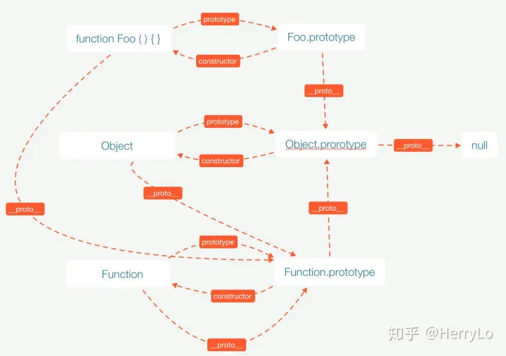
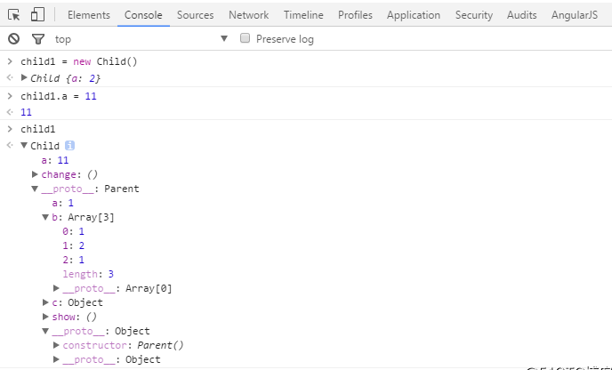
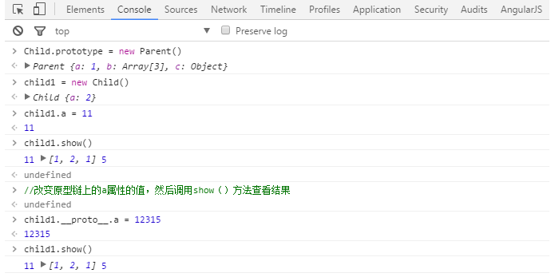
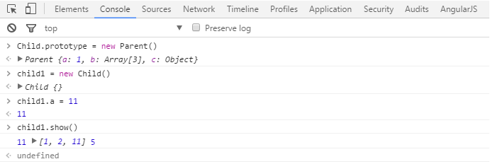

## 构造函数

构造函数用来在创建对象时初始化对象。
特点：构造函数名一般为大写字母开头, 与 `new` 运算符一起使用来实例化对象。

```js
function Person(name, age) {
  this.name = name;
  this.age = age;
}

var p = new Person("zhangsan", 20);
```

## 原型

在 JavaScript 中是使用构造函数来新建一个对象的，每一个构造函
数的内部都有一个 prototype 属性，它的属性值是一个对象，这个
对象包含了可以由该构造函数的所有实例共享的属性和方法。当使用
构造函数新建一个对象后，在这个对象的内部将包含一个指针，这个
指针指向构造函数的 prototype 属性对应的值，在 ES5 中这个指针
被称为对象的原型。一般来说不应该能够获取到这个值的，但是现在
浏览器中都实现了` __proto__` 属性来访问这个属性，但是最好不要
使用这个属性，因为它不是规范中规定的。ES5 中新增了一个
Object.getPrototypeOf() 方法，可以通过这个方法来获取对象的原
型

总结：
构造函数在创建的过程中，系统自动创建出来与构造函数相关联的一个空的对象。可以由构造函数.prototype 来访问到。

举例：在实例化对象 `p `的过程中，系统就自动创建出了构造函数的原型，即 Person.prototype.

注意：每个对象的`__proto__`属性指向自身构造函数的 `prototype`；

constructor 属性是原型对象的属性，指向这个原型对象所对应的构造函数。

## 原型链

当访问一个对象的属性时，如果这个对象内部不存在这个属性，那么
它就会去它的原型对象里找这个属性，这个原型对象又会有自己的原
型，于是就这样一直找下去，也就是原型链的概念。原型链的尽头一
般来说都是 Object.prototype 所以这就是新建的对象为什么能够
使用 toString() 等方法的原因。

例子中的 p 对象的原型链结构图如下：

`p --> Person.prototype --> Object.prototype --> null`

对这个实例化对象而言，访问对象的属性，是首先在对象本身去找，如果没有，就会去他的原型对象中找，一直找到原型链的终点；如果是修改对象的属性，如果这个实例化对象中有这个属性，就修改，没有这个属性就添加这个属性。

## 关系图



## 面试题

要求写出控制台的输出.

```
function Parent() {
    this.a = 1;
    this.b = [1, 2, this.a];
    this.c = { demo: 5 };
    this.show = function () {
        console.log(this.a , this.b , this.c.demo );
    }
}
function Child() {
  this.a = 2;
  this.change = function () {
      this.b.push(this.a);
      this.a = this.b.length;
      this.c.demo = this.a++;
  }
}

Child.prototype = new Parent();
var parent = new Parent();
var child1 = new Child();
var child2 = new Child();
child1.a = 11;
child2.a = 12;
parent.show();
child1.show();
child2.show();
child1.change();
child2.change();
parent.show();
child1.show();
child2.show();

```

## 知识点细节

- 1.构造函数，都有一个 prototype 属性，指向构造函数的原型对象，实例会共享同一个原型对象;
- 2.实例生成时，会在内存中产生一块新的堆内存，对实例的一般操作将不影响其他实例，因为在堆内存里占据- 不同空间，互不影响;
- 3.每一个实例都有一个隐式原型**proto**指向构造函数的原型对象;
- 4.this 的指向问题,常见的情况包含如下几种：
  - 4.1 作为对象方法时，谁调用就指向谁(本题中主要涉及这一条)
  - 4.2 作为函数调用时，指向全局顶层变量 window
  - 4.3 作为构造函数调用时，即 new 操作符生成实例时，构造函数中的 this 指向实例
  - 4.4 call 和 apply 方法中，显示指定 this 的绑定为指定上下文
- 5.字面量的方式(也有资料将 literal 翻译为直接量,个人认为后一种翻译其实更直观更形象)进行对象和数组赋- 值（数组本质也是对象）时，都是引用，即在堆内存生成资源，在栈内存生成变量，然后变量指向资源的地- 址。
- 6.原型链的查找规则遵循最短路径原则，即先查找实例属性，然后顺着原型链去查找指定的属性，直至原型链- 末端的 Object.prototype 和 null，如果实例自身及整个原型链都不存在所查找的属性则返回 undefined
- 7.赋值语句对于原始值赋值和引用类型赋值时的细节区别.

## 开始剖题

1.parent.show()
基本没什么可解释的。直接取值就能得出答案 1 [1,2,1] 5;

2.child1.show()
Child 的构造函数原本是指向 Child 的,题目中显式将 Child 类的原型对象指向了 Parent 类的一个实例，这是 javascript 面向对象编程中常见的继承方式之一。此处需要注意 Child.prototype 指向的是 Parent 的实例 parent，而不是指向 Parent 这个类。

输出答案可得 11 [1,2,1] 5

此处令人迷惑的是 this.b 指向的数组最后一列为什么是 1 而不是 11?

先来看一下 child1 的样子：



当执行 child1.show()这个方法时，由于 child1 作为 Child 的实例，是拥有 a 这个属性的,所以 show()方法中的 this.a 会直接指向这个属性的值，也就是 11,而不会继续沿原型链取到**proto**所指的对象上的 a 属性;

接着寻找 this.b,由于 child1 是没有 b 这个属性的，所以会沿原型链取到 parent 上的 b 属性，其值是一个数组,前 2 项是常量没什么好说的，数组的最后一项是一个引用，而此处的指针并不是一个动态指向,因为在 new Parent()这一步的时候它已经被执行过一次，确定指向了 parent.a 所指向的资源，也就是 child1.**proto**中的 a 属性所指向的资源，即数值 1。

延伸思考
需要注意的是：

1.从代码上看,child1.**proto**.b 数组的第三项是指向 child1.**proto**.a 的，那我们此时修改 child1.**proto**.a 的值，是否会影响 child1.show()的结果呢:


答案是没有影响，为什么看起来指向同一个地址的属性却出现值不一样的情形？因为 parent 实例生成的时候，this.a 指向了一个原始值 2,所以 this.b 中的第三项实际上是被赋值了一个原始值，故此处乍看起来像是引用类型的赋值，实则不是。原始值赋值会开辟新的存储空间，使得 this.a 和 this.b[2]的值相等，但是却指向了堆内存里的不同地址。

2.那怎样让 child1.**proto**.b 数组的第三项也输出 11 呢?

实例化后修改
由于在 Parent 类定义中，b 属性数组的第三项是指向 a 属性的值的，意味着在 Parent 实例化之前这个引用是动态指向的，所以只要在 Parent 实例化之前改变类定义中 this.a 的值，就可以达到想要的效果，如果在 Parent 已经实例化，则只能显式修改\*.b[2]这个属性的值。
get/set 方法同步
另一种方式是通过为 a 属性设置 get/set 方法，是的每当 a 属性的值发生变化时，同步修改 b[2]的值，代码和运行结果如下所示：

```
function Parent() {
    this.a = 1;
    this.b = [1, 2, this.a];
    this.c = { demo: 5 };
    this.show = function () {
        console.log(this.a , this.b , this.c.demo );
    }
}
function Child() {
  // this.a = 2;
  var _a = 2;
  this.change = function () {
      this.b.push(this.a);
      this.a = this.b.length;
      this.c.demo = this.a++;
  }
  Reflect.defineProperty(this,'a', {
    get: function(){
      return _a;
    },
    set: function(newVal){
      _a = newVal;
      if(this.b) {
        this.b[2] = val
      }
  })

}
```



3.child2.show()
如果理解了上面的解释，那么此处同理即可得出答案：12 [1,2,1] 5

接着代码执行了： child1.change(); child2.change();

4.parent.show()
parent 是一个 Parent 类的实例，Child.prorotype 指向的是 Parent 类的另一个实例，两者在堆内存中是两份资源，互不影响，所以上述操作不影响 parent 实例，
输出结果保持不变:1 [1,2,1] 5;

5.child1.show(),child2.show()
child1 执行了 change()方法后，发生了怎样的变化呢?

this.b.push(this.a)
由于 this 的动态指向特性，this.b 会指向 Child.prototype 上的 b 数组,this.a 会指向 child1 的 a 属性,所以 Child.prototype.b 变成了[1,2,1,11];

this.a = this.b.length
这条语句中 this.a 和 this.b 的指向与上一句一致，故结果为 child1.a 变为 4;

this.c.demo = this.a++
由于 child1 自身属性并没有 c 这个属性，所以此处的 this.c 会指向 Child.prototype.c，this.a 值为 4，为原始类型，故赋值操作时会直接赋值，Child.prototype.c.demo 的结果为 4，而 this.a 随后自增为 5(4 + 1 = 5).

接着，child2 执行了 change()方法, 而 child2 和 child1 均是 Child 类的实例，所以他们的原型链指向同一个原型对象 Child.prototype,也就是同一个 parent 实例，所以 child2.change()中所有影响到原型对象的语句都会影响 child1 的最终输出结果

    this.b.push(this.a)
    由于 this 的动态指向特性，this.b 会指向 Child.prototype 上的 b 数组,this.a 会指向 child2 的 a 属性,所以 Child.prototype.b 变成了[1,2,1,11,12];

    this.a = this.b.length
    这条语句中 this.a 和 this.b 的指向与上一句一致，故结果为 child2.a 变为 5;

    this.c.demo = this.a++
    由于 child2 自身属性并没有 c 这个属性，所以此处的 this.c 会指向 Child.prototype.c，故执行结果为 Child.prototype.c.demo 的值变为 child2.a 的值 5，而 child2.a 最终自增为 6(5 + 1 = 6).

接下来执行输出命令，最终结果将输出:

child1.show():5 [1,2,1,11,12] 5

child2.show():6 [1,2,1,11,12] 5

延伸思考

自己在解题时，在 this.c.demo = this.a++出错，本以为这里会传引用，但实际是传了值，分析后明白因为 this.a 指向的是一个原始值，故此处相当于将原始值赋值给对象属性,所以赋值后 child.c.demo 的值不会再受到 child.a 的变化的影响。如果 child.a 是一个引用类型，那么结果会变成什么样子呢？
我们对源码做一些修改，将 child.a 指向一个对象（即引用类型）：

```
function Parent() {
    this.a = 1;
    this.b = [1, 2, this.a];
    this.c = { demo: 5 };
    this.show = function () {
        console.log(this.a , this.b , this.c.demo );
    }
}
function Child() {
  this.a = 2;
  this.change = function () {
      this.b.push(this.a);
      this.a = {
        ref: this.b.length;
      };
      this.c.demo = this.a;
      this.a.ref++;
  }
}
```

然后运行后就会发现，Child.prototype.c 的值会随着 child1.a 的变化而变化，因为此时 child1.a 的值是一个引用类型，赋值过程会使得 Child.prototype.c 和 child1.a 指向同一份资源的内存空间地址。
