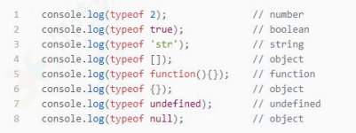
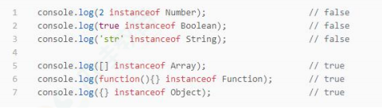
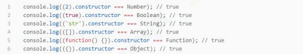
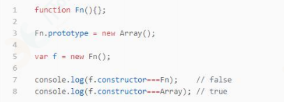
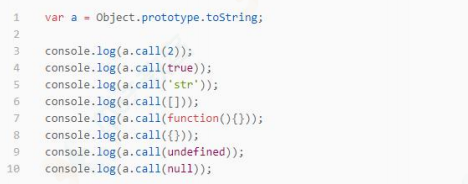

<!-- START doctoc generated TOC please keep comment here to allow auto update -->
<!-- DON'T EDIT THIS SECTION, INSTEAD RE-RUN doctoc TO UPDATE -->

**Table of Contents** _generated with [DocToc](https://github.com/thlorenz/doctoc)_

- [JavaScript 有哪些数据类型，它们的区别？](#javascript-%E6%9C%89%E5%93%AA%E4%BA%9B%E6%95%B0%E6%8D%AE%E7%B1%BB%E5%9E%8B%E5%AE%83%E4%BB%AC%E7%9A%84%E5%8C%BA%E5%88%AB)
- [数据类型检测的方式有哪些？](#%E6%95%B0%E6%8D%AE%E7%B1%BB%E5%9E%8B%E6%A3%80%E6%B5%8B%E7%9A%84%E6%96%B9%E5%BC%8F%E6%9C%89%E5%93%AA%E4%BA%9B)
- [intanceof 操作符的实现原理及实现](#intanceof-%E6%93%8D%E4%BD%9C%E7%AC%A6%E7%9A%84%E5%AE%9E%E7%8E%B0%E5%8E%9F%E7%90%86%E5%8F%8A%E5%AE%9E%E7%8E%B0)
- [什么情况下会发生布尔值的隐式强制类型转换](#%E4%BB%80%E4%B9%88%E6%83%85%E5%86%B5%E4%B8%8B%E4%BC%9A%E5%8F%91%E7%94%9F%E5%B8%83%E5%B0%94%E5%80%BC%E7%9A%84%E9%9A%90%E5%BC%8F%E5%BC%BA%E5%88%B6%E7%B1%BB%E5%9E%8B%E8%BD%AC%E6%8D%A2)
- [字符的转换规则](#%E5%AD%97%E7%AC%A6%E7%9A%84%E8%BD%AC%E6%8D%A2%E8%A7%84%E5%88%99)
- [数值的转换规则](#%E6%95%B0%E5%80%BC%E7%9A%84%E8%BD%AC%E6%8D%A2%E8%A7%84%E5%88%99)
- [布尔的转换规则](#%E5%B8%83%E5%B0%94%E7%9A%84%E8%BD%AC%E6%8D%A2%E8%A7%84%E5%88%99)
- [{} 和 [] 的 valueOf 和 toString 的结果是什么](#-%E5%92%8C--%E7%9A%84-valueof-%E5%92%8C-tostring-%E7%9A%84%E7%BB%93%E6%9E%9C%E6%98%AF%E4%BB%80%E4%B9%88)

<!-- END doctoc generated TOC please keep comment here to allow auto update -->

## JavaScript 有哪些数据类型，它们的区别？

JavaScript 共有八种数据类型，分别是 Undefined、Null、Boolean、
Number、String、Object、Symbol、BigInt。

其中 Symbol 和 BigInt 是 ES6 中新增的数据类型：

- Symbol 代表创建后独一无二且不可变的数据类型，它主要是为了
  解决可能出现的全局变量冲突的问题。

- BigInt 是一种数字类型的数据，它可以表示任意精度格式的整数，
  使用 BigInt 可以安全地存储和操作大整数，即使这个数已经超出了
  Number 能够表示的安全整数范围。

这些数据可以分为原始数据类型和引用数据类型：

- 栈：原始数据类型（Undefined、Null、Boolean、Number、String）
- 堆：引用数据类型（对象、数组、函数等）

两种类型的区别在于存储位置的不同：

- 原始数据类型直接存储在栈（stack）中的简单数据段，占据空间
  小、大小固定，属于被频繁使用数据，所以放入栈中存储；

- 引用数据类型存储在堆（heap）中的对象，占据空间大、大小不固定。如果存储在栈中，将会影响程序运行的性能；**引用数据类型在栈中存储了指针，该指针指向堆中该实体的起始地址。当解释器寻找引用值时，会首先检索其在栈中的地址，取得地址后从堆中获得实体。**

堆和栈的概念存在于数据结构和操作系统内存中，在数据结构中：

- 在数据结构中，栈中数据的存取方式为先进后出。
- 堆是一个优先队列，是按优先级来进行排序的，优先级可以按照大
  小来规定。

在操作系统中，内存被分为栈区和堆区：

- 栈区内存由编译器自动分配释放，存放函数的参数值，局部变量的
  值等。其操作方式类似于数据结构中的栈。
- 堆区内存一般由开发着分配释放，若开发者不释放，程序结束时可
  能由垃圾回收机制回收。

## 数据类型检测的方式有哪些？

- typeof
  可以判断基础数据类型，无法判断引用类型（其中数组、对象、null 都会被判断为 object）

  

- instanceof
  instanceof 操作符用于检测构造函数的 prototype 属性是否出现在某个实例对象的原型链上，返回布尔值。instanceof 只能正确判断引用数据类型，而不能判断基本数据类型。

  

- constructor
  constructor 有两个作用，一是判断数据的类型，二是对象实例通过 constrcutor 对象访问它的构造函数。
  

  需要注意，如果创建一个对象来改变它的原型，constructor 就不能用来判断数据类型了

  

- Object.prototype.toString.call()
  Object.prototype.toString.call() 使用 Object 对象的原型方法 toString 来判断数据类型：
  

  同样是检测对象 obj 调用 toString 方法，obj.toString()的结果和 Object.prototype.toString.call(obj)的结果不一样，这是为什么？

  这是因为 toString 是 Object 的原型方法，而数组函数等类
  型作为 Object 的实例，都重写了 toString 方法。不同的对象类型调
  用 toString 方法时，根据原型链的知识，调用的是对应的重写之后的 toString 方法（function 类型返回内容为函数体的字符串，array
  类型返回元素组成的字符串…），而不会去调用 Object 上原型
  toString 方法（返回对象的具体类型），所以采用 obj.toString()
  不能得到其对象类型，只能将 obj 转换为字符串类型；因此，在想要
  得到对象的具体类型时，应该调用 Object 原型上的 toString 方法。

  **注意**： ES6 中可以使用 Symbol.toStringTag 属性来重新定义对象的默认字符串表示的

  ```
    // ES6版本
    const toString = Object.prototype.toString;
    Reflect.setPrototypeOf(Object.prototype, null); // 将原型链断开连接
    Object.defineProperties(Object.prototype, {
      [Symbol.toStringTag]: {
          get() {
              const constructorName = this.__proto__ && this.__proto__.constructor ? this.__proto__.constructor.name : '';
              if (typeof constructorName === 'string') {
                  return `Object (${constructorName})`;
              } else {
                  return '[object Object]';
              }
          },
      },
      toString: {
          value: function() {
              return `${this}`;
          },
      },
    });

    Object.prototype.toString.call(2)

    // 原输出"[object Number]"
    // 改写后'2'
  ```

## intanceof 操作符的实现原理及实现

instanceof 操作符用于检测构造函数的 prototype 属性是否出现在某个实例对象的原型链上，返回布尔值

如果 a instanceof B ，那么 a 必须要是个对象，而 B 必须是一个合法的函数。在这两个条件都满足的情况下：判断 B 的 prototype 属性指向的原型对象（ B.prototype ）是否在对象 a 的原型链上。如果在，则返回 true；如果不在，则返回 false。简而言之， instanceof 的原理其实就是一个查找原型链的过程。

```js
// 构造函数right的原型是否出现在实例left的原型链上
function _instanceof(left, right) {
  if (typeof left !== "object") return false;
  if (typeof right !== "function") return false;

  const proto_r = right.prototype;
  let proto_l = Object.getPrototypeOf(left);

  while (true) {
    if (!proto_l) return false;
    if (proto_l === proto_r) return true;
    proto_l = Object.getPrototypeOf(proto_l);
  }
}
```

## 什么情况下会发生布尔值的隐式强制类型转换

1. if (..) 语句中的条件判断表达式。
2. for ( .. ; .. ; .. ) 语句中的条件判断表达式（第二个）。
3. while (..) 和 do..while(..) 循环中的条件判断表达式。
4. 三目运算中的条件判断表达式。
5. 逻辑运算符 ||（逻辑或）和 &&（逻辑与）左边的操作数（作为条件判断表达式）。

## 字符的转换规则

规范的 9.8 节中定义了抽象操作 ToString ，它负责处理非字符串到字符串的强制类型转换。

1. null 和 undefined 类型 ，null 转换为 "null"，undefined 转换为 "undefined"

2. Boolean 类型，true 转换为 "true"，false 转换为 "false"。

3. Number 类型的值直接转换，不过那些极小和极大的数字会使用指数形式。

4. Symbol 类型的值直接转换，Symbol('a') => "Symbol('a')", 但是只允许显式强制类型转换，使用隐式强制类型转换会产生错误。

5. 对普通对象来说，除非自行定义 `toString()` 方法，否则会调用 `Object.prototype.toString()`
   来返回内部属性 [[Class]] 的值，如"[object Object]"。如果对象有自己的 toString() 方法，字符串化时就会
   调用该方法并使用其返回值。

## 数值的转换规则

有时我们需要将非数字值当作数字来使用，比如数学运算。为此 ES5 规范在 9.3 节定义了抽象操作 ToNumber。

1. undefined 类型的值转换为 NaN。

2. null 类型的值转换为 0。

3. Boolean 类型的值，true 转换为 1，false 转换为 0。

4. String 类型的值转换如同使用 Number() 函数进行转换，如果包含非数字值则转换为 NaN，空字符串为 0。

5. Symbol 类型的值不能转换为数字，报错。

6. 对象（包括数组）会首先被转换为相应的基本类型值，如果返回的是非数字的基本类型值，则再遵循以上规则将其强制转换为数字。

为了将值转换为相应的基本类型值，抽象操作 ToPrimitive 会首先（通过内部操作 DefaultValue）检查该值是否有 valueOf() 方法。
如果有并且返回基本类型值，就使用该值进行强制类型转换。如果没有就使用 toString() 的返回值（如果存在）来进行强制类型转换。
如果 valueOf() 和 toString() 均不返回基本类型值，会产生 TypeError 错误。

## 布尔的转换规则

ES5 规范 9.2 节中定义了抽象操作 ToBoolean，列举了布尔强制类型转换所有可能出现的结果。
以下这些是假值：
• undefined
• null
• false
• +0、-0 和 NaN
• ""

假值的布尔强制类型转换结果为 false。从逻辑上说，假值列表以外的都应该是真值。

## {} 和 [] 的 valueOf 和 toString 的结果是什么

{} 的 valueOf 结果为 {} ，toString 的结果为 "[object Object]"

[] 的 valueOf 结果为 [] ，toString 的结果为 ""
