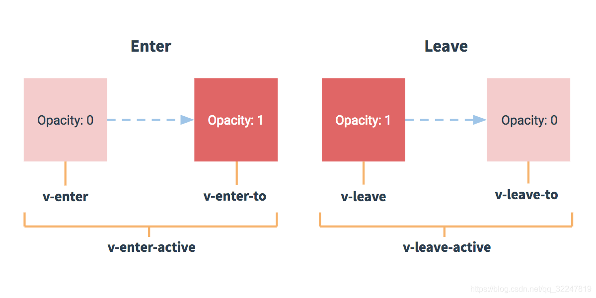

## 触发条件

Vue 提供了 transition 的封装组件，在下列情形中，可以给任何元素和组件添加进入/离开过渡：

1. 条件渲染 (使用 v-if)
2. 条件展示 (使用 v-show)
3. 动态组件
4. 组件根节点

## 触发原理


上图 6 个 class 的解读：
**v-enter**：定义进入过渡的开始状态。在元素被插入之前生效，在元素被插入之后的下一帧移除。
**v-enter-active**：定义进入过渡生效时的状态。在整个进入过渡的阶段中应用，在元素被插入之前生效，在过渡/动画完成之后移除。**这个类可以被用来定义进入过渡的过程时间，延迟和曲线函数**。
**v-enter-to**：2.1.8 版及以上定义进入过渡的结束状态。在元素被插入之后下一帧生效 (与此同时 v-enter 被移除)，在过渡/动画完成之后移除。
**v-leave**：定义离开过渡的开始状态。在离开过渡被触发时立刻生效，下一帧被移除。
**v-leave-active**：定义离开过渡生效时的状态。在整个离开过渡的阶段中应用，在离开过渡被触发时立刻生效，在过渡/动画完成之后移除。**这个类可以被用来定义离开过渡的过程时间，延迟和曲线函数**。
**v-leave-to**：2.1.8 版及以上定义离开过渡的结束状态。在离开过渡被触发之后下一帧生效 (与此同时 v-leave 被删除)，在过渡/动画完成之后移除。

让我们看看官网的例子

```css
/* 可以设置不同的进入和离开动画 */
/* 设置持续时间和动画函数 */
.slide-fade-enter-active {
  transition: all 0.3s ease;
}
.slide-fade-leave-active {
  transition: all 0.8s cubic-bezier(1, 0.5, 0.8, 1);
}
.slide-fade-enter, .slide-fade-leave-to
/* .slide-fade-leave-active for below version 2.1.8 */ {
  transform: translateX(10px);
  opacity: 0;
}
```

问题 1：为什么 Vue 过渡中 v-enter 和 v-leave-to 定义相同的状态？

> **.slide-fade-enter**定义了开始进入的状态，即以透明度 0，X 轴偏移 10px 的位置进入；
> **.slide-fade-leave-to**定义了离开结束的状态，即以透明度 0，X 轴偏移 10px 的位置离开。

问题 2：为什么只写了 4 个 class,不是有 6 个 class 吗？

> 从进入开始-> 过渡->进入结束，进入结束就是我们不进行过渡正常显示的效果，即**v-enter-to**的状态；
> 从离开开始->过渡->离开结束，离开开始也是我们正常显示的效果，即**v-leave**的状态；
> 所以**v-enter-to** 和**v-leave** 省略了状态的定义并不会影响过渡效果的流畅。

[Vue 官网](https://cn.vuejs.org/v2/guide/transitions.html)
