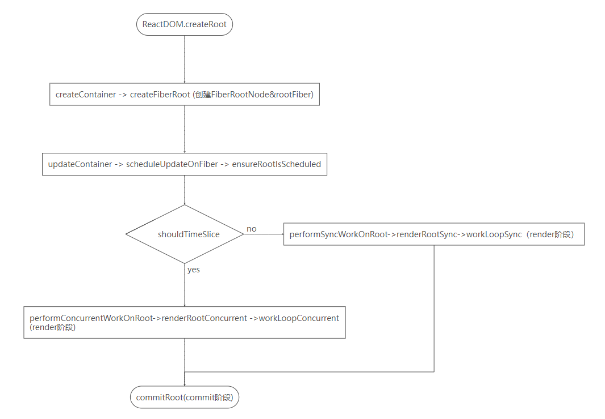
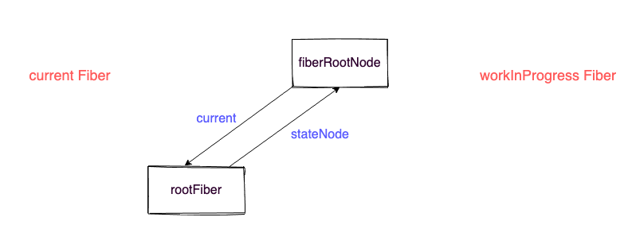
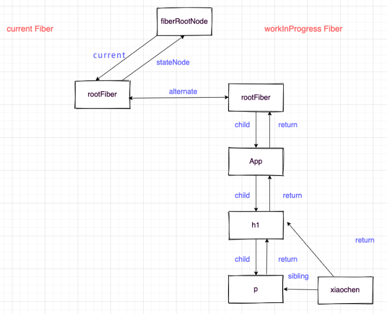
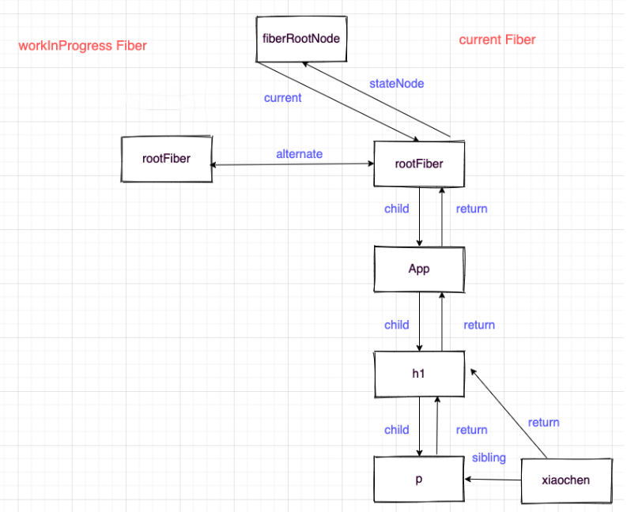
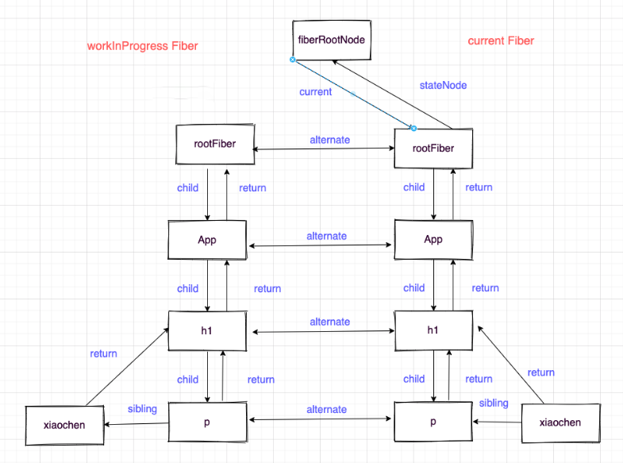
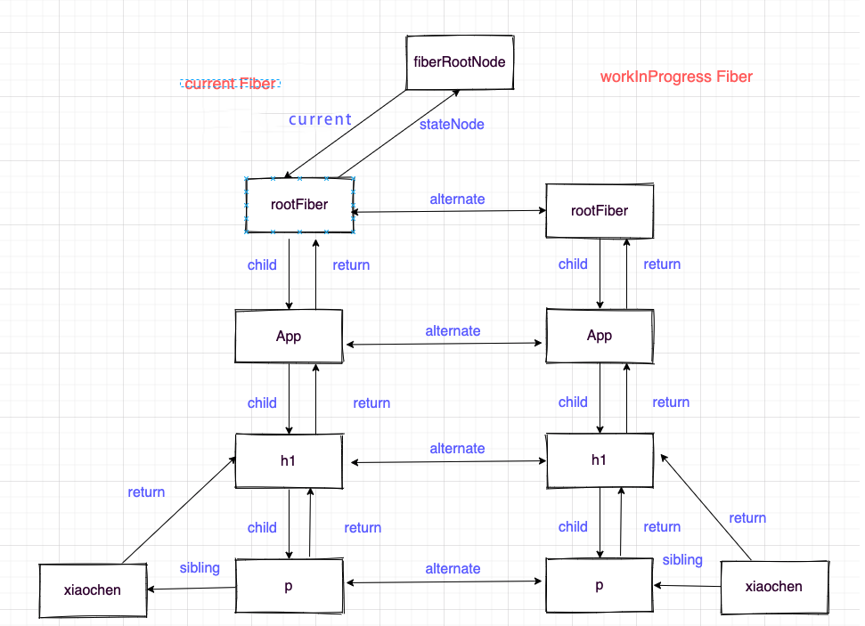

### Fiber 简介

React15 在 render 阶段的 reconcile 是不可打断的，这会在进行大量节点的 reconcile 时可能产生卡顿，因为浏览器所有的时间都交给了 js 执行，并且 js 的执行是单线程。

为此 React16 之后就有了 scheduler 进行时间片的调度，给每个 task（工作单元）一定的时间，如果在这个时间内没执行完，也要交出执行权给浏览器进行绘制和重排，所以**异步可中断的更新**需要一定的数据结构在内存中来保存工作单元的信息，这个数据结构就是 Fiber。

- **工作单元&任务分解** ：Fiber 最重要的功能就是作为工作单元，保存原生节点或者组件节点对应的信息（包括优先级），这些节点通过指针的形式组成 Fiber 树。
- **增量渲染**：通过 workInProgress Fiber 和 current Fiber 的对比，生成最小的差异补丁，应用到真实节点上。
- **优先级**：Fiber 节点上保存了优先级，能通过不同节点优先级的对比，实现任务的暂停、继续、排列等能力，也为上层实现批量更新、Suspense 提供了基础。
- **保存状态**：因为 Fiber 能保存状态和更新的信息，所以就能实现函数组件的状态更新，也就是 hooks。

### Fiber 的数据信息

```javascript
function FiberNode(tag, pendingProps, key, mode) {
  // Instance
  this.tag = tag; // 对应组件的类型HostComponent, LazyComponent, FunctionComponent, ClassComponent ...
  this.key = key; // 唯一的key属性var REACT_ELEMENT_TYPE = Symbol.for('react.element');
  this.elementType = null; // 元素类型reactComponent,div,p ...
  this.type = null; // 元素名称或组件名称
  this.stateNode = null; // Fiber 真是Dom

  // fiber架构 连接成fiber树
  this.return = null; // 指向父节点
  this.child = null; //指向child
  this.sibling = null; // 指向兄弟节点
  this.index = 0; // fiber下标-diff时
  this.ref = null;

  //用作为工作单元 来计算state
  this.pendingProps = pendingProps;
  this.memoizedProps = null; // 保存props
  this.updateQueue = null; // 更新队列
  this.memoizedState = null; // hooks链表
  this.dependencies = null; // 依赖
  this.mode = mode; // Effects

  // 操作标记
  this.flags = NoFlags; // NoFlags：0，Placement：2，ChildDeletion： 16
  this.subtreeFlags = NoFlags; // 0
  this.deletions = null;

  //优先级相关的属性
  this.lanes = NoLanes; // 0
  this.childLanes = NoLanes; // 0

  //current和workInProgress的指针
  this.alternate = null;
}
```

### Fiber 双缓存链表结构

在 React 中最多会同时存在两棵 Fiber 树。
当前屏幕上显示内容对应的 Fiber 树称为`current Fiber` 树，正在内存中构建的 Fiber 树称为`workInProgress Fiber`树。，他们通过`alternate`属性连接。

fiber 树切换代码

```javascript
currentFiber.alternate === workInProgressFiber;
workInProgressFiber.alternate === currentFiber;
```

- React 应用的根节点通过 current 指针在不同 Fiber 树的 rootFiber 间切换来实现 Fiber 树的切换。
- 当 workInProgress Fiber 树构建完成交给 Renderer 渲染在页面上后，应用根节点的 current 指针指向 workInProgress Fiber 树，此时 workInProgress Fiber 树就变为 current Fiber 树。
- 每次状态更新都会产生新的 workInProgress Fiber 树，通过 current 与 workInProgress 的替换，完成 DOM 更新。

### Fiber 在 mount 和 update 时的构建与替换流程

```javascript
function App() {
  return (
    <h1>
      <p>Hello, world</p>
    </h1>
  );
}
const root = ReactDOM.createRoot(document.getElementById("root"));
root.render(<App />);
```

**调用流程说明**


首次执行 `ReactDOM.createRoot` 会创建 `FiberRootNode` 和 `rootFiber`。其中 `FiberRootNode` 是整个应用的根节点，`rootFiber` 是`<App/>`所在组件树的根节点。

在应用中我们可以多次调用 `ReactDOM.createRoot` 渲染不同的组件树，他们会拥有不同的 `rootFiber`。但是整个应用的根节点只有一个，那就是 `FiberRootNode`

```javascript
function createRoot(container, options) {
  var isStrictMode = false;
  var concurrentUpdatesByDefaultOverride = false;
  var identifierPrefix = "";
  var onRecoverableError = defaultOnRecoverableError;
  var transitionCallbacks = null;

  if (options !== null && options !== undefined) {
    // options 参数处理
  }
  // createContainer 调用createFiberRoot创建Fiber的根节点FiberRootNode和组件根节点rootFiber
  var root = createContainer(
    container,
    ConcurrentRoot,
    null,
    isStrictMode,
    concurrentUpdatesByDefaultOverride,
    identifierPrefix,
    onRecoverableError
  );
  markContainerAsRoot(root.current, container);
  var rootContainerElement = container.nodeType === COMMENT_NODE ? container.parentNode : container;
  // 代理事件监听
  listenToAllSupportedEvents(rootContainerElement);
  return new ReactDOMRoot(root);
}
```

`createContainer` 调用 `createFiberRoot` 创建 `Fiber` 的根节点 `FiberRootNode` 和组件根节点 `rootFiber`

```javascript
function createContainer(
  containerInfo,
  tag,
  hydrationCallbacks,
  isStrictMode,
  concurrentUpdatesByDefaultOverride,
  identifierPrefix,
  onRecoverableError,
  transitionCallbacks
) {
  var hydrate = false;
  var initialChildren = null;
  return createFiberRoot(
    containerInfo,
    tag,
    hydrate,
    initialChildren,
    hydrationCallbacks,
    isStrictMode,
    concurrentUpdatesByDefaultOverride,
    identifierPrefix,
    onRecoverableError
  );
}
function createFiberRoot(
  containerInfo,
  tag,
  hydrate,
  initialChildren,
  hydrationCallbacks,
  isStrictMode,
  concurrentUpdatesByDefaultOverride,
  identifierPrefix,
  onRecoverableError,
  transitionCallbacks
) {
  // 创建FiberRootNode
  var root = new FiberRootNode(containerInfo, tag, hydrate, identifierPrefix, onRecoverableError);
  // 创建rootFiber, createHostRootFiber->createFiber
  var uninitializedFiber = createHostRootFiber(tag, isStrictMode);
  root.current = uninitializedFiber;
  uninitializedFiber.stateNode = root;

  // 为<App>的组件rootFiber添加更新队列updateQueue
  initializeUpdateQueue(uninitializedFiber);
  return root;
}
// initializeUpdateQueue
function initializeUpdateQueue(fiber) {
  var queue = {
    baseState: fiber.memoizedState,
    firstBaseUpdate: null,
    lastBaseUpdate: null,
    shared: {
      pending: null,
      interleaved: null,
      lanes: NoLanes,
    },
    effects: null,
  };
  fiber.updateQueue = queue;
}
```

`ReactDOMRoot` 原型上绑定 render 函数, 用于渲染根组件 `root.render(<App />);`, `root.render` 最终调用 `updateContainer` 函数

```javascript
function ReactDOMRoot(internalRoot) {
  this._internalRoot = internalRoot;
}

ReactDOMHydrationRoot.prototype.render = ReactDOMRoot.prototype.render = function (children) {
  var root = this._internalRoot;
  // ....
  updateContainer(children, root, null, null);
};

// updateContainer
function updateContainer(element, container, parentComponent, callback) {
  {
    onScheduleRoot(container, element);
  }
  var current$1 = container.current;
  var eventTime = requestEventTime();
  var lane = requestUpdateLane(current$1);
  {
    markRenderScheduled(lane);
  }
  // ...
  var update = createUpdate(eventTime, lane); // 根据事件事件和优先级创建更新
  var root = enqueueUpdate(current$1, update, lane); // update 入队

  if (root !== null) {
    //  调度更新，root:FiberRootNode, current$1:rootFiber, lane:优先级
    // 进入render阶段-> scheduleUpdateOnFiber -> ensureRootIsScheduled -> performSyncWorkOnRoot
    scheduleUpdateOnFiber(root, current$1, lane, eventTime);
    entangleTransitions(root, current$1, lane); // 优先级合并
  }

  return lane;
}
```

**调用流程图解**


#### mount 阶段

由于是首屏渲染，页面中还没有任何 DOM。所以 rootFiber.child === null，即 current Fiber 树为空。

#### render 阶段

接下来进入 render 阶段,在内存中依次创建 workInProgress fiber 并连接在一起构建 workInProgress Fiber 树


#### commit 阶段

图中右侧已构建完的 workInProgress Fiber 树在 commit 阶段渲染到页面。此时 DOM 更新为右侧树对应的样子。
rootFiberNode 的 current 指针指向 workInProgress Fiber 树使其变为 current Fiber 树


#### update 阶段

当状态发生改变，这会开启一次新的 **render 阶段**并构建一棵 workInProgress Fiber 树。其中很多 workInProgress fiber 的创建可以复用 current Fiber 树对应的节点数据（取决于 diff 算法）



workInProgress Fiber 树在 render 阶段完成构建后进入**commit 阶段**渲染到页面上。渲染完毕后，workInProgress Fiber 树变为 current Fiber 树。


总结：
当状态改变更新时，会触发重新渲染，再次走一遍 render 阶段和 commit 阶段，复用 current Fiber 树中的节点数据，减少新创建节点的开销，提升性能。

[render 阶段如何生成双向链表？](https://blog.csdn.net/qq_32247819/article/details/128755344)
