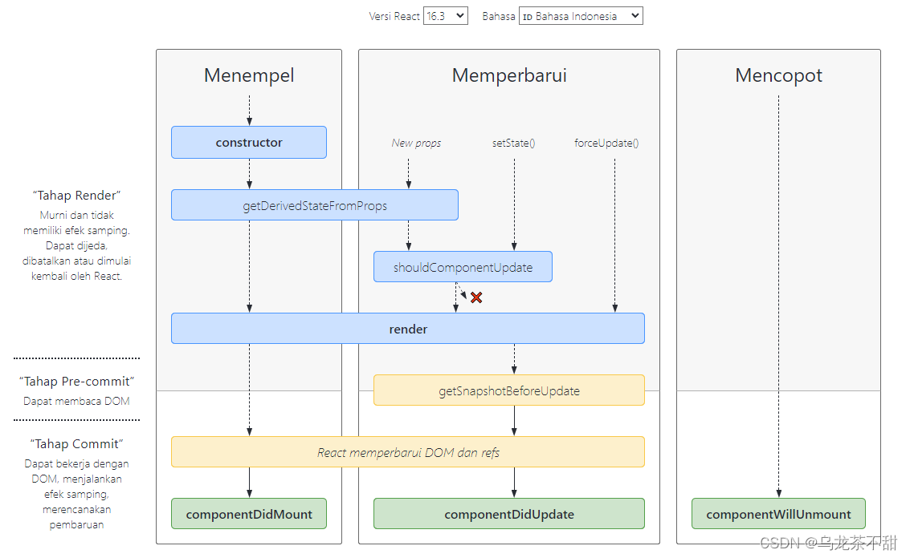
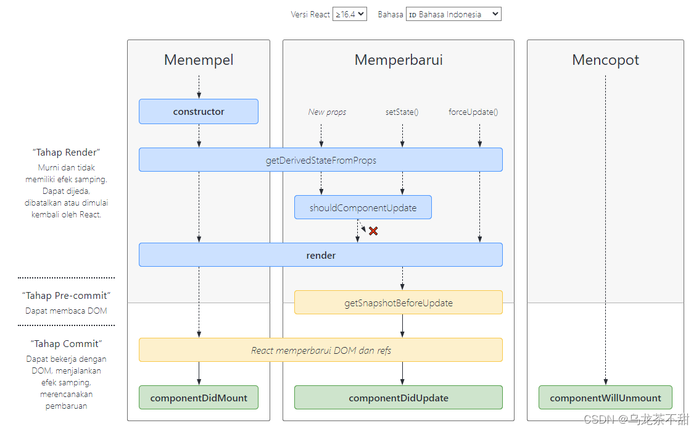

1. 挂载阶段

   - constructor
   - getDerivedStateFromProps(nextProps, prevState)

   > **Returns an update to a component's state based on its new props and old state.**

   ```javascript
   // nextProps: 待更新的props, prevState: 更新前的state（this.state）
   static getDerivedStateFromProps(nextProps, prevState) {
       const {
         location: { pathname }
       } = nextProps;
       const { currentPathname } = prevState;
       if (currentPathname !== pathname) {
         return { ...prevState, currentPathname: pathname };
       }
       return null;
     }
   ```

   - render
   - componentDidMount

   > **Called immediately after a component is mounted. Setting state here will trigger re-rendering.**

2. 更新阶段

   - getDerivedStateFromProps(nextProps, prevState) 同上
   - shouldComponentUpdate(nextProps, nextState)

   > **Called to determine whether the change in props and state should trigger a re-render.** 1.`Component` always returns true. 2.`PureComponent` implements a shallow comparison on props and state and returns true if any props or states have changed. 3. If false is returned, `Component#render`, `componentWillUpdate` and `componentDidUpdate` will not be called.

   ```javascript
   // nextProps：待更新的props, nextState: 待更新的state
   shouldComponentUpdate(nextProps, nextState) {
       if (this.props.name !== nextProps.name) {   //判断name是否改变
         return true;
       }
       if (this.state.age !== nextState.age) {   //判断age是否改变
         return true;
       }
       return false;    //如果两个都不改变，则不重新渲染
     }
   ```

   - render
   - getSnapshotBeforeUpdate(preProps, preState)

   > **Runs before React applies the result of `render` to the document, and returns an object to be given to componentDidUpdate. Useful for saving things such as scroll position before `render` causes changes to it.**

   - componentDidUpdate(preProps, preState, snapshot)

   > **Called immediately after updating occurs. Not called for the initial render.
   > The snapshot is only present if getSnapshotBeforeUpdate is present and returns non-null.**

3. 卸载阶段

   - componentWillUnmount

   > **Called immediately before a component is destroyed. Perform any necessary cleanup in this method, such as cancelled network requests, or cleaning up any DOM elements created in `componentDidMount`.**

[react 生命周期](https://projects.wojtekmaj.pl/react-lifecycle-methods-diagram/)
