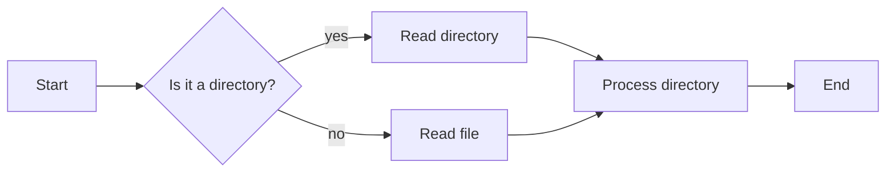

## 启用 markdown 绘图块

mermaid 关键字来开启绘图块

## 1.流程图

```js
graph LR
A[Start] --> B{Is it a directory?}
B -->|yes| C[Read directory]
B -->|no| D[Read file]
C --> E[Process directory]
D --> E
E --> F[End]
```


