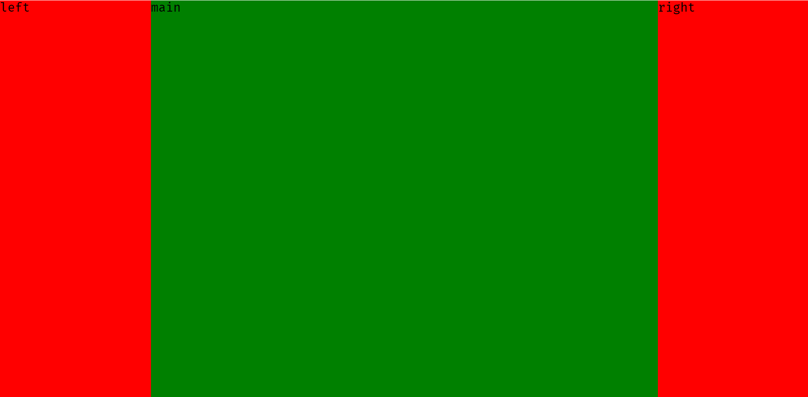

<!-- START doctoc generated TOC please keep comment here to allow auto update -->
<!-- DON'T EDIT THIS SECTION, INSTEAD RE-RUN doctoc TO UPDATE -->

- [实现左右栏宽度各为 300px，中间自适应](#%E5%AE%9E%E7%8E%B0%E5%B7%A6%E5%8F%B3%E6%A0%8F%E5%AE%BD%E5%BA%A6%E5%90%84%E4%B8%BA-300px%E4%B8%AD%E9%97%B4%E8%87%AA%E9%80%82%E5%BA%94)
  - [浮动](#%E6%B5%AE%E5%8A%A8)
  - [绝对定位](#%E7%BB%9D%E5%AF%B9%E5%AE%9A%E4%BD%8D)
  - [弹性盒子布局](#%E5%BC%B9%E6%80%A7%E7%9B%92%E5%AD%90%E5%B8%83%E5%B1%80)
  - [表格布局](#%E8%A1%A8%E6%A0%BC%E5%B8%83%E5%B1%80)
  - [网格布局](#%E7%BD%91%E6%A0%BC%E5%B8%83%E5%B1%80)

<!-- END doctoc generated TOC please keep comment here to allow auto update -->

## 实现左右栏宽度各为 300px，中间自适应

​


### 浮动

float 主要为了实现图文环绕的效果；因为 float 具有不完全脱离文档流的特性，虽然脱离了文档流但是仍然会保留文字的占用空间；

**float 会导致容器高度塌陷**，因为在计算容器高度时会忽略浮动元素；
**float 会为元素添加块级域**，当给行内元素添加浮动就可以给行内元素设置宽/高属性。

```html
<div class="container">
  <div class="left"></div>
  <div class="right"></div>
  <div class="mid">
    <h1>浮动解决方案</h1>
    right浮动最右边,将中间的块挤到中间,中间的块会自动适应宽度
  </div>
</div>
<style>
  .left {
    float: left;
    width: 300px;
    height: 150px;
    background: red;
  }
  .right {
    float: right;
    width: 300px;
    height: 150px;
    background: red;
  }
  .mid {
    height: 150px;
    overflow: auto; /*加这句自适应宽度，不加的话宽度100%*/
  }
</style>
```

### 绝对定位

完全脱离文档流

```html
<div class="container2">
  <div class="left2"></div>
  <div class="mid2">
    <h1>定位解决方案</h1>
    布局最简单,但是脱离文档流
  </div>
  <div class="right2"></div>
</div>
<style>
  .container2 {
    position: relative;
  }
  .left2 {
    position: absolute;
    top: 0;
    left: 0;
    width: 300px;
    height: 150px;
    background: red;
  }
  .right2 {
    position: absolute;
    top: 0;
    right: 0;
    width: 300px;
    height: 150px;
    background: red;
  }
  .mid2 {
    height: 150px;
    padding: 0 300px;
  }
</style>
```

### 弹性盒子布局

`display: flex;`

```html
<div class="container3">
  <div class="left3"></div>
  <div class="mid3">
    <h1>弹性盒子解决方案</h1>
  </div>
  <div class="right3"></div>
</div>
<style>
  .container3 {
    display: flex;
  }
  .left3,
  .right3 {
    width: 300px;
    height: 150px;
    background: red;
  }
  .mid3 {
    flex: 1;
    height: 150px;
  }
</style>
```

### 表格布局

`display: table;` 和` display: table-cell;`

```html
<div class="container4">
  <div class="left4"></div>
  <div class="mid4">
    <h1>表格布局解决方案</h1>
  </div>
  <div class="right4"></div>
</div>
<style>
  .container4 {
    width: 100%;
    display: table;
  }
  .left4,
  .right4 {
    display: table-cell;
    width: 300px;
    height: 150px;
    background: red;
  }
  .mid4 {
    display: table-cell;
  }
</style>
```

### 网格布局

`display: grid;` 和 ` grid-template-columns`

```html
<div class="container5">
  <div class="left5"></div>
  <div class="mid5">
    <h1>网格布局解决方案</h1>
  </div>
  <div class="right5"></div>
</div>
<style>
  .container5 {
    display: grid;
    grid-template-columns: 300px auto 300px;
    grid-template-rows: 150px;
  }
  .right5,
  .left5 {
    background: red;
  }
</style>
```

​
