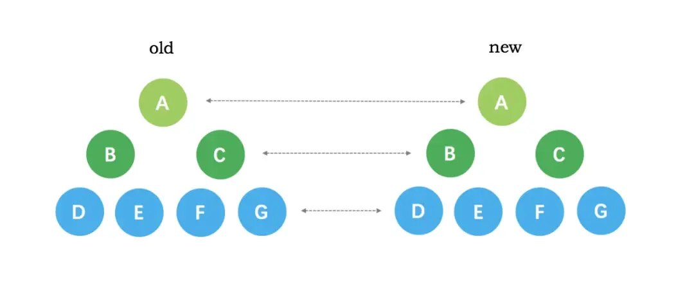
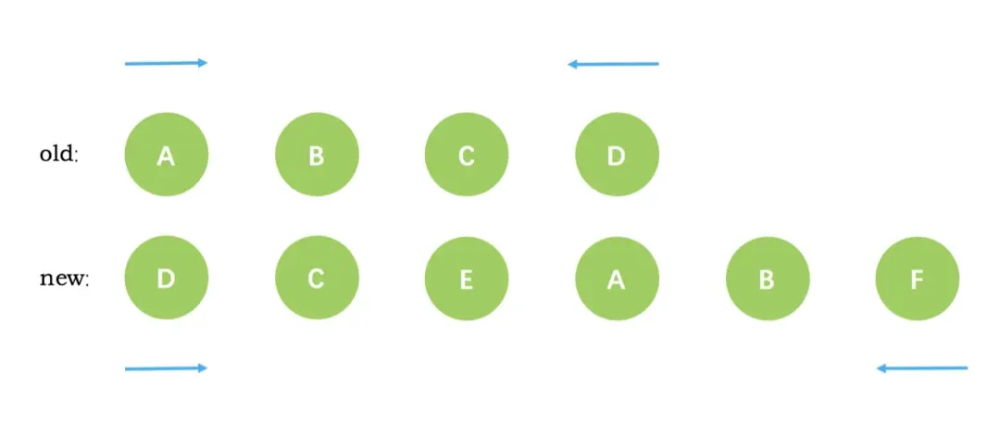
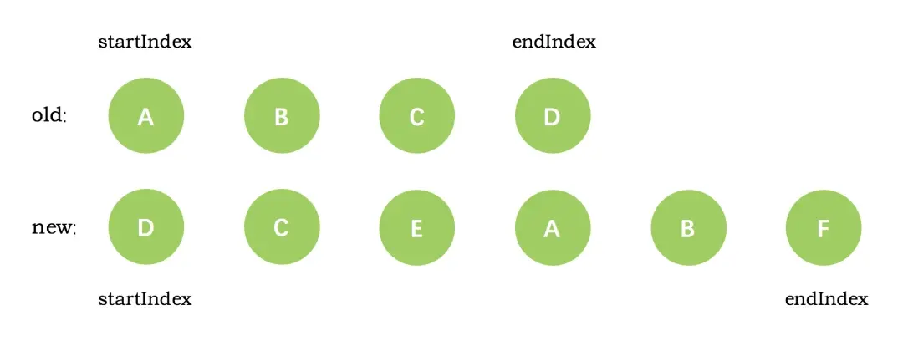
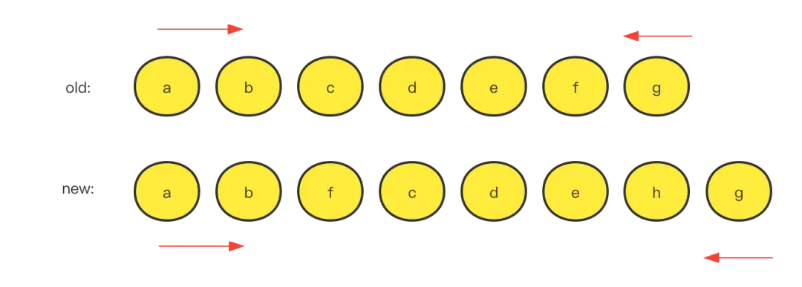
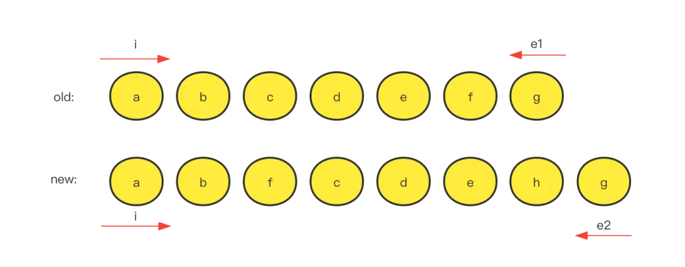
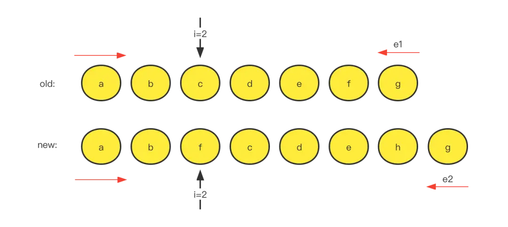
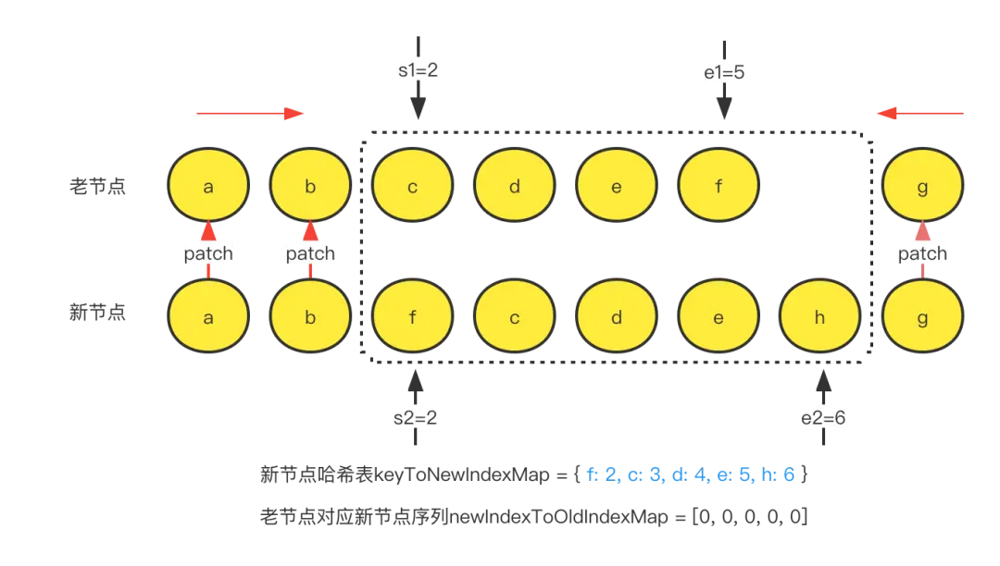
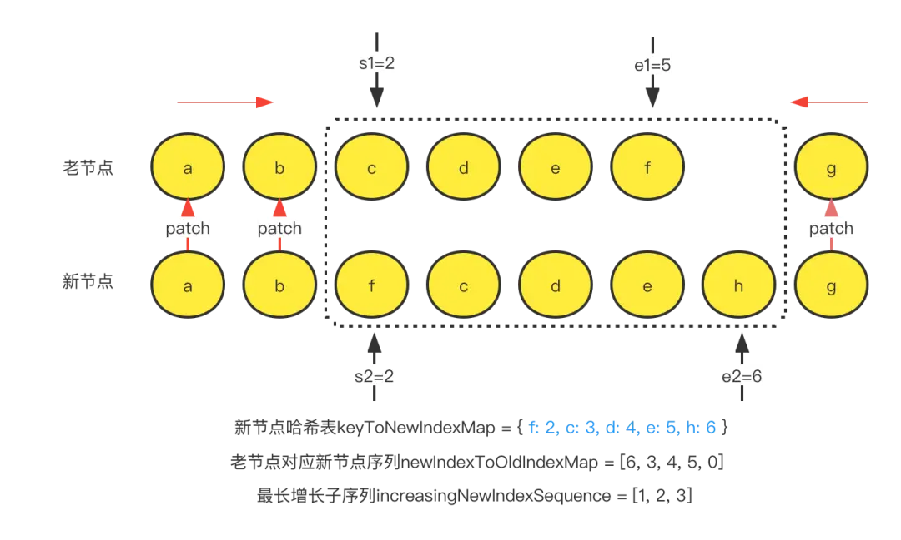

<!-- START doctoc generated TOC please keep comment here to allow auto update -->
<!-- DON'T EDIT THIS SECTION, INSTEAD RE-RUN doctoc TO UPDATE -->
**Table of Contents**  *generated with [DocToc](https://github.com/thlorenz/doctoc)*

- [Vue2、Vue3 的 diff 对比](#vue2vue3-%E7%9A%84-diff-%E5%AF%B9%E6%AF%94)
  - [前言](#%E5%89%8D%E8%A8%80)
  - [Vue2 的 diff 算法核心](#vue2-%E7%9A%84-diff-%E7%AE%97%E6%B3%95%E6%A0%B8%E5%BF%83)
    - [基本原理](#%E5%9F%BA%E6%9C%AC%E5%8E%9F%E7%90%86)
    - [diff 流程](#diff-%E6%B5%81%E7%A8%8B)
      - [第一步：初始化](#%E7%AC%AC%E4%B8%80%E6%AD%A5%E5%88%9D%E5%A7%8B%E5%8C%96)
      - [第二步：循环遍历节点](#%E7%AC%AC%E4%BA%8C%E6%AD%A5%E5%BE%AA%E7%8E%AF%E9%81%8D%E5%8E%86%E8%8A%82%E7%82%B9)
      - [第三步：新增或删除节点](#%E7%AC%AC%E4%B8%89%E6%AD%A5%E6%96%B0%E5%A2%9E%E6%88%96%E5%88%A0%E9%99%A4%E8%8A%82%E7%82%B9)
  - [Vue3 的 diff 算法核心](#vue3-%E7%9A%84-diff-%E7%AE%97%E6%B3%95%E6%A0%B8%E5%BF%83)
    - [基本原理](#%E5%9F%BA%E6%9C%AC%E5%8E%9F%E7%90%86-1)
    - [diff 流程](#diff-%E6%B5%81%E7%A8%8B-1)
    - [第一步：初始化](#%E7%AC%AC%E4%B8%80%E6%AD%A5%E5%88%9D%E5%A7%8B%E5%8C%96-1)
    - [第二步：头部节点开始对比](#%E7%AC%AC%E4%BA%8C%E6%AD%A5%E5%A4%B4%E9%83%A8%E8%8A%82%E7%82%B9%E5%BC%80%E5%A7%8B%E5%AF%B9%E6%AF%94)
    - [第三步：尾部节点开始对比](#%E7%AC%AC%E4%B8%89%E6%AD%A5%E5%B0%BE%E9%83%A8%E8%8A%82%E7%82%B9%E5%BC%80%E5%A7%8B%E5%AF%B9%E6%AF%94)
    - [第四步：剩余节点对比](#%E7%AC%AC%E5%9B%9B%E6%AD%A5%E5%89%A9%E4%BD%99%E8%8A%82%E7%82%B9%E5%AF%B9%E6%AF%94)
  - [diff 差别总结](#diff-%E5%B7%AE%E5%88%AB%E6%80%BB%E7%BB%93)

<!-- END doctoc generated TOC please keep comment here to allow auto update -->

# Vue2、Vue3 的 diff 对比

## 前言

diff 算法是一种通过同层的树节点进行比较的高效算法，避免了对树进行逐层搜索遍历，所以时间复杂度只有 O(n)。diff 算法的在很多场景下都有应用，例如在 vue 虚拟 dom 渲染成真实 dom 的新旧 VNode 节点比较更新时，就用到了该算法。

diff 算法有两个比较显著的特点：比较只会在同层级进行, 不会跨层级比较。


比较的过程中，循环从两边向中间靠拢。


## Vue2 的 diff 算法核心

### 基本原理

新老节点头尾对比（头与头对比、尾与尾对比、头尾对比）,寻找未移动的节点。

新老节点头尾对比完后，进行交叉对比（头与尾、尾与头对比），这一步即寻找移动后可复用的节点。

在剩余新老结点中对比寻找可复用节点。创建一个老节点 keyToIndex 的哈希表 map 记录 key，然后继续遍历新节点索引通过 key 查找可以复用的旧的节点。节点遍历完成后，通过新老索引，进行移除多余老节点或者增加新节点的操作。

### diff 流程

[updateChildren 源码](https://github.com/vuejs/vue/blob/v2.6.11/src/core/vdom/patch.js#L404)

#### 第一步：初始化

```js
let oldStartIdx = 0; // 老vnode遍历的开始下标
let newStartIdx = 0; // 新vnode遍历的开始下标
let oldEndIdx = oldCh.length - 1; // 老vnode 列表长度
let oldStartVnode = oldCh[0]; // 老vnode列表第一个子元素
let oldEndVnode = oldCh[oldEndIdx]; // 老vnode列表最后一个子元素
let newEndIdx = newCh.length - 1; // 新vnode列表长度
let newStartVnode = newCh[0]; // 新vnode列表第一个子元素
let newEndVnode = newCh[newEndIdx]; // 新vnode列表最后一个子元素
```

经过第一步之后，我们初始的新旧节点 VNode 节点如下图所示：


#### 第二步：循环遍历节点

循环过程中首先对新老 VNode 节点的头尾进行比较，寻找相同节点，如果有相同节点满足 sameVnode（可以复用的相同节点） 则直接进行 patchVnode (该方法进行节点复用处理)，并且根据具体情形，移动新老节点的 VNode 索引，以便进入下一次循环处理，一共有 2 \* 2 = 4 种情形。

```JS
function sameVnode (a, b) {
  return (
    a.key === b.key && (
      (
        a.tag === b.tag &&
        a.isComment === b.isComment &&
        isDef(a.data) === isDef(b.data) &&
        sameInputType(a, b)
      ) || (
        isTrue(a.isAsyncPlaceholder) &&
        a.asyncFactory === b.asyncFactory &&
        isUndef(b.asyncFactory.error)
      )
    )
  )
}
```

- 头与头相同
  当新老 VNode 节点的 start 满足 sameVnode 时，直接 patchVnode 即可，同时新老 VNode 节点的开始索引都加 1。

  ```js
  if (sameVnode(oldStartVnode, newStartVnode)) {
    patchVnode(oldStartVnode, newStartVnode, insertedVnodeQueue, newCh, newStartIdx);
    oldStartVnode = oldCh[++oldStartIdx];
    newStartVnode = newCh[++newStartIdx];
  }
  ```

- 尾与尾相同
  当新老 VNode 节点的 end 满足 sameVnode 时，同样直接 patchVnode 即可，同时新老 VNode 节点的结束索引都减 1。

  ```js
  else if (sameVnode(oldEndVnode, newEndVnode)) {
    patchVnode(oldEndVnode, newEndVnode, insertedVnodeQueue, newCh, newEndIdx)
    oldEndVnode = oldCh[--oldEndIdx]
    newEndVnode = newCh[--newEndIdx]
  }
  ```

- 头与尾相同
  当老 VNode 节点的 start 和新 VNode 节点的 end 满足 sameVnode 时，这说明这次数据更新后 oldStartVnode 已经跑到了 oldEndVnode 后面去了。这时候在 patchVnode 后，还需要将当前真实 dom 节点移动到 oldEndVnode 的后面，同时老 VNode 节点开始索引加 1，新 VNode 节点的结束索引减 1。

  ```js
  else if (sameVnode(oldStartVnode, newEndVnode)) { // Vnode moved right
  patchVnode(oldStartVnode, newEndVnode, insertedVnodeQueue, newCh, newEndIdx)
  canMove && nodeOps.insertBefore(parentElm, oldStartVnode.elm, nodeOps.nextSibling(oldEndVnode.elm))
  oldStartVnode = oldCh[++oldStartIdx]
  newEndVnode = newCh[--newEndIdx]
  }
  ```

- 尾与头相同
  当老 VNode 节点的 end 和新 VNode 节点的 start 满足 sameVnode 时，这说明这次数据更新后 oldEndVnode 跑到了 oldStartVnode 的前面去了。这时候在 patchVnode 后，还需要将当前真实 dom 节点移动到 oldStartVnode 的前面，同时老 VNode 节点结束索引减 1，新 VNode 节点的开始索引加 1。

  ```js
  else if (sameVnode(oldEndVnode, newStartVnode)) {  // Vnode moved left
  patchVnode(oldEndVnode, newStartVnode, insertedVnodeQueue, newCh, newStartIdx);
  canMove && nodeOps.insertBefore(parentElm, oldEndVnode.elm, oldStartVnode.elm);
  oldEndVnode = oldCh[--oldEndIdx];
  newStartVnode = newCh[++newStartIdx];
  }
  ```

- 都不满足
  通过查找事先建立好的以旧的 VNode 为 key 值，对应 index 序列为 value 值的哈希表。从这个哈希表中找到与 newStartVnode 一致 key 的旧的 VNode 节点，如果两者满足 sameVnode 的条件，在进行 patchVnode 的同时会将这个真实 dom 移动到 oldStartVnode 对应的真实 dom 的前面；如果没有找到，则说明当前索引下的新的 VNode 节点在旧的 VNode 队列中不存在，无法进行节点的复用，那么就只能调用 createElm 创建一个新的 dom 节点放到当前 newStartIdx 的位置。
  ```js
  else {
  // 创建一个 { key: oldVnode } 的映射表
  if (isUndef(oldKeyToIdx)) oldKeyToIdx = createKeyToOldIdx(oldCh, oldStartIdx, oldEndIdx)
  // 查找这个表，如果 newStartVnode 中有 key，则直接去映射表中查；否则通过 findIdxInOld 查
  idxInOld = isDef(newStartVnode.key)
   ? oldKeyToIdx[newStartVnode.key]
   : findIdxInOld(newStartVnode, oldCh, oldStartIdx, oldEndIdx)
  if (isUndef(idxInOld)) {
   // 如果没找到，那么新建节点
   createElm(newStartVnode, insertedVnodeQueue, parentElm, oldStartVnode.elm, false, newCh, newStartIdx)
  } else {
   vnodeToMove = oldCh[idxInOld]
   // 相同节点的话
   if (sameVnode(vnodeToMove, newStartVnode)) {
     // 进行patch
     patchVnode(vnodeToMove, newStartVnode, insertedVnodeQueue)
     // 因为该位置对应的节点处理完毕，因此，将该位置设置为 undefined，后续指针遍历进来后可以直接跳过遍历下一个
     oldCh[idxInOld] = undefined
     // 后移动对应的真实DOM
     canMove && nodeOps.insertBefore(parentElm, vnodeToMove.elm, oldStartVnode.elm)
   } else {
     // 不是相同节点的话，那么需要新建节点
     createElm(newStartVnode, insertedVnodeQueue, parentElm, oldStartVnode.elm, false, newCh, newStartIdx)
   }
  }
  newStartVnode = newCh[++newStartIdx]
  }
  ```

#### 第三步：新增或删除节点

当 while 循环结束后，根据新老节点的数目不同，做相应的节点添加或者删除。
若新节点数目大于老节点则需要把多出来的节点创建出来加入到真实 dom 中，反之若老节点数目大于新节点则需要把多出来的老节点从真实 dom 中删除。至此整个 diff 过程就已经全部完成了。

```js
// oldStartIdx > oldEndIdx 说明老的 vnode 先遍历完
if (oldStartIdx > oldEndIdx) {
  // 就添加从 newStartIdx 到 newEndIdx 之间的节点
  refElm = isUndef(newCh[newEndIdx + 1]) ? null : newCh[newEndIdx + 1].elm;
  addVnodes(parentElm, refElm, newCh, newStartIdx, newEndIdx, insertedVnodeQueue);
  // 否则就说明新的 vnode 先遍历完
} else if (newStartIdx > newEndIdx) {
  // 就删除掉老的 vnode 里没有遍历的节点
  removeVnodes(oldCh, oldStartIdx, oldEndIdx);
}
```

## Vue3 的 diff 算法核心

### 基本原理

首先进行新老节点头尾对比（头与头、尾与尾）对比，寻找未移动的节点。

创建一个新节点在旧节点中的位置的映射表，这个映射表的元素如果不为空，代表可复用。

然后根据这个映射表计算出最长递增子序列，这个序列中的结点代表可以原地复用。之后移动剩下的新结点到正确的位置即递增序列的间隙中。

### diff 流程

[diff 源码 patchKeyedChildren](https://github.com/vuejs/core/blob/main/packages/runtime-core/src/renderer.ts#L1763)

相同节点`isSameVNodeType`: type 和 key 相同

```js
//
export function isSameVNodeType(n1: VNode, n2: VNode): boolean {
  if (
    __DEV__ &&
    n2.shapeFlag & ShapeFlags.COMPONENT &&
    hmrDirtyComponents.has(n2.type as ConcreteComponent)
  ) {
    // #7042, ensure the vnode being unmounted during HMR
    // bitwise operations to remove keep alive flags
    n1.shapeFlag &= ~ShapeFlags.COMPONENT_SHOULD_KEEP_ALIVE
    n2.shapeFlag &= ~ShapeFlags.COMPONENT_KEPT_ALIVE
    // HMR only: if the component has been hot-updated, force a reload.
    return false
  }
  return n1.type === n2.type && n1.key === n2.key
}
```

如图所示为新老节点 old 与 new 的节点


### 第一步：初始化

```js
// patchKeyedChildren
let i = 0; // 新老vnode遍历的开始下标
const l2 = c2.length; // 新vnode的遍历长度
let e1 = c1.length - 1; // 老vnode的末尾下标
let e2 = l2 - 1; // 新vnode的末尾下标
```

我们初始的新旧节点 VNode 节点如下图所示：


### 第二步：头部节点开始对比

首先对新老 VNode 节点的头部开始进行比较，寻找相同节点，如果有相同节点满足`isSameVNodeType`（可以复用的相同节点）则直接进行 patch (该方法进行节点复用处理)。

```js
// 第一次遍历. sync from start
// (a b) c
// (a b) d e
while (i <= e1 && i <= e2) {
  const prevChild = c1[i];
  const nextChild = c2[i];
  // 如果不是相同节点，遍历终止
  if (!isSameVNodeType(prevChild, nextChild)) {
    break;
  }
  // 是相同节点，继续往后遍历，新老节点末尾索引加一
  patch(prevChild, nextChild, container, parentAnchor, parentComponent);
  i++;
}
```

如图所示，来看我们的实例，经历头部节点遍历后，找到了旧节点的头部和新节点的头部(都是 a、b)相同，遍历完成后旧节点移动到了 c，新节点的移动到了 f。


### 第三步：尾部节点开始对比

首先对新老 VNode 节点的尾部开始进行比较，寻找相同节点，如果有相同节点满足`isSameVNodeType`（可以复用的相同节点）则直接进行 patch (该方法进行节点复用处理)。

```js
// 第2次遍历. sync from end
// a (b c)
// d e (b c)
while (i <= e1 && i <= e2) {
  // 从右向左取值
  const prevChild = c1[e1];
  const nextChild = c2[e2];
  // 如果不是相同节点，遍历终止
  if (!isSameVNodeType(prevChild, nextChild)) {
    break;
  }
  // 是相同节点，继续往后遍历，新老节点末尾索引减一
  patch(prevChild, nextChild, container, parentAnchor, parentComponent);
  e1--;
  e2--;
}
```

如图所示，来看我们的实例，经历头部节点遍历后，找到了旧节点的尾部和新节点的尾部(都是 g)相同，遍历完成后旧节点移动到了 f，新节点的移动到了 h。

### 第四步：剩余节点对比

遍历完头尾节点后存在 3 种特殊情况。

1. 老节点先遍历完，新节点还剩余：创建剩余新节点。
   ```js
   // 老节点先遍历完，新节点还剩余
   // (a b)
   // (a b) c
   // i = 2, e1 = 1, e2 = 2
   // (a b)
   // c (a b)
   // i = 0, e1 = -1, e2 = 0
   if (i > e1 && i <= e2) {
     // 如果是这种情况的话就说明 e2 也就是新节点的数量大于旧节点的数量
     // 也就是说新增了 vnode
     // 应该循环 c2
     // 锚点的计算：新的节点有可能需要添加到尾部，也可能添加到头部，所以需要指定添加的问题
     // 要添加的位置是当前的位置(e2 开始)+1
     // 因为对于往左侧添加的话，应该获取到 c2 的第一个元素
     // 所以我们需要从 e2 + 1 取到锚点的位置
     const nextPos = e2 + 1;
     const anchor = nextPos < l2 ? c2[nextPos].el : parentAnchor;
     while (i <= e2) {
       patch(null, c2[i], container, anchor, parentComponent);
       i++;
     }
   }
   ```
2. 新节点先遍历完，老节点还剩余：删除剩余老节点。
   ```js
   // 新节点先遍历完，老节点还剩余
   // (a b c)
   // (a b)
   // i = 2, e1 = 2, e2 = 1
   // (a b c)
   // (a b) c
   // i = 0, e1 = 0, e2 = -1
   else if (i > e2 && i <= e1) {
     // 如果是这种情况的话就说明 e1 也就是老节点的数量大于新节点的数量
     // 也就是说删除了 vnode
     // 应该循环 c1
     while (i <= e1) {
       // 调用 unmount 函数
       unmount(c1[i], parentComponent, parentComponent);
       i++;
     }
   }
   ```
3. 新老节点都有剩余：在新老剩余节点中寻找可复用节点。
   创建**新节点**剩余节点对应的映射表 keyToNewIndexMap， 存储的是[key: index]。

   ```js
   // 左右两边都比对完了，然后剩下的就是中间部位顺序变动的
   // 例如下面的情况
   // a,b,[c,d,e,f],g
   // a,b,[f,c,d,e,h],g
   let s1 = i; // 2
   let s2 = i; // 2
   const keyToNewIndexMap = new Map(); // 新节点剩余节点映射哈希表
   let moved = false; // 移动标识
   let maxNewIndexSoFar = 0; // 判断是否需要移动
   // 先把 key 和 newIndex 绑定好，方便后续基于 key 找到 newIndex
   // 时间复杂度是 O(1)
   for (let i = s2; i <= e2; i++) {
     // i= 2-6
     const nextChild = c2[i];
     keyToNewIndexMap.set(nextChild.key, i);
   }
   // keyToNewIndexMap = { f: 2, c: 3, d: 4, e: 5, h: 6 }
   ```

   再创建一个 newIndexToOldIndexMap 数组，用来存储**新节点数组中的剩余节点在旧节点数组上的索引**，后面将使用它计算出一个最长递增子序列，并初始化数组为 0。

   ```js
   // 需要处理新节点的数量
   const toBePatched = e2 - s2 + 1; // 6 - 2 + 1 = 5
   let patched = 0; // 记录新老节点都有的数量
   // 初始化 从新的index映射为老的index
   // 创建数组的时候给定数组的长度，这个是性能最快的写法
   const newIndexToOldIndexMap = new Array(toBePatched);
   // 初始化为 0 , 后面处理的时候 如果发现是 0 的话，那么就说明新值在老的里面不存在
   for (let i = 0; i < toBePatched; i++) newIndexToOldIndexMap[i] = 0;
   // [0, 0, 0, 0, 0]
   ```

   

   遍历老节点，存储新节点数组中的剩余节点在旧节点数组上的索引，结果如下图所示。

   ```js
   // 遍历老节点
   // 1. 需要找出老节点有，而新节点没有的 -> 需要把这个节点删除掉
   // 2. 新老节点都有的，—> 需要 patch
   // 老节点 => [c,d,e,f]
   // 新节点剩余索引 keyToNewIndexMap = { f: 2, c: 3, d: 4, e: 5, h: 6 }
   for (i = s1; i <= e1; i++) {
     const prevChild = c1[i];
     // 如果新老节点都有的数量大于新节点的数量的话，那么这里在处理老节点的时候就直接删除即可
     if (patched >= toBePatched) {
       hostRemove(prevChild.el);
       continue;
     }
     let newIndex; // 老节点在新节点的索引
     if (prevChild.key != null) {
       // 这里就可以通过key快速的查找了， 看看在新的里面这个节点存在不存在
       // 时间复杂度O(1)
       newIndex = keyToNewIndexMap.get(prevChild.key);
     } else {
       // 如果没key 的话，那么只能是遍历所有的新节点来确定当前节点存在不存在了
       // 时间复杂度O(n)
       for (let j = s2; j <= e2; j++) {
         if (isSameVNodeType(prevChild, c2[j])) {
           newIndex = j;
           break;
         }
       }
     }
     // 因为有可能 nextIndex 的值为0（0也是正常值）
     // 所以需要通过值是不是 undefined 或者 null 来判断
     if (newIndex === undefined) {
       // 当前节点的key 不存在于 newChildren 中，需要把当前节点给删除掉
       hostRemove(prevChild.el);
     } else {
       // 老节点 => [c,d,e,f]
       // 新节点剩余索引 keyToNewIndexMap = { f: 2, c: 3, d: 4, e: 5, h: 6 }
       // 老节点在新节点中的索引newIndex: [3,4,5,2]
       // i + 1 是因为 i 有可能是0 (0 的话会被认为新节点在老的节点中不存在)
       newIndexToOldIndexMap[newIndex - s2] = i + 1;
       // newIndexToOldIndexMap = [6, 3, 4, 5, 0]
       // 来确定中间的节点是不是需要移动
       // 新的 newIndex 如果一直是升序的话，那么就说明没有移动
       // 所以我们可以记录最后一个节点在新的里面的索引，然后看看是不是升序
       // 不是升序的话，我们就可以确定节点移动过了
       if (newIndex >= maxNewIndexSoFar) {
         maxNewIndexSoFar = newIndex;
       } else {
         moved = true;
       }
       patch(prevChild, c2[newIndex], container, null, parentComponent); // 继续递归diff
       patched++; // 记录新老节点都有的数量
     }
   }
   ```

   
   计算 newIndexToOldIndexMap 数组，得到最长增长子序列。

   ```js
   // 利用最长递增子序列来优化移动逻辑
   // 因为元素是升序的话，那么这些元素就是不需要移动的
   // 而我们就可以通过最长递增子序列来获取到升序的列表
   // 在移动的时候我们去对比这个列表，如果对比上的话，就说明当前元素不需要移动
   // 通过 moved 来进行优化，如果没有移动过的话 那么就不需要执行算法
   // getSequence 返回的是 newIndexToOldIndexMap 的索引值
   // 所以后面我们可以直接遍历索引值来处理，也就是直接使用 toBePatched 即可
   const increasingNewIndexSequence = moved ? getSequence(newIndexToOldIndexMap) : [];
   // increasingNewIndexSequence = [1,2,3]
   /*
   最长增长子序列方法
   贪心加二分获取最长序列
   根据前驱序列得到正确索引序列
   */
   function getSequence(arr) {
     const preIndex = new Array(arr.length),
       indexResult = [0];
     let resultLastIndex, left, right, mid;
     const len = arr.length;
     for (let i = 0; i < len; i++) {
       const arrI = arr[i];
       if (arrI !== 0) {
         resultLastIndex = indexResult[indexResult.length - 1];
         // 当前项大于最后一项，直接加入结果res
         if (arr[resultLastIndex] < arrI) {
           preIndex[i] = resultLastIndex;
           indexResult.push(i);
           continue;
         }
         // 当前项小于最后一项，二分查找+替换，找到并替换比当前项大的那项
         (left = 0), (right = indexResult.length - 1);
         while (left < right) {
           // 重合就说明找到了 对应的值,时间复杂度O(logn)
           mid = (left + right) >> 1;
           // mid的值比当前项小，所以不包括mid的值
           if (arr[indexResult[mid]] < arrI) {
             left = mid + 1;
           } else {
             right = mid;
           }
         }
         // 只替换比当前项大的那一项，如果相同、比当前项的还小就不换了
         if (arrI < arr[indexResult[left]]) {
           if (left > 0) {
             preIndex[i] = indexResult[left - 1];
           }
           indexResult[left] = i;
         }
       }
     }
     // 利用前驱节点重新计算result
     let length = indexResult.length; //总长度
     let prev = indexResult[length - 1]; // 最后一项
     while (length-- > 0) {
       // 根据前驱节点一个个向前查找
       indexResult[length] = prev;
       prev = preIndex[prev];
     }
     return indexResult;
   }
   ```

   

   - 遍历新节点，根据最长增长子序列进行移动、添加、删除节点。
   - 第一个节点为 h，在 newIndexToOldIndexMap 中值为 0，说明是新增的节点，创建
   - 第二个节点为 e，索引为 3，与最长增长子序列中 3 命中，跳过
   - 第三个节点为 d，索引为 2，与最长增长子序列中 2 命中，跳过
   - 第四个节点为 c，索引为 1，与最长增长子序列中 1 命中，跳过
   - 第五个节点为 f，索引为 0，均不符合，进行 hostInsert，将节点 f 的真实 dom 移动到节点- nextChild 节点 c 的前面
   - 遍历结束完成

   ```js
   let j = increasingNewIndexSequence.length - 1; // 2
   // 遍历新节点，用toBePatched，是之前记录的新节点个数
   // 1. 需要找出老节点没有，而新节点有的(如节点h) -> 需要把这个节点创建
   // 2. 最后需要移动一下位置，比如 [c,d,e,f] -> [f,c,d,e]
   // 这里倒循环是因为在 insert 的时候，需要保证锚点是处理完的节点（也就是已经确定位置了）
   // 因为 insert 逻辑是使用的 insertBefore()
   // [ 0:a, 1:b, 2:f, 3:c, 4:d, 5:e, 6:h, 7:g ], s2 = 2
   for (let i = toBePatched - 1; i >= 0; i--) {
     // 4, 3, 2, 1, 0与increasingNewIndexSequence下标相同
     // 确定当前要处理的节点索引，拿到正确的下标
     const nextIndex = s2 + i; // 6 -> 'h'
     const nextChild = c2[nextIndex]; // 'h'节点
     // 锚点等于当前节点索引+1
     // 也就是当前节点的后面一个节点(又因为是倒遍历，所以锚点是位置确定的节点)
     const anchor = nextIndex + 1 < l2 ? c2[nextIndex + 1].el : parentAnchor;
     // newIndexToOldIndexMap = [6, 3, 4, 5, 0]
     if (newIndexToOldIndexMap[i] === 0) {
       // 说明新节点在老的里面不存在，需要创建
       patch(null, nextChild, container, anchor, parentComponent);
     } else if (moved) {
       // 需要移动
       // 1. j 已经没有了 说明剩下的都需要移动了
       // 2. 最长子序列里面的值和当前的值匹配不上， 说明当前元素需要移动
       if (j < 0 || increasingNewIndexSequence[j] !== i) {
         // 移动的话使用 insert 即可
         hostInsert(nextChild.el, container, anchor);
       } else {
         // 这里就是命中了  index 和 最长递增子序列的值
         // 所以可以移动指针了
         j--;
       }
     }
   }
   ```

## diff 差别总结

- vue2、vue3 的 diff 算法实现差异主要体现在：处理完首尾节点后，对剩余节点的处理方式。
- vue2 是通过对旧节点列表建立一个 { key, oldVnode }的映射表，然后遍历新节点列表的剩余节点，根据 newVnode.key 在旧映射表中寻找可复用的节点，然后打补丁并且移动到正确的位置。
- vue3 则是建立一个存储新节点数组中的剩余节点在旧节点数组上的索引的映射关系数组，建立完成这个数组后也即找到了可复用的节点，然后通过这个数组计算得到最长递增子序列，这个序列中的节点保持不动，然后将新节点数组中的剩余节点移动到正确的位置。

[哈啰技术-Vue2、Vue3 的 diff 对比](<[Vue2、Vue3的diff对比](https://segmentfault.com/a/1190000042586883?sort=newest#item-3-3)>)
