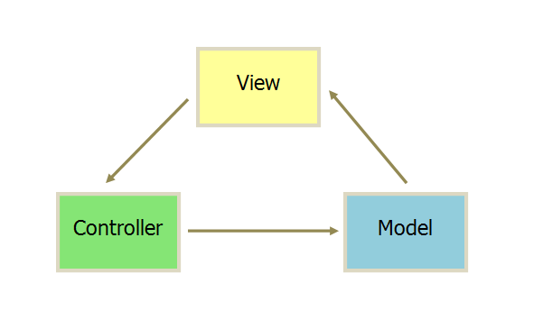
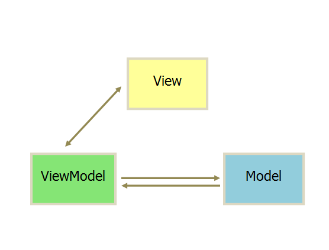

<!-- START doctoc generated TOC please keep comment here to allow auto update -->
<!-- DON'T EDIT THIS SECTION, INSTEAD RE-RUN doctoc TO UPDATE -->

- [MVVM 和 MVC 的区别](#mvvm-%E5%92%8C-mvc-%E7%9A%84%E5%8C%BA%E5%88%AB)
- [vue 的响应式原理](#vue-%E7%9A%84%E5%93%8D%E5%BA%94%E5%BC%8F%E5%8E%9F%E7%90%86)
- [vue 双向数据绑定原理](#vue-%E5%8F%8C%E5%90%91%E6%95%B0%E6%8D%AE%E7%BB%91%E5%AE%9A%E5%8E%9F%E7%90%86)
- [Object.defineProperty 介绍](#objectdefineproperty-%E4%BB%8B%E7%BB%8D)
- [使用 Object.defineProperty() 来进行数据劫持有什么缺点](#%E4%BD%BF%E7%94%A8-objectdefineproperty-%E6%9D%A5%E8%BF%9B%E8%A1%8C%E6%95%B0%E6%8D%AE%E5%8A%AB%E6%8C%81%E6%9C%89%E4%BB%80%E4%B9%88%E7%BC%BA%E7%82%B9)
- [v-if 和 v-show 的区别](#v-if-%E5%92%8C-v-show-%E7%9A%84%E5%8C%BA%E5%88%AB)
- [为什么 vue 组件中的 data 必须是函数](#%E4%B8%BA%E4%BB%80%E4%B9%88-vue-%E7%BB%84%E4%BB%B6%E4%B8%AD%E7%9A%84-data-%E5%BF%85%E9%A1%BB%E6%98%AF%E5%87%BD%E6%95%B0)
- [vue 的 activated 和 deactivated 钩子函数](#vue-%E7%9A%84-activated-%E5%92%8C-deactivated-%E9%92%A9%E5%AD%90%E5%87%BD%E6%95%B0)
- [Vue 中父子组件生命周期执行顺序](#vue-%E4%B8%AD%E7%88%B6%E5%AD%90%E7%BB%84%E4%BB%B6%E7%94%9F%E5%91%BD%E5%91%A8%E6%9C%9F%E6%89%A7%E8%A1%8C%E9%A1%BA%E5%BA%8F)
- [vue 中 key 属性的作用](#vue-%E4%B8%AD-key-%E5%B1%9E%E6%80%A7%E7%9A%84%E4%BD%9C%E7%94%A8)
- [Vue 的路由模式](#vue-%E7%9A%84%E8%B7%AF%E7%94%B1%E6%A8%A1%E5%BC%8F)
- [vue 中\$router 和\$route 的区别](#vue-%E4%B8%AD%5Crouter-%E5%92%8C%5Croute-%E7%9A%84%E5%8C%BA%E5%88%AB)
- [Vue diff 算法详解](#vue-diff-%E7%AE%97%E6%B3%95%E8%AF%A6%E8%A7%A3)
- [Vue 和 React 数据驱动的区别](#vue-%E5%92%8C-react-%E6%95%B0%E6%8D%AE%E9%A9%B1%E5%8A%A8%E7%9A%84%E5%8C%BA%E5%88%AB)

<!-- END doctoc generated TOC please keep comment here to allow auto update -->

## MVVM 和 MVC 的区别

- MVC 是应用最广泛的软件架构之一,一般 MVC 分为:Model(模型),View(视图),Controller(控制器)。 这主要是基于分层的目的,让彼此的职责分开，View 一般用过 Controller 来和 Model 进行联系。Controller 是 Model 和 View 的协调者,View 和 Model 不直接联系。基本都是单向联系。



1. View 传送指令到 Controller。
2. Controller 完成业务逻辑后改变 Model 状态。
3. Model 将新的数据发送至 View,用户得到反馈。

- MVVM: MVVM 是把 MVC 中的 Controller 改变成了 ViewModel。

View 的变化会自动更新到 ViewModel,ViewModel 的变化也会自动同步到 View 上显示,通过数据来显示视图层。



MVVM 和 MVC 的区别:

- MVC 中 Controller 演变成 MVVM 中的 ViewModel
- MVVM 通过数据来显示视图层而不是节点操作
- MVVM 主要解决了 MVC 中大量的 dom 操作使页面渲染性能降低,加载速度变慢,影响用户体验

## vue 的响应式原理

数据劫持 / 数据代理
依赖收集
发布订阅模式

## vue 双向数据绑定原理

> vue 通过使用双向数据绑定，来实现了 View 和 Model 的同步更新。vue 的双向数据绑定主要是通过使用数据劫持和发布订阅者模式来实现的。
>
> 首先我们通过 Object.defineProperty() 方法来对 Model 数据各个属性添加访问器属性，以此来实现数据的劫持，因此当 Model 中的数据发生变化的时候，我们可以通过配置的 setter 和 getter 方法来实现对 View 层数据更新的通知。
>
> 数据在 html 模板中一共有两种绑定情况，一种是使用 v-model 来对 value 值进行绑定，一种是作为文本绑定，在对模板引擎进行解析的过程中。
>
> 如果遇到元素节点，并且属性值包含 v-model 的话，我们就从 Model 中去获取 v-model 所对应的属性的值，并赋值给元素的 value 值。然后给这个元素设置一个监听事件，当 View 中元素的数据发生变化的时候触发该事件，通知 Model 中的对应的属性的值进行更新。
>
> 如果遇到了绑定的文本节点，我们使用 Model 中对应的属性的值来替换这个文本。对于文本节点的更新，我们使用了发布订阅者模式，属性作为一个主题，我们为这个节点设置一个订阅者对象，将这个订阅者对象加入这个属性主题的订阅者列表中。当 Model 层数据发生改变的时候，Model 作为发布者向主题发出通知，主题收到通知再向它的所有订阅者推送，订阅者收到通知后更改自己的数据。

## Object.defineProperty 介绍

> Object.defineProperty 函数一共有三个参数，第一个参数是**需要定义属性的对象**，第二个参数是**需要定义的属性**，第三个是**属性描述符**。
>
> 属性描述符：
> value 属性的值，
> writable 属性是否可写，
> enumerable 属性是否可枚举，
> configurable 属性是否可配置修改。
> get 属性 当访问该属性时，会调用此函数
> set 属性 当属性值被修改时，会调用此函数。

## 使用 Object.defineProperty() 来进行数据劫持有什么缺点

有一些对属性的操作，使用这种方法无法拦截，比如说通过下标方式修改数组数据或者给对象新增属性，vue 内部通过重写函数解决了这个问题。

在 Vue3.0 中已经不使用这种方式了，而是通过使用 Proxy 对对象进行代理，从而实现数据劫持。使用 Proxy 的好处是它可以完美的监听到任何方式的数据改变，唯一的缺点是兼容性的问题，因为这是 ES6 的语法。

## v-if 和 v-show 的区别

- v-if：每次都会重新删除或创建元素来控制 DOM 结点的存在与否

- v-show:是切换了元素的样式 display:none，display: block

因而 v-if 有较高的切换性能消耗，v-show 有较高的初始渲染消耗

## 为什么 vue 组件中的 data 必须是函数

<!-- 一个组件被复用多次的话，也就会创建多个实例。本质上，这些实例用的都是同一个构造函数，如果data是对象的话，对象属性引用类型，会影响到所有的实例，为了保证组件不同的实例之间的data互不冲突，data必须是一个函数。 -->

当一个组件被定义，data 必须声明为返回一个初始数据对象的函数，因为组件可能被用来创建多个实例。如果 data 仍然是一个纯粹的对象，则所有的实例将共享引用同一个数据对象！通过提供 data 函数，每次创建一个新实例后，我们能够调用 data 函数，从而返回初始数据的一个全新副本数据对象。

简而言之，就是 data 中数据可能会被复用，要保证不同组件调用的时候数据是相同的。

## vue 的 activated 和 deactivated 钩子函数

```html
<keep-alive>
  <component :is="view"></component>
</keep-alive>
```

`keep-alive`包裹动态组件时，会缓存不活动的组件实例，而不是销毁它们。

当组件在 `<keep-alive>` 内被切换，它的 `activated` 和 `deactivated` 这两个生命周期钩子函数将会被对应执行。

- `activated`在`keep-alive`组件激活时调用，该钩子函数在服务器端渲染期间不被调用。
- `deactivated`在`keep-alive`组件停用时调用，该钩子函数在服务端渲染期间不被调用。

## Vue 中父子组件生命周期执行顺序

在单一组件中，钩子的执行顺序是 beforeCreate-> created -> mounted->... ->destroyed

父子组件生命周期执行顺序：

- 加载渲染过程

  ```txt
  父beforeCreate->父created->父beforeMount->
  子beforeCreate->子created->子beforeMount->子mounted->
  父mounted
  ```

- 更新过程

  ```txt
  父beforeUpdate->子beforeUpdate->子updated->父updated
  ```

- 销毁过程

  ```txt
  父beforeDestroy->子beforeDestroy->子destroyed->父destroyed
  ```

- 常用钩子简易版

  ```txt
  父create->子created->子mounted->父mounted
  ```

## vue 中 key 属性的作用

key 的作用主要是为了高效的更新虚拟 DOM

key 的特殊 attribute 主要用在 Vue 的虚拟 DOM 算法，在新旧 nodes 对比时辨识 VNodes。如果不使用 key，Vue 会使用一种最大限度减少动态元素并且尽可能的尝试就地修改/复用相同类型元素的算法。而使用 key 时，它会基于 key 的变化重新排列元素顺序，并且会移除 key 不存在的元素。

有相同父元素的子元素必须有独特的 key。重复的 key 会造成渲染错误。

## Vue 的路由模式

> hash 模式 与 history 模式

hash（即地址栏 URL 中的 # 符号)。

```txt
比如这个 URL：www.123.com/#/test，hash 的值为 #/test。

特点： hash 虽然出现在 URL 中，但不会被包括在 HTTP，因为我们hash每次页面切换其实切换的是#之后的内容，而#后内容的改变并不会触发地址的改变，
所以不存在向后台发出请求，对后端完全没有影响，因此改变 hash 不会重新加载页面。

每次hash发生变化时都会调用 onhashchange事件

优点：可以随意刷新
```

history（利用了浏览器的历史记录栈）

```txt
特点：利用了 HTML5 History Interface 中新增的 pushState() 和 replaceState() 方法。（需要特定浏览器支持）

在当前已有的 back、forward、go的基础之上，它们提供了对历史记录进行修改的功能。只是当它们执行修改时，虽然改变了当前的URL，但浏览器不会立即向后端发送请求。

history：可以通过前进 后退控制页面的跳转，刷新是真是的改变url。

缺点：不能刷新，需要后端进行配置。由于history模式下是可以自由修改请求url，当刷新时如果不对对应地址进行匹配就会返回404。
但是在hash模式下是可以刷新的，前端路由修改的是#中的信息，请求时地址是不会变的
```

## vue 中\$router 和\$route 的区别

- this.\$route：当前激活的路由的信息对象。每个对象都是局部的，可以获取当前路由的 path, name, params, query 等属性。

- this.\$router：全局的 router 实例。通过 vue 根实例中注入 router 实例，然后再注入到每个子组件，从而让整个应用都有路由功能。其中包含了很多属性和对象（比如 history 对象），任何页面也都可以调用其 push(), replace(), go() 等方法。

## Vue diff 算法详解

- updateChildren

> 这个函数是用来比较两个结点的子节点

```js
updateChildren(parentElm, oldCh, newCh) {
    let oldStartIdx = 0,
        newStartIdx = 0
    let oldEndIdx = oldCh.length - 1
    let oldStartVnode = oldCh[0]
    let oldEndVnode = oldCh[oldEndIdx]
    let newEndIdx = newCh.length - 1
    let newStartVnode = newCh[0]
    let newEndVnode = newCh[newEndIdx]
    let oldKeyToIdx
    let idxInOld
    let elmToMove
    let before
    while (oldStartIdx <= oldEndIdx && newStartIdx <= newEndIdx) { // 只有 oldS>oldE 或者 newS>newE 才会终止循环
        if (oldStartVnode == null) { // 对于vnode.key的比较，会把oldVnode = null
            oldStartVnode = oldCh[++oldStartIdx]
        } else if (oldEndVnode == null) {
            oldEndVnode = oldCh[--oldEndIdx]
        } else if (newStartVnode == null) {
            newStartVnode = newCh[++newStartIdx]
        } else if (newEndVnode == null) { // 到这里是找到第一个不为null的oldStartVnode oldEndVnode newStartVnode newEndVnode
            newEndVnode = newCh[--newEndIdx]
        } else if (sameVnode(oldStartVnode, newStartVnode)) { // oldS指针和newS指针对应的结点相同时，将oldS和newS指针同时向后移一位
            patchVnode(oldStartVnode, newStartVnode)
            oldStartVnode = oldCh[++oldStartIdx]
            newStartVnode = newCh[++newStartIdx]
        } else if (sameVnode(oldEndVnode, newEndVnode)) { // oldE指针和newE指针对应的结点相同时，将oldE和newE指针同时向前移一位
            patchVnode(oldEndVnode, newEndVnode)
            oldEndVnode = oldCh[--oldEndIdx]
            newEndVnode = newCh[--newEndIdx]
        } else if (sameVnode(oldStartVnode, newEndVnode)) { // oldS指针和newE指针对应的结点相同时，将oldS指针对应结点移动到oldE指针之后，同时将oldS指针向后移动一位，newE指针向前移动一位
            patchVnode(oldStartVnode, newEndVnode)
            api.insertBefore(parentElm, oldStartVnode.el, api.nextSibling(oldEndVnode.el))
            oldStartVnode = oldCh[++oldStartIdx]
            newEndVnode = newCh[--newEndIdx]
        } else if (sameVnode(oldEndVnode, newStartVnode)) { // oldE指针和newS指针对应的结点相同时，将oldE指针对应的结点移动到oldS指针之前，同时将oldE指针向前移动一位，newS指针想后移动一位
            patchVnode(oldEndVnode, newStartVnode)
            api.insertBefore(parentElm, oldEndVnode.el, oldStartVnode.el)
            oldEndVnode = oldCh[--oldEndIdx]
            newStartVnode = newCh[++newStartIdx]
        } else { // 使用key时的比较
            if (oldKeyToIdx === undefined) {
                oldKeyToIdx = createKeyToOldIdx(oldCh, oldStartIdx, oldEndIdx) // 有key生成index表
            }
            idxInOld = oldKeyToIdx[newStartVnode.key]
            if (!idxInOld) {
                api.insertBefore(parentElm, createEle(newStartVnode).el, oldStartVnode.el)
                newStartVnode = newCh[++newStartIdx]
            } else {
                elmToMove = oldCh[idxInOld]
                if (elmToMove.sel !== newStartVnode.sel) {
                    api.insertBefore(parentElm, createEle(newStartVnode).el, oldStartVnode.el)
                } else {
                    patchVnode(elmToMove, newStartVnode)
                    oldCh[idxInOld] = null
                    api.insertBefore(parentElm, elmToMove.el, oldStartVnode.el)
                }
                newStartVnode = newCh[++newStartIdx]
            }
        }
    }
    if (oldStartIdx > oldEndIdx) { // oldVnode遍历结束了，那就将newVnode里newS指针和newE指针之间的结点添加到oldVnode里
        before = newCh[newEndIdx + 1] == null ? null : newCh[newEndIdx + 1].el
        addVnodes(parentElm, before, newCh, newStartIdx, newEndIdx)
    } else if (newStartIdx > newEndIdx) { // newVnode遍历结束了，那就将oldVnonde里oldS指针和oldE指针之间的结点删除
        removeVnodes(parentElm, oldCh, oldStartIdx, oldEndIdx)
    }
}
```

## Vue 和 React 数据驱动的区别

在数据绑定上来说，vue 的特色是双向数据绑定，而在 react 中是单向数据绑定。

vue 中实现数据绑定靠的是数据劫持（Object.defineProperty()）+发布-订阅模式

vue 中实现双向绑定

```html
<input v-model="msg" />
```

react 中实现双向绑定

```html
<input value={this.state.msg} onChange={() => this.handleInputChange()} />
```
