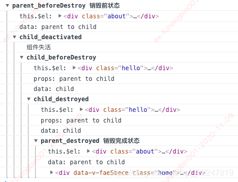

<!-- START doctoc generated TOC please keep comment here to allow auto update -->
<!-- DON'T EDIT THIS SECTION, INSTEAD RE-RUN doctoc TO UPDATE -->
**Table of Contents**  *generated with [DocToc](https://github.com/thlorenz/doctoc)*

- [生命周期分析](#%E7%94%9F%E5%91%BD%E5%91%A8%E6%9C%9F%E5%88%86%E6%9E%90)
- [父子组件的生命周期](#%E7%88%B6%E5%AD%90%E7%BB%84%E4%BB%B6%E7%9A%84%E7%94%9F%E5%91%BD%E5%91%A8%E6%9C%9F)

<!-- END doctoc generated TOC please keep comment here to allow auto update -->

## 生命周期分析


- beforeCreate:
  > 在实例初始化之后，数据观测 (data observer) 和 event/watcher 事件配置之前被调用。
  >
  > 在 new 一个 vue 实例后，只有一些默认的生命周期钩子和默认事件，其他的东西都还没创建。在 beforeCreate 生命周期执行的时候，data 和 methods 中的数据都还没有初始化。不能在这个阶段使用 data 中的数据和 methods 中的方法
- created:
  > 在实例创建完成后被立即调用。在这一步，实例已完成以下的配置：数据观测 (data observer)，property 和方法的运算，watch/event 事件回调。然而，挂载阶段还没开始，\$el property 目前尚不可用。
  >
  > data 和 methods 都已经被初始化好了，如果要调用 methods 中的方法，或者操作 data 中的数据，最早可以在这个阶段中操作
- beforeMount:
  > 在挂载开始之前被调用：相关的 render 函数首次被调用。
  >
  > 执行到这个钩子的时候，在内存中已经编译好了模板了，但是还没有挂载到页面中，此时，页面还是旧的
- mounted:
  > 实例被挂载后调用，这时 el 被新创建的 vm.\$el 替换了。如果根实例挂载到了一个文档内的元素上，当 mounted 被调用时 vm.\$el 也在文档内。
  >
  > 执行到这个钩子的时候，就表示 Vue 实例已经初始化完成了。此时组件脱离了创建阶段，进入到了运行阶段。如果我们想要通过插件操作页面上的 DOM 节点，最早可以在这个阶段中进行
- beforeUpdate:
  > 当执行这个钩子时，页面中的显示的数据还是旧的，data 中的数据是更新后的， 页面还没有和最新的数据保持同步
- updated:
  > 页面显示的数据和 data 中的数据已经保持同步了，都是最新的
- beforeDestroy:
  > Vue 实例从运行阶段进入到了销毁阶段，这个时候上所有的 data 和 methods，指令，过滤器……都是处于可用状态，还没有真正被销毁
- destroyed:
  > 这个时候上所有的 data 和 methods，指令，过滤器……都是处于不可用状态，组件已经被销毁了。
- activated:
  > 被 `keep-alive` 缓存的组件激活时调用。
- deactivated:
  > 被 `keep-alive` 缓存的组件停用时调用。

## 父子组件的生命周期

```html
// 父组件
<template>
  <div class="about">
    <p @click="clickHandler">{{ name }}</p>
    <keep-alive>
      <hello-world :message="name"></hello-world>
    </keep-alive>
  </div>
</template>
<script>
  import HelloWorld from "../components/HelloWorld";
  export default {
    data() {
      return {
        name: "parent",
      };
    },
    components: {
      HelloWorld,
    },
    methods: {
      clickHandler() {
        this.name = "parent to child";
      },
    },
    beforeCreate() {
      console.group("parent_beforeCreate");
      console.log("this.$el:", this.$el);
      console.log("data:", this.name);
    },
    created() {
      console.group("parent_created");
      console.log("this.$el:", this.$el);
      console.log("data:", this.name);
    },
    beforeMount: function () {
      console.group("parent_beforeMount");
      console.log("this.$el:", this.$el);
      console.log("data:", this.name);
    },
    mounted: function () {
      console.group("parent_mounted");
      console.log("this.$el:", this.$el);
      console.log("data:", this.name);
    },
    beforeUpdate: function () {
      console.group("parent_beforeUpdate");
      console.log("更新前");
    },
    updated: function () {
      console.group("parent_updated");
      console.log("更新完");
    },
    beforeDestroy: function () {
      console.group("parent_beforeDestroy 销毁前状态");
      console.log("this.$el:", this.$el);
      console.log("data:", this.name);
    },
    destroyed: function () {
      console.group("parent_destroyed 销毁完成状态");
      console.log("this.$el:", this.$el);
      console.log("data:", this.name);
    },
  };
</script>

// 子组件
<template>
  <div class="hello">
    <h1>{{ message }}</h1>
  </div>
</template>

<script>
  export default {
    name: "HelloWorld",
    props: {
      message: String,
    },
    data() {
      return {
        name: "child",
      };
    },
    beforeCreate: function () {
      console.group("child_beforeCreate");
      console.log("this.$el:", this.$el);
      // console.log('props:',this.message);
      console.log("data:", this.name);
    },
    created: function () {
      console.group("child_created");
      console.log("this.$el:", this.$el);
      console.log("props:", this.message);
      console.log("data:", this.name);
    },
    beforeMount: function () {
      console.group("child_beforeMount");
      console.log("this.$el:", this.$el);
      console.log("props:", this.message);
      console.log("data:", this.name);
    },
    mounted: function () {
      console.group("child_mounted");
      console.log("this.$el:", this.$el);
      console.log("props:", this.message);
      console.log("data:", this.name);
    },
    activated: function () {
      console.group("child_activated");
      console.log("组件激活");
    },
    beforeUpdate: function () {
      console.group("child_beforeUpdate");
      console.log("更新前");
    },
    updated: function () {
      console.group("child_updated");
      console.log("更新完");
    },
    deactivated: function () {
      console.group("child_deactivated");
      console.log("组件失活");
    },
    beforeDestroy: function () {
      console.group("child_beforeDestroy");
      console.log("this.$el:", this.$el);
      console.log("props:", this.message);
      console.log("data:", this.name);
    },
    destroyed: function () {
      console.group("child_destroyed");
      console.log("this.$el:", this.$el);
      console.log("props:", this.message);
      console.log("data:", this.name);
    },
  };
</script>
```

创建过程

更新过程

销毁过程

