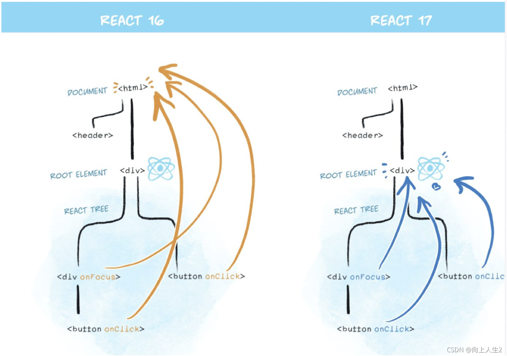
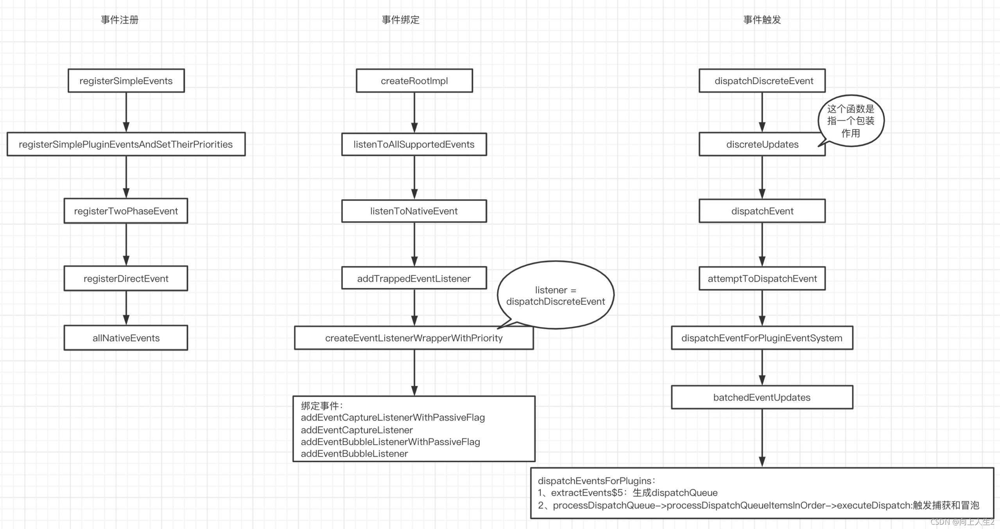

<!-- START doctoc generated TOC please keep comment here to allow auto update -->
<!-- DON'T EDIT THIS SECTION, INSTEAD RE-RUN doctoc TO UPDATE -->
**Table of Contents**  *generated with [DocToc](https://github.com/thlorenz/doctoc)*

- [合成事件](#%E5%90%88%E6%88%90%E4%BA%8B%E4%BB%B6)
  - [优点](#%E4%BC%98%E7%82%B9)
  - [合成事件和原生事件的区别](#%E5%90%88%E6%88%90%E4%BA%8B%E4%BB%B6%E5%92%8C%E5%8E%9F%E7%94%9F%E4%BA%8B%E4%BB%B6%E7%9A%84%E5%8C%BA%E5%88%AB)
  - [图解](#%E5%9B%BE%E8%A7%A3)

<!-- END doctoc generated TOC please keep comment here to allow auto update -->

## 合成事件

https://juejin.cn/post/7042197672723218463
https://juejin.cn/post/6844903502729183239

React 中，如果需要绑定事件，我们常常在 jsx 中绑定，并不是将 click 事件绑定到了 div 的真实 DOM 上，所有的事件会被附加到 root(react 17) 或者 document(react 16)上，当 DOM 事件触发时，会向上冒泡到 root(react 17) 或者 document(react 16)，也就是附加事件处理器的地方，事件会得到响应。

### 优点

不需要担心跨浏览器的兼容问题；对事件的处理，通过事件委托机制冒泡到 root(react 17) 或者 document(react 16) 节点进行触发，减少内存消耗，避免频繁解绑，提高性能；方便事件的同一管理（如事务机制）

### 合成事件和原生事件的区别

事件命名方式不同。react 事件采用小驼峰(onClick)，不是纯小写（onclick, onblur）；jsx 语法需要传入一个函数作为事件处理函数，而不是一个字符串；不能通过返回 false 来阻止默认行为，必须使用 preventDefault。

冒泡到 document 上的事件也不是原生的浏览器事件，而是由 react 自己实现的合成事件（SyntheticEvent）。因此如果不想要是事件冒泡的话应该调用 event.preventDefault()方法，而不是调用 event.stopProppagation()方法。

react 17 为什么将事件绑定到 root:
有利于多个 react 版本并存，例如微前端。同时绑定到 document 上，会导致 react 版本混乱。

合成事件和原生事件的执行顺序：

```js
import "./styles.css";
import React from "react";

export default function App() {
  const h1Click = React.useRef((e) => {
    console.log("h1=> click");
  });

  const documentClick = React.useRef(() => {
    console.log("document=> click");
  });

  const rootClick = React.useRef(() => {
    console.log("#root=> click");
  });

  React.useEffect(() => {
    const h1Ref = document.querySelector("h1");
    const rootRef = document.getElementById("root");
    document.addEventListener("click", documentClick.current);
    rootRef.addEventListener("click", rootClick.current);
    h1Ref.addEventListener("click", h1Click.current);
  }, []);

  const onReactClick = (e) => {
    console.log("react h1=> click");
  };

  return (
    <div className="App">
      <h1 onClick={onReactClick}>Hello CodeSandbox</h1>
      <h2>Start editing to see some magic happen!</h2>
    </div>
  );
}
// react17中点击 h1 输出：h1=> click  react h1=> click   #root=> click   document=> click
// 结合官方文档和 demo，可总结出执行顺序：触发目标 dom 元素原生事件，冒泡到 root 节点。执行 root 节点上的 react 合成事件。执行 root 节点上的原生事件。向上冒泡执行原生事件。
// react16中点击 h1 输出: h1=> click  #root=> click   react=> click   document=> click
```

### 图解




[图解来源](https://blog.csdn.net/qq_35577655/article/details/120916432)
