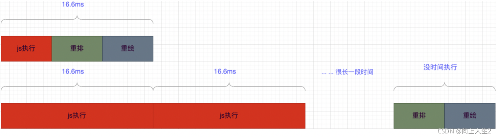
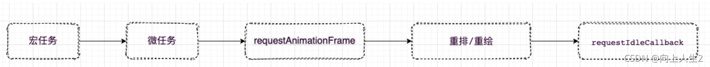
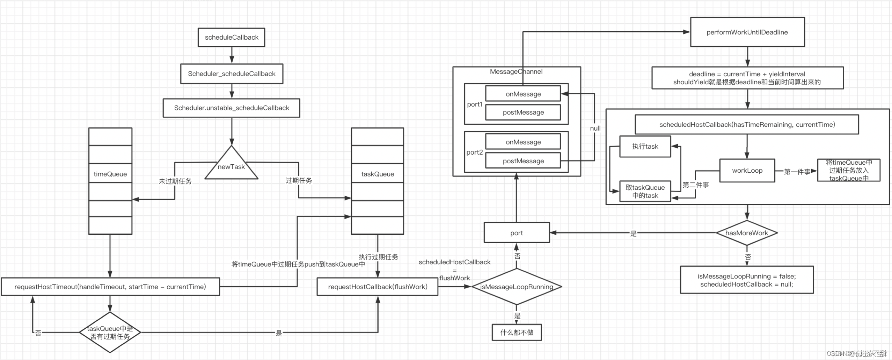

<!-- START doctoc generated TOC please keep comment here to allow auto update -->
<!-- DON'T EDIT THIS SECTION, INSTEAD RE-RUN doctoc TO UPDATE -->
**Table of Contents**  *generated with [DocToc](https://github.com/thlorenz/doctoc)*

- [Scheduler](#scheduler)
- [Lane](#lane)
- [时间切片 5ms](#%E6%97%B6%E9%97%B4%E5%88%87%E7%89%87-5ms)
- [任务暂停判断](#%E4%BB%BB%E5%8A%A1%E6%9A%82%E5%81%9C%E5%88%A4%E6%96%AD)
- [Scheduler 的两个核心 API](#scheduler-%E7%9A%84%E4%B8%A4%E4%B8%AA%E6%A0%B8%E5%BF%83-api)
  - [runWithPriority](#runwithpriority)
  - [scheduleCallback](#schedulecallback)

<!-- END doctoc generated TOC please keep comment here to allow auto update -->

## Scheduler

Scheduler 是 React 16 引入的一个新的调度器，用于实现任务的优先级调度。Scheduler 的主要功能是：

- 接收任务并分配优先级。
- 根据任务的优先级决定任务的执行顺序。
- 在合适的时机执行任务。
- 处理任务的取消和暂停。
- 提供任务的超时机制。
- 提供任务的重试机制。

Scheduler 的实现基于 Lane 和 Task，每个任务都有一个对应的 Lane 和 Task。Scheduler 会根据任务的 Lane 来决定任务的执行顺序，同时也会根据任务的优先级来决定任务的执行时机。例如，如果任务的 Lane 是 SyncLane，那么 Scheduler 会立即执行该任务，而不会等待其他任务。

Scheduler 的实现还提供了任务的超时机制和重试机制。当任务超时时，Scheduler 会取消该任务并重新调度。当任务失败时，Scheduler 会重新尝试执行该任务。

## Lane

Lane 是 React 18 引入的一个新的调度机制，用于优先级调度。Lane 是一个 31 位的二进制数，每个位代表一个优先级，从高到低依次为：

- SyncLane: 同步优先级，最高优先级，用于同步渲染。
- InputContinuousLane: 输入连续优先级，用于处理用户输入。例如点击、滚动等。
- DefaultLane: 默认优先级，用于处理其他任务。
- IdleLane: 空闲优先级，最低优先级，用于处理空闲任务。
- OffscreenLane: 隐藏优先级，用于处理隐藏组件的任务。
- NoLane: 无优先级，用于取消任务。
- OffscreenLane: 隐藏优先级，用于处理隐藏组件的任务。

在 React 18 中，每个任务都有一个对应的 Lane，用于表示任务的优先级。当调度器执行任务时，会根据任务的 Lane 来决定任务的执行顺序。例如，如果任务的 Lane 是 SyncLane，那么调度器会立即执行该任务，而不会等待其他任务。

## 时间切片 5ms

React Fiber 架构下使用 Scheduler 调度器特性：【时间切片】进行【任务调度】，即每执行一段时间的任务，就把主线程交还给浏览器，避免长时间占用主线程。

在 Fiber 架构下，每一个虚拟 DOM 都是一个【任务执行单元】，而不是整个 Fiber 树一次性全进入调和阶段。借助 Scheduler 时间切片特性去调用 workLoop 循环执行任务，在需要让出主线程的时候中断任务，等待下一次合适的时间继续执行。

主流浏览器刷新频率为 60Hz，即每（1000ms / 60Hz）16.67ms 浏览器刷新一次。


浏览器执行流程图

requestIdleCallback 是在浏览器重绘重排之后，如果还有空闲就可以执行的时机，所以为了不影响重绘重排，可以在浏览器在 requestIdleCallback 中执行耗性能的计算，但是由于 requestIdleCallback 存在**兼容和触发时机不稳定**的问题，scheduler 中采用 MessageChannel 来实现 requestIdleCallback，当前环境不支持 MessageChannel 就采用 setTimeout。

**Scheduler 时间切片的本质是模拟 requestIdelCallback 实现 JS 任务执行和浏览器渲染合理分配的运行在每一帧上，任何连续、可中断的流程都可以使用 Scheduler 来调度**

实现的区别：

- requestIdelCallback 会在每一帧任务执行后存在剩余时间时，允许用户调用它来执行自己定义的代码，当没有剩余时间时，会将执行权交还给浏览器；
- React 时间切片则是通过宏任务 MessageChannel 实现高频短间隔 5ms 执行 JS 逻辑，之后会将执行权交给浏览器去做渲染，并开启下一个异步请求，待浏览器工作完成后继续执行此任务。
-

## 任务暂停判断

```javascript
function workLoopConcurrent() {
  while (workInProgress !== null && !shouldYield()) {
    performUnitOfWork(workInProgress);
  }
}
function shouldYieldToHost() {
  var timeElapsed = getCurrentTime() - startTime;
  if (timeElapsed < frameInterval) {
    // The main thread has only been blocked for a really short amount of time;
    // smaller than a single frame. Don't yield yet.
    return false;
  } // The main thread has been blocked for a non-negligible amount of time. We
  return true;
}
```

shouldYield 调用了 Scheduler 的 unstable_shouldYield：shouldYieldToHost 函数进行判断是否执行超时，如果超时跳出循环。

## Scheduler 的两个核心 API

### runWithPriority

以一个优先级执行 callback

```javascript
function unstable_runWithPriority(priorityLevel, eventHandler) {
  switch (
    priorityLevel //5种优先级
  ) {
    case ImmediatePriority:
    case UserBlockingPriority:
    case NormalPriority:
    case LowPriority:
    case IdlePriority:
      break;

    default:
      priorityLevel = NormalPriority;
  }

  var previousPriorityLevel = currentPriorityLevel;
  currentPriorityLevel = priorityLevel;

  try {
    return eventHandler();
  } finally {
    currentPriorityLevel = previousPriorityLevel;
  }
}
```

### scheduleCallback

以优先级创建任务, 因为涉及过期时间的计算，所以 scheduleCallback 比 runWithPriority 的粒度更细

1.  在 scheduleCallback 中优先级意味着过期时间，优先级越高 priorityLevel 就越小，过期时间离当前时间就越近。
2.  scheduleCallback 调度的过程用到了小顶堆，所以我们可以在 O(1)的复杂度找到优先级最高的 task，不了解可以查阅资料，在源码中小顶堆存放着任务，每次 peek 都能取到离过期时间最近的 task。
3.  scheduleCallback 中，未过期任务 task 存放在 timerQueue 中，过期任务存放在 taskQueue 中。

```js
function unstable_scheduleCallback(priorityLevel, callback, options) {
  var currentTime = getCurrentTime();
  var startTime;

  if (typeof options === "object" && options !== null) {
    var delay = options.delay;

    if (typeof delay === "number" && delay > 0) {
      startTime = currentTime + delay;
    } else {
      startTime = currentTime;
    }
  } else {
    startTime = currentTime;
  }

  var timeout;

  switch (priorityLevel) {
    case ImmediatePriority:
      timeout = IMMEDIATE_PRIORITY_TIMEOUT;
      break;

    case UserBlockingPriority:
      timeout = USER_BLOCKING_PRIORITY_TIMEOUT;
      break;

    case IdlePriority:
      timeout = IDLE_PRIORITY_TIMEOUT;
      break;

    case LowPriority:
      timeout = LOW_PRIORITY_TIMEOUT;
      break;

    case NormalPriority:
    default:
      timeout = NORMAL_PRIORITY_TIMEOUT;
      break;
  }

  var expirationTime = startTime + timeout; //优先级越高 过期时间越小
  var newTask = {
    id: taskIdCounter++,
    callback: callback,
    priorityLevel: priorityLevel,
    startTime: startTime,
    expirationTime: expirationTime,
    sortIndex: -1,
  };

  if (startTime > currentTime) {
    // This is a delayed task.
    newTask.sortIndex = startTime;
    push(timerQueue, newTask); //加入timerQueue
    if (peek(taskQueue) === null && newTask === peek(timerQueue)) {
      // All tasks are delayed, and this is the task with the earliest delay.
      if (isHostTimeoutScheduled) {
        // Cancel an existing timeout.
        cancelHostTimeout();
      } else {
        isHostTimeoutScheduled = true;
      } // Schedule a timeout.
      requestHostTimeout(handleTimeout, startTime - currentTime);
    }
  } else {
    newTask.sortIndex = expirationTime;
    push(taskQueue, newTask); //加入taskQueue
    // wait until the next time we yield.
    if (!isHostCallbackScheduled && !isPerformingWork) {
      isHostCallbackScheduled = true;
      requestHostCallback(flushWork); //执行过期的任务
    }
  }
  return newTask;
}
```

scheduleCallback 图解

