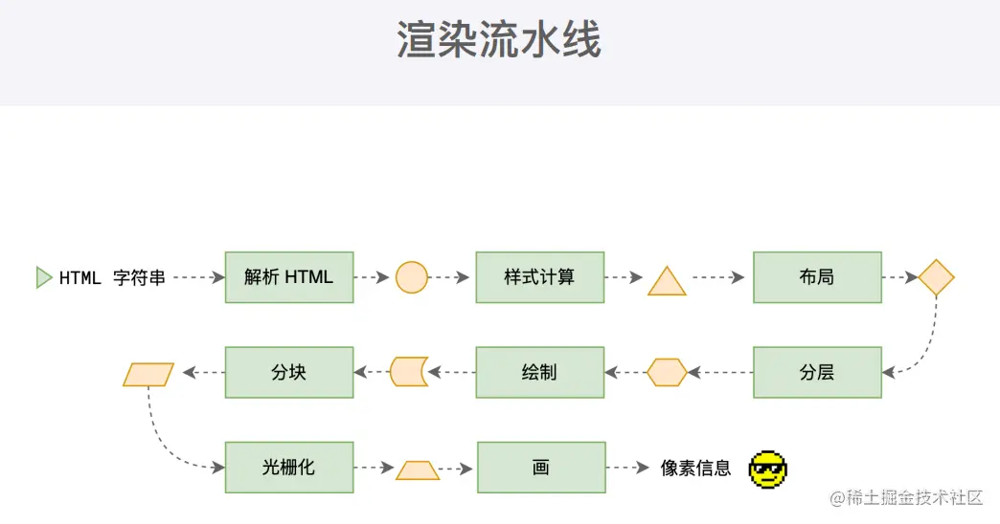
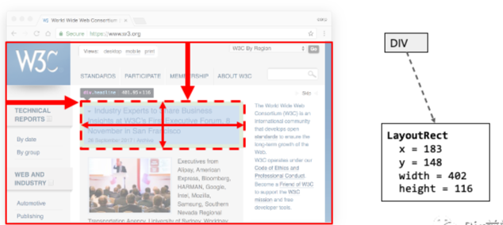
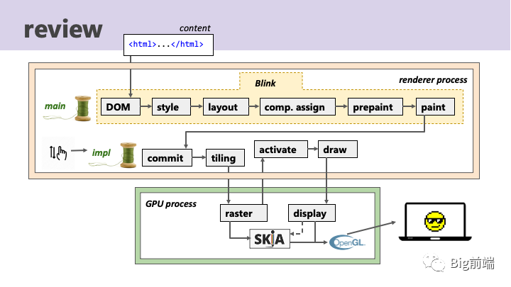

## 浏览器渲染流水线概述

在事件循环机制的作用下，渲染主线程取出消息队列中的渲染任务，开启渲染流程。
整个渲染流程分为多个阶段，分别是： HTML 解析、样式计算、布局、分层、绘制、分块、光栅化、画。
每个阶段都有明确的输入输出，上一个阶段的输出会成为下一个阶段的输入。
这样，整个渲染流程就形成了一套组织严密的生产流水线

### 第一步： 解析 HTML

解析过程中遇到 CSS 解析 CSS，遇到 JS 执行 JS。为了提高解析效率，浏览器在开始解析前，会启动一个**预解析**的线程，率先下载 HTML 中的外部 CSS 文件和 外部的 JS 文件。

如果主线程解析到 link 位置，此时外部的 CSS 文件还没有下载解析好，主线程不会等待，继续解析后续的 HTML。这是因为下载和解析 CSS 的工作是在**预解析线程**中进行的。这就是 **CSS 不会阻塞 HTML 解析**的根本原因。

如果主线程解析到 script 位置，会停止解析 HTML，转而等待 JS 文件下载好，并将全局代码解析执行完成后，才能继续解析 HTML。这是因为 JS 代码的执行过程可能会修改当前的 DOM 树，所以 DOM 树的生成必须暂停。这就是**JS 会阻塞 HTML 解析**的根本原因。

这步完成后**得到 DOM 树和 CSSOM 树**，浏览器的默认样式、内部样式、外部样式、行内样式均会包含在 CSSOM 树中。

### 第二步：样式计算

主线程会遍历得到的 DOM 树，依次为树中的每个节点计算出它最终的样式，称之为 Computed Style。
在这一过程中，很多预设值会变成绝对值，比如 red 会变成 rgb(255,0,0)；相对单位会变成绝对单位，比如 em 会变成 px
这一步完成后会得到一棵带有样式的 DOM 树，也称为**渲染树(Render Tree**)，包含每个需要绘制的元素及其样式。
需要注意：

Render Tree 和 DOM Tree 不完全对应
`display: none` 的元素不在 Render Tree 中
`visibility: hidden` 的元素在 Render Tree 中

### 第三步：布局（Layout）

计算每个元素的大小、位置，并确定它们如何相对排列，这个过程称为布局。

布局完成后会得到**布局树（Layout Tree）**，记录每个节点在设备视口内的确切位置和大小。

比如将 DIV 解析为一个块级的 LayoutReat 区域，用 x+y+width+height 来表示，布局就是为了计算 x,y,width,height 这些数据

### 第四步：分层（Layer）

主线程会使用一套复杂的策略对整个布局树中进行分层。

在渲染流水线中，分层并不是必须的，但在现代浏览器中，它是提高渲染性能的关键步骤。
某些样式属性会单独形成层，如 transform 会形成单独的层方便进行图形变换，滚动元素会多出 scrollbar 的 4 层。合成任务在渲染进程的合成线程中执行，与渲染主线程隔离互不影响

### 第五步：绘制（Paint）

根据布局树 layout tree 对每个层叠上下文生成绘制指令集，得到绘制指令列表。

paint 阶段只是创建绘制指令 paint op，页面还没有东西，甚至直到 GL 调用之前页面都是没有呈现任何东西的状态。

将 LayoutObject 转化为绘制指令 paint op，每个 LayoutObject 会对应多个绘制指令 paint ops，比如背景，前景，轮廓等。样式可以控制绘制的顺序。绘制有自己的顺序，如背景色在前，其次是浮动元素，前景色，轮廓 outline

**以下步骤交给合成线程处理**

### 第六步： 分块 (Tiling)

合成线程首先对每个图层进行分块，将其划分为更多的小区域，这些小区域称为块（tiles）。

栅格化整个图层成本大，渲染进程合成线程将 layer 分块后选择视口相近的图块 tiles 再进行栅格化成本小很多。

整个网页是非常大的，向下延伸理论上可以无限长（比如新闻类网站的无限滚动）。
栅格化是绘制之后的步骤，栅格化会将绘制指令转化为位图 bitmap。试想一下如果在绘制完整个图层之后再栅格化整个图层，则成本会很大，但如果只栅格化部分图层的可见部分成本则会小很多。

这里 tiling 是平铺的意思，类似装修时候铺地板用大块瓷砖平铺，页面显示的做法类似。

根据视口 viewport 所在位置的不同，渲染进程合成器线程会选择靠近视口的图块 tiles 进行渲染，将最后选择渲染的图块传递给 GPU 栅格化线程池里的单个栅格化线程执行栅格化，最后得到栅格化好后的 tile 图块。图块大小根据不同设备的分辨率有不同的大小，比如 256*256 或 512*512

「图块 tiles 是栅格化任务的单位，栅格化就是将一块块的 tiles 转化为位图 bitmap」

### 第七步： 光栅化（Raster）

栅格化是将绘制指令 paint op 转化为位图 bitmap 的过程，转化后每个像素点的 rgba 都确定。栅格化还处理图片解码，通过调用不同解码器解压缩图片，GPU 可以加速栅格化，通过调用 Skia 对图块进行栅格化。

### 第八步： 画 （Draw）

栅格化所有变换后的图块之后，生成 draw quads 命令，包含多个 DrawQuad 的 CompositorFrame，这是渲染进程最后的输出，此时屏幕还没有像素出现。
合成线程将每个图块 tile 的位图 bitmap 发送给 GPU 硬件，GPU 硬件将每个位图 tile 绘制到对应的屏幕位置上。

### 浏览器渲染流水线总结

回顾一下整个渲染流水线的过程，从渲染主线程获取 Web 内容，构建 DOM 树，解析样式，更新布局，layer 分层后合成，生成属性树，创建绘制指令列表。

再到渲染进程合成线程收到渲染主线程 commit 过来的带有绘制指令和属性树的 layer，将 layer 分块为图块，使用 Skia 对图块进行栅格化，拷贝 pending tree 到 active tree，生成 draw quads 命令，将 quad 发送给 GPU 的 Viz 线程，最后像素显示到屏幕上。

大多数阶段是在渲染器进程里执行的，但是 raster 和 display 则在 GPU 进程中执行。

核心渲染阶段 DOM，style，layout，paint 是在渲染进程主线程的 Blink 进行的，但是滚动和缩放等交互事件在渲染主线程繁忙时可以在渲染进程合成线程里执行

#### 渲染进程主线程

「DOM:」 解析 HTML 生成 DOM 树

「style:」 解析 styleSheet 生成 ComputedStyle

「layout:」 生成 layout tree，跟 DOM 树基本对应，但是 display:none 的节点不显示，内联元素会创建 LayoutBlock 匿名节点包裹

「layer 分层后合成:」 某些样式属性会单独形成层，如 transform 会形成单独的层方便进行图形变换，滚动元素会多出 scrollbar 的 4 层。合成任务在渲染进程的合成线程中执行，与渲染主线程隔离互不影响

「prepaint:」 为了将属性与层解耦引入 prepaint 阶段，prepaint 阶段需要遍历并构建属性树，属性树即存储如变换矩阵，裁剪，滚动偏移，透明度等数据的地方，方便后面 paint 阶段拿属性树数据处理

「paint:」 绘制过程是将 LayoutObject 转化为绘制指令 paint op，每个 LayoutObject 会对应多个绘制指令 paint ops，比如背景，前景，轮廓等。样式可以控制绘制的顺序。绘制有自己的顺序，如背景色在前，其次是浮动元素，前景色，轮廓 outline

#### 渲染进程合成线程

页面的滚动等交互会进入渲染进程合成线程 compositor thread 里处理，这也是渲染进程主线程繁忙时交互也不卡的原因

「commit」: 渲染进程合成线程将层从渲染主线程拷贝出两份层和属性树副本

「tiling」: 栅格化整个图层成本大，渲染进程合成线程将 layer 分块后选择视口相近的图块 tiles 再进行栅格化成本小很多

「activate」: 合成线程具有两个树的副本，pending tree 负责将新 commit 的 layer 转到栅格化线程池里的栅格化线程处理好后同步到 active tree

「draw」: 栅格化所有变换后的图块之后，生成 draw quads 命令，包含多个 DrawQuad 的 CompositorFrame，这是渲染进程最后的输出，此时屏幕还没有像素出现

#### GPU 进程

「raster」: 栅格化是将绘制指令 paint op 转化为位图 bitmap 的过程，转化后每个像素点的 rgba 都确定。栅格化还处理图片解码，通过调用不同解码器解压缩图片，GPU 可以加速栅格化，通过调用 Skia 对图块进行栅格化

「Skia」: 封装 OpenGL 调用，提供异步显示列表，最后传递到 GPU 主线程处理，GPU 主线程的 Skia 后台发起真正的 GL 调用

「display」: GPU Viz 线程里的显示合成器 display compositor 合并多个进程的「CompositorFrame」输出，并通过 Skia 发起图形调用，像素呈现在屏幕上

## 什么是 reflow（回流）？

reflow 的本质就是重新计算 layout 树。
当进行了会影响布局树的操作后，需要重新计算布局树，会引发 layout。
为了避免连续的多次操作导致布局树反复计算，浏览器会合并这些操作，当 JS 代码全部完成后再进行统一计算。所以，改动属性造成的 reflow 是异步完成的。
也同样因为如此，当 JS 获取布局属性时，就可能造成无法获取到最新的布局信息。
浏览器在反复权衡下，最终决定获取属性立即 reflow。

## 什么是 repaint（重绘）？

repaint 的本质就是重新根据分层信息计算了绘制指令。
当改动了可见样式后，就需要重新计算，会引发 repaint。
由于元素的布局信息也属于可见样式，所以 reflow 一定会引起 repaint。

## 为什么 transform 的效率高？

因为 transform 既不会影响布局也不会影响绘制指令，它影响的只是渲染流程的最后一个「draw」阶段
由于 draw 阶段在合成线程中，所以 transform 的变化几乎不会影响渲染主线程。反之，渲染主线程无论如何忙碌，也不会影响 transform 的变化。
