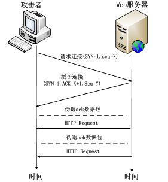
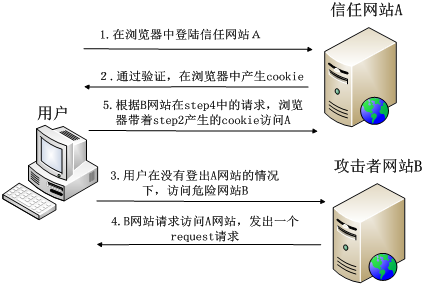

<!-- START doctoc generated TOC please keep comment here to allow auto update -->
<!-- DON'T EDIT THIS SECTION, INSTEAD RE-RUN doctoc TO UPDATE -->


- [DOS(Denial of Service)攻击](#dosdenial-of-service%E6%94%BB%E5%87%BB)
- [跨站点脚本 XSS (cross-site script)攻击](#%E8%B7%A8%E7%AB%99%E7%82%B9%E8%84%9A%E6%9C%AC-xss-cross-site-script%E6%94%BB%E5%87%BB)
- [跨站请求伪造 CSRF (cross site request forgery)攻击](#%E8%B7%A8%E7%AB%99%E8%AF%B7%E6%B1%82%E4%BC%AA%E9%80%A0-csrf-cross-site-request-forgery%E6%94%BB%E5%87%BB)
- [SQL 注入攻击](#sql-%E6%B3%A8%E5%85%A5%E6%94%BB%E5%87%BB)

<!-- END doctoc generated TOC please keep comment here to allow auto update -->

### DOS(Denial of Service)攻击

Client 发送连接请求报文，Server 接受连接后回复 ACK 报文，并为这次连接分配资源。Client 接收到 ACK 报文后也向 Server 发送 ACK 报文，并分配资源，这样 TCP 连接就建立了。前两次握手，是为了保证服务端能收接受到客户端的信息并能做出正确的应答；后两次握手，是为了保证客户端能够接收到服务端的信息并能做出正确的应答。建立完 TCP 三次握手后，Client 就可以和 Web 服务器进行通信了。
在 DoS 攻击中，攻击者通过伪造客户端的 ACK 数据包，希望 Server 重传某些数据包，Server 根据 TCP 重转机制，进行数据重传。攻击者利用 TCP 协议缺陷，通过发送大量的半连接请求，耗费 CPU 和内存资源



Web 服务器在未收到客户端的确认包时，会重发请求包一直到连接超时，才将此条目从未连接队列删除。攻击者再配合 IP 欺骗，SYN 攻击会达到很好的效果。通常攻击者在短时间内伪造大量不存在的 IP 地址，向服务器不断地发送 SYN 包，服务器回复确认包，并等待客户的确认，由于源地址是不存在的，服务器需要不断的重发直至超时，这些伪造的 SYN 包将长时间占用未连接队列，正常的 SYN 请求被丢弃，目标系统运行缓慢，严重者引起网络堵塞甚至系统瘫痪。

如何防范：

- 缩短 SYN Timeout 时间，及时将超时请求丢弃，释放被占用 CPU 和内存资源。
- 限制同时打开的 SYN 半连接数目，关闭不必要的服务。
- 设置 SYN Cookie，给每一个请求连接的 IP 地址分配一个 Cookie。如果短时间内连续受到某个 IP 的重复 SYN 报文，就认定是受到了攻击，以后从这个 IP 地址来的包会被一概丢弃。

### 跨站点脚本 XSS (cross-site script)攻击

攻击者往 Web 页面里注入恶意 Script 代码，当用户浏览这些网页时，就会执行其中的恶意代码，可对用户进行盗取 cookie 信息、会话劫持等各种攻击。XSS 是常见的 Web 攻击技术之一，由于跨站脚本漏洞易于出现且利用成本低，所以被 OWASP 列为当前的头号 Web 安全威胁。

XSS 跨站脚本攻击本身对 Web 服务器没有直接的危害，它借助网站进行传播，使网站上大量用户受到攻击。攻击者一般通过留言、电子邮件或其他途径向受害者发送一个精心构造的恶意 URL，当受害者在 Web 中打开该 URL 的时候，恶意脚本会在受害者的计算机上悄悄执行。

根据 XSS 攻击的效果，可以将 XSS 分为 3 类：

1. 反射型 XSS(Non-persistent XSS)，主要是将恶意的脚本附加到 URL 地址的参数中。服务器接受客户端的请求包，不会存储请求包的内容，只是简单的把用户输入的数据“反射”给浏览器。例如：`http://www.a.com/xss.php?name=<script>alert(document.cookie)</script>`, 访问这个链接如果存在 xss 漏洞则会弹出页面的 cookie 内容。
   ```html
   //前端 1.html：
   <html>
     <head lang="en">
       <meta charset="UTF-8" />
       <title>反射型XSS</title>
     </head>
     <body>
       <!-- <form>表示文档的服务器区域，此区域中包含一个Web站点的信息控件，用于向Web服务器区域提交 -->
       <form action="action.php" method="post">
         <input type="text" name="name" />
         <input type="submit" value="提交" />
       </form>
     </body>
   </html>
   ```
   // 后端
   ```php
   // action.php：
   <?php
     $name=$_POST["name"];
     echo $name;
   ?>
   ```
   这里有一个用户提交的页面，用户可以在此提交数据，数据提交之后给后台处理, 当我们提交 name 的是一个脚本时，`echo $name` 脚本会立即执行，这就是最基本的反射型 XSS 漏洞 ，这种漏洞数据流向是： 前端–>后端–>前端。
2. 存储型 XSS(Persistent XSS)，这类 XSS 攻击会把用户输入的数据“存储”在服务器端，具有很强的稳定性。多发生在富文本编辑器、日志、留言、评论、配置系统等数据库保存用户输入内容的业务场景。即用户的注入脚本保存到了数据库里，其他用户进行访问涉及到包含恶意脚本的链接都会中招。由于这段恶意的脚本被上传保存到了服务器，这种 XSS 攻击就叫做“存储型 XSS”。

   // 前端

   ```html
   <html>
     <head lang="en">
       <meta charset="UTF-8" />
       <title>存储型XSS</title>
     </head>
     <body>
       <form action="action2.php" method="post">
         输入你的ID： <input type="text" name="id" /> <br />
         输入你的Name：<input type="text" name="name" /> <br />
         <input type="submit" value="提交" />
       </form>
     </body>
   </html>
   ```

   // 后端

   ```php
   // action2.php
   <?php
     $id=$_POST["id"];
     $name=$_POST["name"];
     mysql_connect("localhost","root","root");
     mysql_select_db("test");

     $sql="insert into xss value ($id,'$name')";
     $result=mysql_query($sql);
   ?>
   // show2.php
   <?php
     mysql_connect("localhost","root","root");
     mysql_select_db("test");
     $sql="select * from xss where id=1";
     $result=mysql_query($sql);
     while($row=mysql_fetch_array($result)){
       echo $row['name'];
     }
   ?>
   ```

   用户提交的页面，数据提交给后端之后，后端存储在数据库中,当其他用户访问另一个页面的时候，后端调出该数据，显示给另一个用户，XSS 代码就被执行了。存储型 XSS 的数据流向是：前端–>后端–>数据库–>后端–>前端

3. DOM based XSS(Document Object Model XSS)，这类 XSS 攻击者将攻击脚本注入到 DOM 结构里。

   ```html
   <html>
     <head lang="en">
       <meta charset="UTF-8" />
       <title>DOM型XSS</title>
     </head>
     <body>
       <form action="action3.php" method="post">
         <input type="text" name="name" />
         <input type="submit" value="提交" />
       </form>
     </body>
   </html>
   ```

   // 后端 action3.php

   ```php
      <?php
        $name=$_POST["name"];
      ?>
      <input id="text" type="text" value="<?php echo $name; ?>"/>
      <div id="print"></div>
      <script type="text/javascript">
        var text=document.getElementById("text");
        var print=document.getElementById("print");
        print.innerHTML=text.value;  // 获取 text的值，并且输出在print内。这里是导致 xss 的主要原因。
      </script>
   ```

   我们可以输入``, 页面直接弹出了 hack 的页面，插入的语句被页面给执行了。
   这就是 DOM 型 XSS 漏洞，这种漏洞数据流向是： 前端–>浏览器

xss 如何执行：

> 标签法：`<script>alert(123)</script>`
>
> 伪协议：`<a href=javascript:alert(555)>555</a>`
>
> 事件法 onerror|onload|oninput：``

如何防范：

- 输入过滤。永远不要相信用户的输入，对用户输入的数据做一定的过滤。如输入的数据是否符合预期的格式，比如日期格式，Email 格式，电话号码格式等等。这样可以初步对 XSS 漏洞进行防御。过滤可以用正则，通过替换标签的方式进行转码或解码，例如`<> 空格 & '' ""`等替换成 html 编码

  ```js
  htmlEncodeByRegExp:function (str) {
    var s = "";
    if(str.length == 0) return "";
      s = str.replace(/&/g,"&amp;");
      s = s.replace(/</g,"&lt;");
      s = s.replace(/>/g,"&gt;");
      s = s.replace(/ /g,"&nbsp;");
      s = s.replace(/\'/g,"&#39;");
      s = s.replace(/\"/g,"&quot;");
      return s;
    }
  ```

- 输入/输出编码。服务器端输出到浏览器的数据，可以使用系统的安全函数来进行编码或转义来防范 XSS 攻击。相应的 JavaScript 的编码方式可以使用`encodeURI <-> decodeURI, encodeURIComponent <-> decodeURIComponent`
- cookie 中设置 HttpOnly 属性
- WAF(Web Application Firewall)Web 应用防火墙。主要的功能是防范诸如网页木马、XSS 以及 CSRF 等常见的 Web 漏洞攻击。由第三方公司开发，在企业环境中深受欢迎。

### 跨站请求伪造 CSRF (cross site request forgery)攻击



经典例子：用户登陆某银行网站，以 Get 请求的方式完成到另一银行的转账，如：http://www.mybank.com/Transfer.php?toBankId=11&money=1000 攻击者可构造另一危险链接 http://www.mybank.com/Transfer.php?toUserId=100&money=1000, 并把该链接通过一定方式发给受害者用户。受害者用户若在浏览器打开此链接，会将之前登陆后的 cookie 信息一起发送给银行网站，服务器在接收到该请求后，确认 cookie 信息无误，会完成改请求操作，造成攻击行为完成。攻击者可以构造 CGI 的每一个参数，伪造请求。这也是存在 CSRF 漏洞的最本质原因。

如何防范：

- 验证码。应用程序和用户进行交互过程中，特别是账户交易这种核心步骤，强制用户输入验证码，才能完成最终请求。在通常情况下，验证码够很好地遏制 CSRF 攻击。

- 验证 HTTP Referer 字段。在 HTTP 头中有 Referer 字段，他记录该 HTTP 请求的来源地址，如果跳转的网站与来源地址相符，那就是合法的，如果不符则可能是 csrf 攻击，拒绝该请求（可靠程度低）。

- 请求中添加 token 并验证。即发送请求时在 HTTP 请求中以参数的形式加入一个随机产生的 token，并在服务器建立一个拦截器来验证这个 token。服务器读取浏览器当前域 cookie 中这个 token 值，会进行校验该请求当中的 token 和 cookie 当中的 token 值是否都存在且相等，才认为这是合法的请求。否则认为这次请求是违法的，拒绝该次服务。

  ```js
  $.ajax({
      url: '/v1/api',
      dataType: 'json',
      data: param,
      type:'post',
      headers: { 'Accept':'application/json','token': tokenValue }
      success:function(res){
          console.log(res)
      }
  })
  ```

### SQL 注入攻击

SQL 注入(SQL Injection)，应用程序在向后台数据库传递 SQL(Structured Query Language，结构化查询语言)时，攻击者将 SQL 命令插入到 Web 表单提交或输入域名或页面请求的查询字符串，最终达到欺骗服务器执行恶意的 SQL 命令。

参考链接:

[Web 安全知多少](https://www.cnblogs.com/yzycoder/p/5741507.html)

[Web 安全 XSS 攻击详解](https://blog.csdn.net/weixin_44211968/article/details/124696627?spm=1001.2101.3001.6650.2&utm_medium=distribute.pc_relevant.none-task-blog-2%7Edefault%7ECTRLIST%7ERate-2-124696627-blog-126017006.pc_relevant_recovery_v2&depth_1-utm_source=distribute.pc_relevant.none-task-blog-2%7Edefault%7ECTRLIST%7ERate-2-124696627-blog-126017006.pc_relevant_recovery_v2&utm_relevant_index=5)
