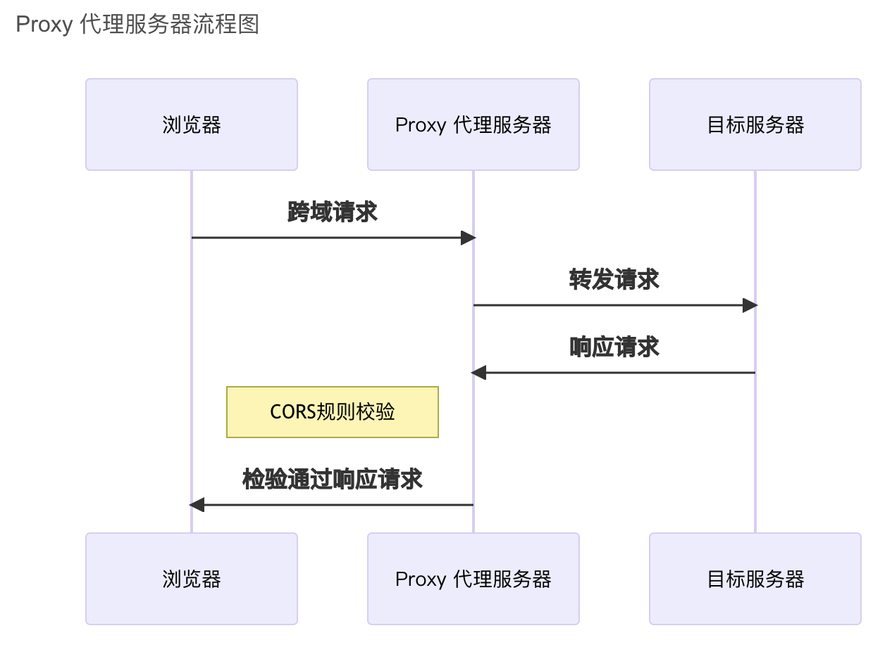

<!-- START doctoc generated TOC please keep comment here to allow auto update -->
<!-- DON'T EDIT THIS SECTION, INSTEAD RE-RUN doctoc TO UPDATE -->

- [浏览器的跨域问题](#%E6%B5%8F%E8%A7%88%E5%99%A8%E7%9A%84%E8%B7%A8%E5%9F%9F%E9%97%AE%E9%A2%98)
  - [跨域的来源](#%E8%B7%A8%E5%9F%9F%E7%9A%84%E6%9D%A5%E6%BA%90)
  - [跨域的影响](#%E8%B7%A8%E5%9F%9F%E7%9A%84%E5%BD%B1%E5%93%8D)
  - [AJAX 跨域如何解决](#ajax-%E8%B7%A8%E5%9F%9F%E5%A6%82%E4%BD%95%E8%A7%A3%E5%86%B3)
  - [跨域资源共享 CORS](#%E8%B7%A8%E5%9F%9F%E8%B5%84%E6%BA%90%E5%85%B1%E4%BA%AB-cors)

<!-- END doctoc generated TOC please keep comment here to allow auto update -->

## 浏览器的跨域问题

### 跨域的来源

跨域是因为浏览器的同源策略限制了不同源的访问。

同源策略：是浏览器的安全功能，它限制一个源上的文档和脚本如何与另一个源的资源交互。

同源：**协议相同、域名相同、端口相同**

### 跨域的影响

同源策略规定 AJAX 的请求只能发给同源的服务，否则浏览器将中断请求。

- Cookie、Web Storage 和 IndexDB 无法读取；
- DOM 无法获得；
- AJAX 请求被中断；

### AJAX 跨域如何解决

- JSONP 创建 script 标签进行请求，仅支持 Get 请求(CORS 规则对标签请求没有那么严格)

- CORS 跨域资源共享(cross-origin-resource-sharing)，CORS 需要浏览器和服务器同时支持，整个 CORS 通信过程，都是浏览器自动完成，不需要用户参与。对于开发者来说，CORS 通信与同源的 AJAX 通信没有差别，代码完全一样。浏览器一旦发现 AJAX 请求跨源，就会自动添加一些附加的头信息，有时还会多出一次附加的请求，但用户不会有感觉。

- Proxy 代理服务器，浏览器请求代理服务器，再由代理服务器请求外部服务；或者前端启动一个 node 服务设置响应头 Access-Control-Allow-Origin: \*,然后再去访问目前服务器（**因为同源策略是针对浏览器的，服务器与服务器间不存在**）

- WebSocket ws(s)协议不实行同源政策，只要服务器支持，就可以通过它进行跨源通信

### 跨域资源共享 CORS

实现 CORS 通信的关键是服务器。只要服务器实现了 CORS 接口，就可以跨源通信。

浏览器将 CORS 请求分成两类：简单请求（simple request）和非简单请求（not simple request）。

只要同时满足以下两大条件，就属于简单请求。
（1) 请求方法是以下三种方法之一：

    HEAD
    GET
    POST

（2）HTTP 的头信息不超出以下几种字段：

    Accept
    Accept-Language
    Content-Language
    Last-Event-ID
    Content-Type：只限于三个值 application/x-www-form-urlencoded、multipart/form-data、text/plain

**简单请求**
对于简单请求，浏览器直接发出 CORS 请求。具体来说，就是在头信息之中，增加一个 Origin 字段，origin 字段用来说明本次请求来自哪个源（协议 + 域名 + 端口），服务器根据这个值，决定是否同意这次请求。

**非简单请求**
会在正式通信之前，增加一次 OPTIONS 查询请求，称为**预检请求**（preflight）。

浏览器先询问服务器，当前网页所在的域名是否在服务器的许可名单之中，以及可以使用哪些 HTTP 动词和头信息字段。只有得到肯定答复，浏览器才会发出正式的 XMLHttpRequest 请求，否则就中断请求并报错

[跨域资源共享 CORS 详解——阮一峰](https://www.ruanyifeng.com/blog/2016/04/cors.html)
