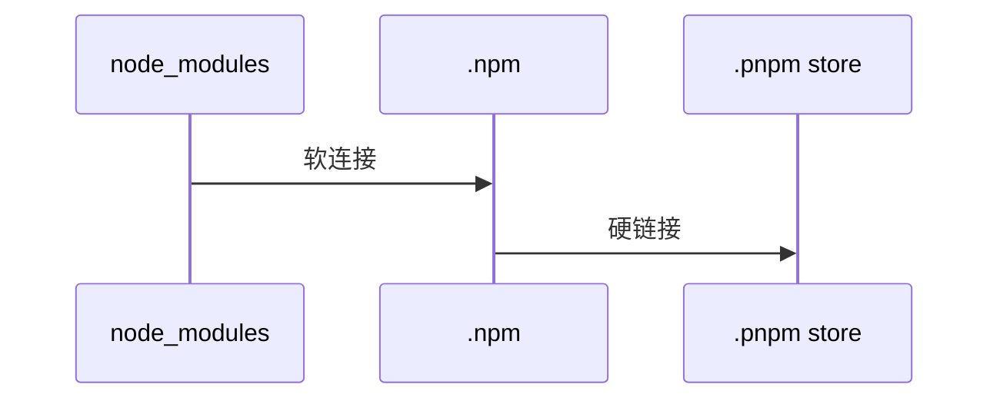

### npm

> npm(node package manager)，Node.js 的包管理工具

### yarn

将 JobTracker 的两个主要功能资源管理和作业调度/监控分离,主要方法是创建一个全局的 ResourceManager 和若干个针对应用程序的 ApplicationMaster。主要优点是大大减小了 JobTracker 的资源消耗，并且让监测每一个 Job 子任务 (tasks) 状态的程序分布式化了，更安全、更快。

**yarn 与 npm 区别**
yarn 虽然和 npm 一样是本地缓存，但是 yarn 无需互联网链接就能安装本地缓存的依赖项，提供了离线模式。

### pnpm

**简介**
pnpm 是高性能的 npm，通过内容可寻址存储(CAS)、符号链接(Symbolic Link)、硬链接(Hard Link)等管理依赖包，达到多项目之间依赖共享，减少安装时间，也非常的好上手，通过 npm install -g pnpm 安装，pnpm install 安装依赖即可。

1.  如果你用到了某依赖项的不同版本，只会将**不同版本间有差异的文件添加到仓库**。 例如，如果某个包有 100 个文件，而它的新版本只改变了其中 1 个文件。那么 pnpm update 时只会向存储中心额外添加 1 个新文件，而不会因为仅仅一个文件的改变复制整新版本包的内容。
2.  所有文件都会存储在硬盘上的某一位置。 当软件包被安装时，包里的文件会**硬链接**到这一位置上对应的文件，而不会占用额外的磁盘空间。 这允许你**跨项目地共享同一版本的依赖**。

**实际位置**
pnpm 使用符号链接 Symbolic link（软链接）来创建依赖项的嵌套结构，将项目的直接依赖符号链接到 node_modules 的根目录，直接依赖的实际位在.pnpm/[name]@[version]/node_modules/[name]，依赖包中的每个文件再硬链接（Hard link）到.pnpm store

.pnpm 称为虚拟存储目录，以平铺的形式储存着所有的项目依赖包，每个依赖包都可以通过.pnpm/[name]@[version]/node_modules/[name]路径找到实际位置。
例如：直接依赖的 react 符号链接到路径：.pnpm/react@18.0.3/node_modules/react，react 包中的每个文件都是来自内容可寻址存储的硬链接。

### nrm

> nrm(node registry manager)，npm 中镜像地址管理

### nvm

> nvm(node versions manager), node 版本管理工具，为了解决 node 各种版本存在不兼容现象
