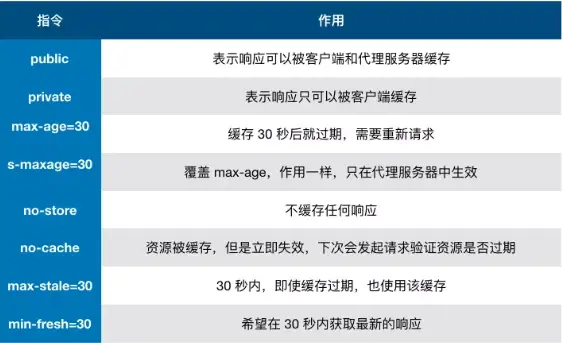

<!-- START doctoc generated TOC please keep comment here to allow auto update -->
<!-- DON'T EDIT THIS SECTION, INSTEAD RE-RUN doctoc TO UPDATE -->


- [根据缓存位置进行分类](#%E6%A0%B9%E6%8D%AE%E7%BC%93%E5%AD%98%E4%BD%8D%E7%BD%AE%E8%BF%9B%E8%A1%8C%E5%88%86%E7%B1%BB)
- [强缓存(Expires 和 Cache-Control)](#%E5%BC%BA%E7%BC%93%E5%AD%98expires-%E5%92%8C-cache-control)
  - [Expires](#expires)
  - [Cache-Control](#cache-control)
- [协商缓存](#%E5%8D%8F%E5%95%86%E7%BC%93%E5%AD%98)
  - [Last-Modify / If-Modify-Since](#last-modify--if-modify-since)
  - [Etag 和 If-None-Match](#etag-%E5%92%8C-if-none-match)
  - [为什么要有 Etag？](#%E4%B8%BA%E4%BB%80%E4%B9%88%E8%A6%81%E6%9C%89-etag)
- [浏览器缓存机制](#%E6%B5%8F%E8%A7%88%E5%99%A8%E7%BC%93%E5%AD%98%E6%9C%BA%E5%88%B6)

<!-- END doctoc generated TOC please keep comment here to allow auto update -->

## 根据缓存位置进行分类

从缓存位置上来说分为四种，并且各自有优先级，当依次查找缓存且都没有命中的时候，才会去请求网络。

1. Service Worker
2. Memory Cache
3. Disk Cache
4. Push Cache

**Service Worker**
Service Worker 是运行在浏览器背后的独立线程，一般可以用来实现缓存功能。使用 Service Worker 的话，传输协议必须为 HTTPS。因为 Service Worker 中涉及到请求拦截，所以必须使用 HTTPS 协议来保障安全。Service Worker 的缓存与浏览器其他内建的缓存机制不同，它可以让我们自由控制缓存哪些文件、如何匹配缓存、如何读取缓存，并且缓存是持续性的。

Service Worker 实现缓存功能一般分为三个步骤：首先需要先注册 Service Worker，然后监听到 install 事件以后就可以缓存需要的文件，那么在下次用户访问的时候就可以通过拦截请求的方式查询是否存在缓存，存在缓存的话就可以直接读取缓存文件，否则就去请求数据。

当 Service Worker 没有命中缓存的时候，我们需要去调用 fetch 函数获取数据。也就是说，如果我们没有在 Service Worker 命中缓存的话，会根据缓存查找优先级去查找数据。但是不管我们是从 Memory Cache 中还是从网络请求中获取的数据，浏览器都会显示我们是从 Service Worker 中获取的内容。

**Memory Cache**
Memory Cache 也就是内存中的缓存，主要包含的是当前中页面中已经抓取到的资源,例如页面上已经下载的样式、脚本、图片等。读取内存中的数据肯定比磁盘快,内存缓存虽然读取高效，可是缓存持续性很短，会随着进程的释放而释放。 一旦我们关闭 Tab 页面，内存中的缓存也就被释放了。

那么既然内存缓存这么高效，我们是不是能让数据都存放在内存中呢？
这是不可能的。计算机中的内存一定比硬盘容量小得多，操作系统需要精打细算内存的使用，所以能让我们使用的内存必然不多。

当我们访问过页面以后，再次刷新页面，可以发现很多数据都来自于内存缓存
内存缓存中有一块重要的缓存资源是 preloader 相关指令（例如`<link rel="prefetch">`）下载的资源。总所周知 preloader 的相关指令已经是页面优化的常见手段之一，它可以一边解析 js/css 文件，一边网络请求下一个资源。

需要注意的事情是，内存缓存在缓存资源时并不关心返回资源的 HTTP 缓存头 Cache-Control 是什么值，同时资源的匹配也并非仅仅是对 URL 做匹配，还可能会对 Content-Type，CORS 等其他特征做校验。

**Disk Cache**
Disk Cache 也就是存储在硬盘中的缓存，读取速度慢点，但是什么都能存储到磁盘中，比之 Memory Cache 胜在容量和存储时效性上。

在所有浏览器缓存中，Disk Cache 覆盖面基本是最大的。它会根据 HTTP Herder 中的字段判断哪些资源需要缓存，哪些资源可以不请求直接使用，哪些资源已经过期需要重新请求。并且即使在跨站点的情况下，相同地址的资源一旦被硬盘缓存下来，就不会再次去请求数据。绝大部分的缓存都来自 Disk Cache，关于 HTTP 的协议头中的缓存字段，我们会在下文进行详细介绍。

浏览器会把哪些文件丢进内存中？哪些丢进硬盘中？
关于这点，网上说法不一，不过以下观点比较靠得住：

**对于大文件来说，大概率是不存储在内存中的，反之优先**
**当前系统内存使用率高的话，文件优先存储进硬盘**

**Push Cache**
Push Cache（推送缓存）是 HTTP/2 中的内容，当以上三种缓存都没有命中时，它才会被使用。它只在会话（Session）中存在，一旦会话结束就被释放，并且缓存时间也很短暂，在 Chrome 浏览器中只有 5 分钟左右，同时它也并非严格执行 HTTP 头中的缓存指令。

Push Cache 在国内能够查到的资料很少，也是因为 HTTP/2 在国内不够普及。这里推荐阅读 Jake Archibald 的 HTTP/2 push is tougher than I thought 这篇文章，文章中的几个结论：

所有的资源都能被推送，并且能够被缓存,但是 Edge 和 Safari 浏览器支持相对比较差
可以推送 no-cache 和 no-store 的资源
一旦连接被关闭，Push Cache 就被释放
多个页面可以使用同一个 HTTP/2 的连接，也就可以使用同一个 Push Cache。这主要还是依赖浏览器的实现而定，出于对性能的考虑，有的浏览器会对相同域名但不同的 tab 标签使用同一个 HTTP 连接。
Push Cache 中的缓存只能被使用一次
浏览器可以拒绝接受已经存在的资源推送
你可以给其他域名推送资源
如果以上四种缓存都没有命中的话，那么只能发起请求来获取资源了。

那么为了性能上的考虑，大部分的接口都应该选择好缓存策略，通常浏览器缓存策略分为两种：**强缓存和协商缓存**，并且缓存策略都是通过设置 HTTP Header 来实现的。

## 强缓存(Expires 和 Cache-Control)

强缓存是利用 http 头中的 Expires 和 Cache-Control 两个字段来控制的，用来表示资源的缓存时间。强缓存中，普通刷新会忽略它，但不会清除它，需要强制刷新。浏览器强制刷新，请求会带上`Cache-Control:no-cache` 和 `Pragma:no-cache`

### Expires

Expires 的值是一个绝对时间的 GMT 格式的时间字符串。比如 Expires 值是：`expires:Fri, 14 Apr 2017 10:47:02 GMT`。这个时间代表这这个资源的失效时间，只要发送请求时间是在 Expires 之前，那么本地缓存始终有效，则在缓存中读取数据。
Expires 是 HTTP/1 的产物，受限于本地时间，如果修改了本地时间，可能会造成缓存失效。

缺点：由于失效的时间是一个绝对时间，所以当服务器与客户端时间偏差较大时，误差很大，就会导致缓存混乱。

### Cache-Control

在 HTTP/1.1 中，Cache-Control 主要是利用该字段的 `max-age` 值来进行判断，它是一个相对时间，例如`Cache-Control:max-age=3600`，代表着资源的有效期是 3600 秒。

cache-control 除了该字段外，还有下面几个比较常用的设置值：

- no-cache：不使用本地缓存。需要使用缓存协商，先与服务器确认返回的响应是否被更改，如果之前的响应中存在 ETag，那么请求的时候会与服务端验证，如果资源未被更改，则可以避免重新下载。
- no-store：直接禁止浏览器缓存数据，每次用户请求该资源，都会向服务器发送一个请求，每次都会下载完整的资源。
- public：可以被所有的用户缓存，包括终端用户和 CDN 等中间代理服务器。
- private：只能被终端用户的浏览器缓存，不允许 CDN 等中继缓存服务器对其缓存。



**Cache-Control 与 Expires 可以在服务端配置同时启用，同时启用的时候 Cache-Control 优先级高。**

```txt
cache-control:max-age=691200
expires:Fri, 15 May 2020 10:47:02 GMT
```

那么表示资源可以被缓存的最长时间为 691200 秒。

## 协商缓存

协商缓存就是由服务器来确定缓存资源是否可用，所以客户端与服务器端要通过某种标识来进行通信，从而让服务器判断请求资源是否可以缓存访问。

### Last-Modify / If-Modify-Since

浏览器第一次请求一个资源的时候，服务器返回的 header 中会加上 `Last-Modify`，`Last-Modify` 是一个时间，标识该资源的最后修改时间，例如`Last-Modify: Thu,31 Dec 2037 23:59:59 GMT`。当浏览器再次请求该资源时，request 的请求头中会包含`If-Modify-Since`，该值为缓存之前返回 `Last-Modify`。服务器收到`If-Modify-Since` 后，根据资源的最后修改时间判断是否命中缓存。如果命中缓存，则返回 304，并且不会返回资源内容，并且不会返回`Last-Modify`。

### Etag 和 If-None-Match

Etag 是服务器响应请求时，返回当前资源文件的一个唯一标识(由服务器生成)，只要资源有变化，Etag 就会重新生成。浏览器在下一次加载资源向服务器发送请求时，会将上一次返回的 Etag 值放到 request header 里的 If-None-Match 里，服务器只需要比较客户端传来的 If-None-Match 跟自己服务器上该资源的 ETag 是否一致，就能很好地判断资源相对客户端而言是否被修改过了。如果服务器发现 ETag 匹配不上，那么直接以常规 GET 200 回包形式将新的资源（当然也包括了新的 ETag）发给客户端；如果 ETag 是一致的，则直接返回 304 知会客户端直接使用本地缓存即可。

### 为什么要有 Etag？

两个都可以确定缓存资源的是否可用，有什么区别呢？

`Etag` 的出现主要是为了解决几个 `Last-Modified` 比较难解决的问题：

1. 一些文件也许会周期性的更改，但是他的内容并不改变(仅仅改变的修改时间)，这个时候我们并不希望客户端认为这个文件被修改了，而重新 GET；
2. 某些文件修改非常频繁，比如在秒以下的时间内进行修改，(比方说 1s 内修改了 N 次)，`If-Modified-Since` 能检查到的力度是秒级的，这种修改无法判断；
3. 某些服务器不能精确的得到文件的最后修改时间。

`Last-Modified` 与 `ETag` 是可以一起使用的，服务器会优先验证`ETag`，一致的情况下，才会继续比对 `Last-Modified`，最后才决定是否返回 304。

## 浏览器缓存机制

> 参考链接：[深入理解浏览器的缓存机制](https://www.jianshu.com/p/54cc04190252)


根据上图，浏览器在第一次请求发生后，再次发送请求时：

- 浏览器请求某一资源时，会先获取该资源缓存的 header 信息，然后根据 header 中的 Cache-Control 和 Expires 来判断是否过期。若没过期则直接从缓存中获取资源信息，包括缓存的 header 的信息，所以此次请求不会与服务器进行通信。这里判断是否过期，是强缓存。
- 如果显示已过期，浏览器会向服务器端发送请求，这个请求会携带第一次请求返回的有关缓存的 header 字段信息，比如客户端会通过 If-None-Match 头将先前服务器端发送过来的 Etag 发送给服务器，服务会对比这个客户端发过来的 Etag 是否与服务器的相同，若相同，就将 If-None-Match 的值设为 false，返回状态 304，客户端继续使用本地缓存，不解析服务器端发回来的数据，若不相同就将 If-None-Match 的值设为 true，返回状态为 200，客户端重新请求服务器端返回的数据；客户端还会通过 If-Modified-Since 头将先前服务器端发过来的最后修改时间戳发送给服务器，服务器端通过这个时间戳判断客户端的页面是否是最新的，如果不是最新的，则返回最新的内容，如果是最新的，则返回 304，客户端继续使用本地缓存。
