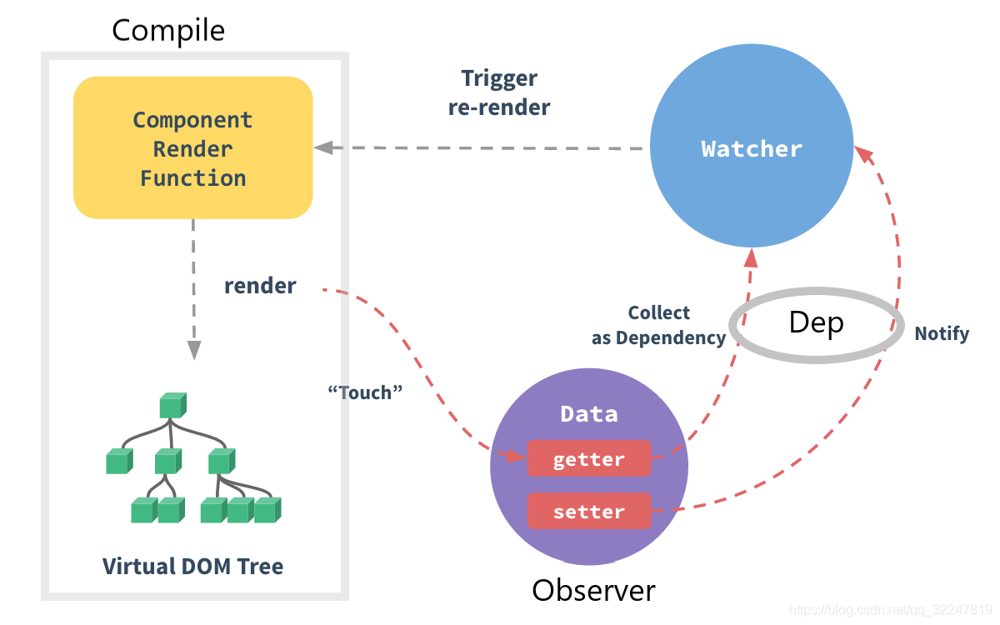

<!-- START doctoc generated TOC please keep comment here to allow auto update -->
<!-- DON'T EDIT THIS SECTION, INSTEAD RE-RUN doctoc TO UPDATE -->
**Table of Contents**  *generated with [DocToc](https://github.com/thlorenz/doctoc)*

- [响应式原理简析](#%E5%93%8D%E5%BA%94%E5%BC%8F%E5%8E%9F%E7%90%86%E7%AE%80%E6%9E%90)

<!-- END doctoc generated TOC please keep comment here to allow auto update -->

### 响应式原理简析

Vue 响应式通过**数据劫持**结合**发布订阅模式**来实现。
核心成员包括：Observer、Dep、Watcher

**观察者 Observer**：对数据进行劫持监听，监听所有属性；一个普通的 JavaScript 对象传入 Vue 实例作为 data 选项，Vue 将遍历此对象所有的 property，并使用 Object.defineProperty 把这些 property 全部转为 getter/setter。Object.defineProperty 是 ES5 中一个无法 shim 的特性，这也就是 Vue 不支持 IE8 以及更低版本浏览器的原因。

**发布者 Dep**：观察者 Observer 和订阅者 Watcher 连接的桥梁。因为订阅者`watcher`是有很多个，需要有一个 Dep 来专门收集这些订阅者，然后在数据变化时调用`dep.notify()`, 通知 dep 内所有的订阅者 watcher 执行`update()`方法来更新。

**订阅者 Watcher**：模板中使用的 data 属性会在解析时生成一系列的订阅者`watcher`，并执行`watcher` 的 get 函数返回`value`。

**模板解析器 Compile**：获取模板，生成字符串形式的 render 函数，模板解析(parser, optimizer, codegen)，render 函数生成虚拟 DOM。

