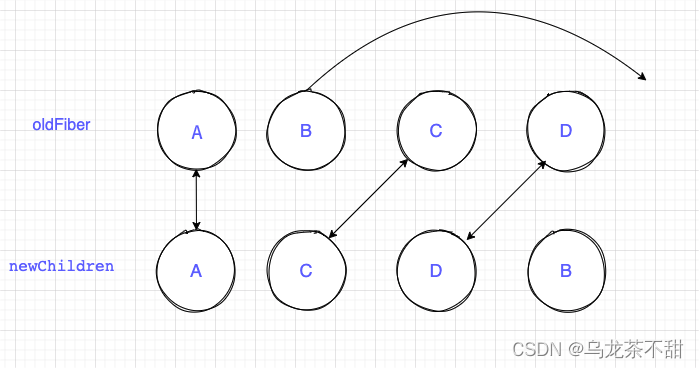

### Diff 算法

在 render 阶段更新 Fiber 节点时，我们会调用 reconcileChildFibers 对比 current Fiber 树和 workInProgress Fiber 树。

reconcileChildFibers 中会根据 newChild 的类型来进入单节点的 diff 或者多节点 diff。
单节点 diff：reconcileSingleElement；
多节点 diff: reconcileChildrenArray；

```javascript
function reconcileChildFibers(returnFiber, currentFirstChild, newChild, lanes) {
      var isUnkeyedTopLevelFragment = typeof newChild === 'object' && newChild !== null && newChild.type === REACT_FRAGMENT_TYPE && newChild.key === null;

      if (isUnkeyedTopLevelFragment) {
        newChild = newChild.props.children;
      }
       // Handle object types
      if (typeof newChild === 'object' && newChild !== null) {
        switch (newChild.$$typeof) {
          case REACT_ELEMENT_TYPE:
            return placeSingleChild(reconcileSingleElement(returnFiber, currentFirstChild, newChild, lanes));

          case REACT_PORTAL_TYPE:
            return placeSingleChild(reconcileSinglePortal(returnFiber, currentFirstChild, newChild, lanes));

          case REACT_LAZY_TYPE:
            var payload = newChild._payload;
            var init = newChild._init; // TODO: This function is supposed to be non-recursive.

            return reconcileChildFibers(returnFiber, currentFirstChild, init(payload), lanes);
        }

        if (isArray(newChild)) {
          return reconcileChildrenArray(returnFiber, currentFirstChild, newChild, lanes);
        }

        if (getIteratorFn(newChild)) {
          return reconcileChildrenIterator(returnFiber, currentFirstChild, newChild, lanes);
        }

        throwOnInvalidObjectType(returnFiber, newChild);
      }

      if (typeof newChild === 'string' && newChild !== '' || typeof newChild === 'number') {
        return placeSingleChild(reconcileSingleTextNode(returnFiber, currentFirstChild, '' + newChild, lanes));
      }

      {
        if (typeof newChild === 'function') {
          warnOnFunctionType(returnFiber);
        }
      } // Remaining cases are all treated as empty.


      return deleteRemainingChildren(returnFiber, currentFirstChild);
    }

    return reconcileChildFibers;
  }
```

对比两颗树的复杂度本身是 O(n3)，react 为了降低复杂度，提出了三个前提：

1. **同级比较**，跨层级的 dom 不会进行复用
2. **不同类型**节点生成的 dom 树不同，此时会直接销毁老节点及子孙节点，并新建节点
3. 可以通过**key**来对元素 diff 的过程提供**复用**的线索

### 单节点 diff

- key 和 type 相同表示可以复用节点
- key 不同直接标记删除节点，然后新建节点
- key 相同 type 不同，标记删除该节点和兄弟节点，然后新创建节点

```javascript
function reconcileSingleElement(returnFiber, currentFirstChild, element, lanes) {
      var key = element.key;
      var child = currentFirstChild;
		//child节点不为null执行对比
      while (child !== null) {
        // TODO: If key === null and child.key === null, then this only applies to
        // the first item in the list.
        // 1.比较key
        if (child.key === key) {
          var elementType = element.type;
           // type相同则可以复用 返回复用的节点
          if (elementType === REACT_FRAGMENT_TYPE) {
            if (child.tag === Fragment) {
              deleteRemainingChildren(returnFiber, child.sibling);
              var existing = useFiber(child, element.props.children);
              existing.return = returnFiber;
              {
                existing._debugSource = element._source;
                existing._debugOwner = element._owner;
              }
              return existing;
            }
          } else {
          	// key相同，type不同则把fiber及和兄弟fiber标记删除
            if (child.elementType === elementType || ( // Keep this check inline so it only runs on the false path:
             isCompatibleFamilyForHotReloading(child, element) ) || // Lazy types should reconcile their resolved type.
            // We need to do this after the Hot Reloading check above,
            // because hot reloading has different semantics than prod because
            // it doesn't resuspend. So we can't let the call below suspend.
            typeof elementType === 'object' && elementType !== null && elementType.$$typeof === REACT_LAZY_TYPE && resolveLazy(elementType) === child.type) {
              deleteRemainingChildren(returnFiber, child.sibling);
              var _existing = useFiber(child, element.props);
              _existing.ref = coerceRef(returnFiber, child, element);
              _existing.return = returnFiber;
              {
                _existing._debugSource = element._source;
                _existing._debugOwner = element._owner;
              }
              return _existing;
            }
          } // Didn't match.
		  // key相同，type不同则把fiber及和兄弟fiber标记删除
          deleteRemainingChildren(returnFiber, child);
          break;
        } else {
          //key不同直接标记删除该节点
          deleteChild(returnFiber, child);
        }
        child = child.sibling;
      }
	  // 新建新Fiber
      if (element.type === REACT_FRAGMENT_TYPE) {
        var created = createFiberFromFragment(element.props.children, returnFiber.mode, lanes, element.key);
        created.return = returnFiber;
        return created;
      } else {
        var _created4 = createFiberFromElement(element, returnFiber.mode, lanes);

        _created4.ref = coerceRef(returnFiber, currentFirstChild, element);
        _created4.return = returnFiber;
        return _created4;
      }
    }
}
```

### 多节点 diff

多节点 diff 比较复杂，我们分三种情况进行讨论，其中 a 表示更新前的节点，b 表示更新后的节点

#### 属性变化

```javascript
const a = (
  <>
    <p key="0" name="0">
      0
    </p>
    <p key="1">1</p>
  </>
);
const b = (
  <>
    <p key="0" name="00">
      0
    </p>
    <p key="1">1</p>
  </>
);
```

#### type 变化

```javascript
const a = (
  <>
    <p key="0">0</p>
    <p key="1">1</p>
  </>
);
const b = (
  <>
    <div key="0">0</div>
    <p key="1">1</p>
  </>
);
```

#### 新增节点

```javascript
const a = (
  <>
    <p key="0">0</p>
    <p key="1">1</p>
  </>
);
const b = (
  <>
    <p key="0">0</p>
    <p key="1">1</p>
    <p key="2">2</p>
  </>
);
```

#### 节点删除

```javascript
const a = (
  <>
    <p key="0">0</p>
    <p key="1">1</p>
    <p key="2">2</p>
  </>
);
const b = (
  <>
    <p key="0">0</p>
    <p key="1">1</p>
  </>
);
```

#### 节点位置变化

```javascript
const a = (
  <>
    <p key="0">0</p>
    <p key="1">1</p>
  </>
);
const b = (
  <>
    <p key="1">1</p>
    <p key="0">0</p>
  </>
);
```

在源码中多节点 diff 有三个 for 循环遍历（并不意味着所有更新都有经历三个遍历，进入循环体有条件，也有条件跳出循环），**第一个遍历处理节点的更新（包括 props 更新和 type 更新和删除），第二个遍历处理其他的情况（节点新增）**，其原因在于在大多数的应用中，节点更新的频率更加频繁，**第三个处理位节点置改变**

- 第一次遍历 因为老的节点存在于 current Fiber 中，所以它是个链表结构，还记得 Fiber 双缓存结构嘛，节点通过 child、return、sibling 连接，而 newChildren 存在于 jsx 当中，所以遍历对比的时候，首先让 newChildren[i]与 oldFiber 对比，然后让 i++、nextOldFiber = oldFiber.sibling。在第一轮遍历中，会处理三种情况，其中第 1，2 两种情况会结束第一次循环

1. key 不同，第一次循环结束
2. newChildren 或者 oldFiber 遍历完，第一次循环结束
3. key 同 type 不同，标记 oldFiber 为 DELETION
4. key 相同 type 相同则可以复用
   newChildren 遍历完，oldFiber 没遍历完，在第一次遍历完成之后将 oldFiber 中没遍历完的节点标记为 DELETION，即 effectFlag = Delection

- 第二个遍历 第二个遍历考虑三种情况

1. newChildren 和 oldFiber 都遍历完：多节点 diff 过程结束
2. newChildren 没遍历完，oldFiber 遍历完，将剩下的 newChildren 的节点标记为 Placement，即插入的 Tag
3. newChildren 和 oldFiber 没遍历完，则进入节点移动的逻辑

- 第三个遍历 主要逻辑在 placeChild 函数中，例如更新前节点顺序是 ABCD，更新后是 ACDB

1. newChild 中第一个位置的 A 和 oldFiber 第一个位置的 A，key 相同可复用，lastPlacedIndex=0

2. newChild 中第二个位置的 C 和 oldFiber 第二个位置的 B，key 不同跳出第一次循环，将 oldFiber 中的 BCD 保存在 map 中

3. newChild 中第二个位置的 C 在 oldFiber 中的 index=2 > lastPlacedIndex=0 不需要移动，lastPlacedIndex=2

4. newChild 中第三个位置的 D 在 oldFiber 中的 index=3 > lastPlacedIndex=2 不需要移动，lastPlacedIndex=3

5. newChild 中第四个位置的 B 在 oldFiber 中的 index=1 < lastPlacedIndex=3,移动到最后
   

```javascript
function reconcileChildrenArray(returnFiber, currentFirstChild, newChildren, lanes) {
  // ...
  var resultingFirstChild = null;
  var previousNewFiber = null;
  var oldFiber = currentFirstChild;
  var lastPlacedIndex = 0;
  var newIdx = 0;
  var nextOldFiber = null;
  // 第一次遍历，更新节点
  for (; oldFiber !== null && newIdx < newChildren.length; newIdx++) {
    if (oldFiber.index > newIdx) {
      nextOldFiber = oldFiber;
      oldFiber = null;
    } else {
      nextOldFiber = oldFiber.sibling;
    }
    // 更新节点, 根据新旧节点的key和type 实现props更新和type更新和删除
    var newFiber = updateSlot(returnFiber, oldFiber, newChildren[newIdx], lanes);

    if (newFiber === null) {
      // TODO: This breaks on empty slots like null children. That's
      // unfortunate because it triggers the slow path all the time. We need
      // a better way to communicate whether this was a miss or null,
      // boolean, undefined, etc.
      if (oldFiber === null) {
        oldFiber = nextOldFiber;
      }
      // 跳出第一次遍历
      break;
    }
    // 检查shouldTrackSideEffects
    if (shouldTrackSideEffects) {
      if (oldFiber && newFiber.alternate === null) {
        // We matched the slot, but we didn't reuse the existing fiber, so we
        // need to delete the existing child.
        deleteChild(returnFiber, oldFiber);
      }
    }
    // 判断节点是否需要移动，更新lastPlaceIndex
    lastPlacedIndex = placeChild(newFiber, lastPlacedIndex, newIdx);

    if (previousNewFiber === null) {
      // TODO: Move out of the loop. This only happens for the first run.
      resultingFirstChild = newFiber;
    } else {
      // TODO: Defer siblings if we're not at the right index for this slot.
      // I.e. if we had null values before, then we want to defer this
      // for each null value. However, we also don't want to call updateSlot
      // with the previous one.
      previousNewFiber.sibling = newFiber;
    }

    previousNewFiber = newFiber;
    oldFiber = nextOldFiber;
  }

  if (newIdx === newChildren.length) {
    // We've reached the end of the new children. We can delete the rest.
    deleteRemainingChildren(returnFiber, oldFiber);

    if (getIsHydrating()) {
      var numberOfForks = newIdx;
      pushTreeFork(returnFiber, numberOfForks);
    }
    return resultingFirstChild;
  }
  // 第二次遍历，新增节点createChild
  if (oldFiber === null) {
    // If we don't have any more existing children we can choose a fast path
    // since the rest will all be insertions.
    for (; newIdx < newChildren.length; newIdx++) {
      var _newFiber = createChild(returnFiber, newChildren[newIdx], lanes);

      if (_newFiber === null) {
        continue;
      }
      // 判断节点是否需要移动
      lastPlacedIndex = placeChild(_newFiber, lastPlacedIndex, newIdx);

      if (previousNewFiber === null) {
        // TODO: Move out of the loop. This only happens for the first run.
        resultingFirstChild = _newFiber;
      } else {
        previousNewFiber.sibling = _newFiber;
      }

      previousNewFiber = _newFiber;
    }

    if (getIsHydrating()) {
      var _numberOfForks = newIdx;
      pushTreeFork(returnFiber, _numberOfForks);
    }

    return resultingFirstChild;
  } // Add all children to a key map for quick lookups.

  var existingChildren = mapRemainingChildren(returnFiber, oldFiber); // Keep scanning and use the map to restore deleted items as moves.
  // 第三次遍历剩下的节点，位置移动
  for (; newIdx < newChildren.length; newIdx++) {
    var _newFiber2 = updateFromMap(existingChildren, returnFiber, newIdx, newChildren[newIdx], lanes);

    if (_newFiber2 !== null) {
      if (shouldTrackSideEffects) {
        if (_newFiber2.alternate !== null) {
          // The new fiber is a work in progress, but if there exists a
          // current, that means that we reused the fiber. We need to delete
          // it from the child list so that we don't add it to the deletion
          // list.
          existingChildren.delete(_newFiber2.key === null ? newIdx : _newFiber2.key);
        }
      }

      lastPlacedIndex = placeChild(_newFiber2, lastPlacedIndex, newIdx);

      if (previousNewFiber === null) {
        resultingFirstChild = _newFiber2;
      } else {
        previousNewFiber.sibling = _newFiber2;
      }

      previousNewFiber = _newFiber2;
    }
  }

  if (shouldTrackSideEffects) {
    // Any existing children that weren't consumed above were deleted. We need
    // to add them to the deletion list.
    existingChildren.forEach(function (child) {
      return deleteChild(returnFiber, child);
    });
  }

  if (getIsHydrating()) {
    var _numberOfForks2 = newIdx;
    pushTreeFork(returnFiber, _numberOfForks2);
  }

  return resultingFirstChild;
}
```

updateSlot 方法用于更新 fiber, 根据 newChild 的类型更新 updateTextNode、updateElement、updateFragment 等，然后借助复用函数 useFiber(更新 oldFiber 上的 props)

```javascript
function updateSlot(returnFiber, oldFiber, newChild, lanes) {
  // Update the fiber if the keys match, otherwise return null.
  var key = oldFiber !== null ? oldFiber.key : null;

  if ((typeof newChild === "string" && newChild !== "") || typeof newChild === "number") {
    // ...
    return updateTextNode(returnFiber, oldFiber, "" + newChild, lanes);
  }

  if (typeof newChild === "object" && newChild !== null) {
    switch (newChild.$$typeof) {
      case REACT_ELEMENT_TYPE: {
        if (newChild.key === key) {
          return updateElement(returnFiber, oldFiber, newChild, lanes);
        } else {
          return null;
        }
      }

      case REACT_PORTAL_TYPE: {
        if (newChild.key === key) {
          return updatePortal(returnFiber, oldFiber, newChild, lanes);
        } else {
          return null;
        }
      }

      case REACT_LAZY_TYPE: {
        var payload = newChild._payload;
        var init = newChild._init;
        return updateSlot(returnFiber, oldFiber, init(payload), lanes);
      }
    }

    if (isArray(newChild) || getIteratorFn(newChild)) {
      if (key !== null) {
        return null;
      }

      return updateFragment(returnFiber, oldFiber, newChild, lanes, null);
    }

    throwOnInvalidObjectType(returnFiber, newChild);
  }

  {
    if (typeof newChild === "function") {
      warnOnFunctionType(returnFiber);
    }
  }

  return null;
}

function updateElement(returnFiber, current, element, lanes) {
  var elementType = element.type;

  if (elementType === REACT_FRAGMENT_TYPE) {
    return updateFragment(returnFiber, current, element.props.children, lanes, element.key);
  }

  if (current !== null) {
    if (
      current.elementType === elementType || // Keep this check inline so it only runs on the false path:
      isCompatibleFamilyForHotReloading(current, element) || // Lazy types should reconcile their resolved type.
      // We need to do this after the Hot Reloading check above,
      // because hot reloading has different semantics than prod because
      // it doesn't resuspend. So we can't let the call below suspend.
      (typeof elementType === "object" &&
        elementType !== null &&
        elementType.$$typeof === REACT_LAZY_TYPE &&
        resolveLazy(elementType) === current.type)
    ) {
      // Move based on index
      var existing = useFiber(current, element.props);
      existing.ref = coerceRef(returnFiber, current, element);
      existing.return = returnFiber;

      {
        existing._debugSource = element._source;
        existing._debugOwner = element._owner;
      }

      return existing;
    }
  } // Insert

  var created = createFiberFromElement(element, returnFiber.mode, lanes);
  created.ref = coerceRef(returnFiber, current, element);
  created.return = returnFiber;
  return created;
}
```
