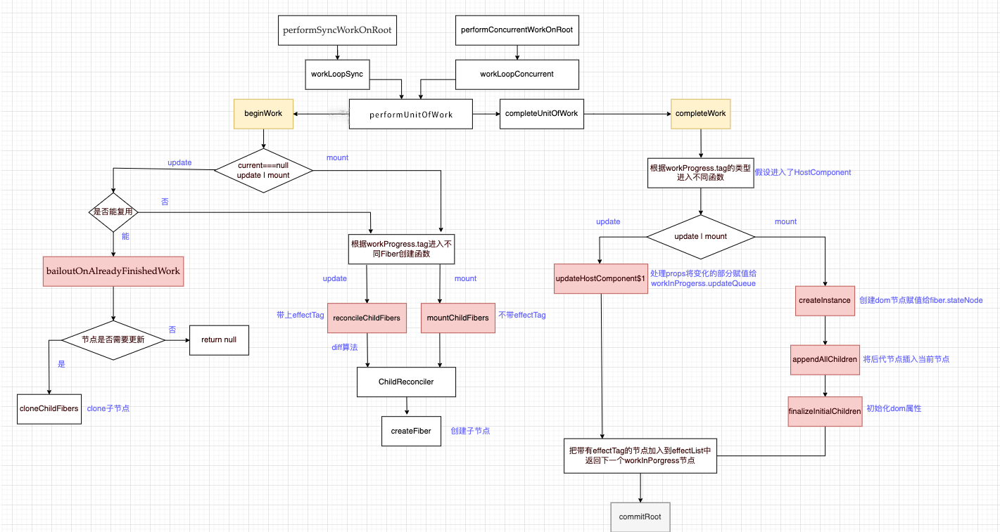
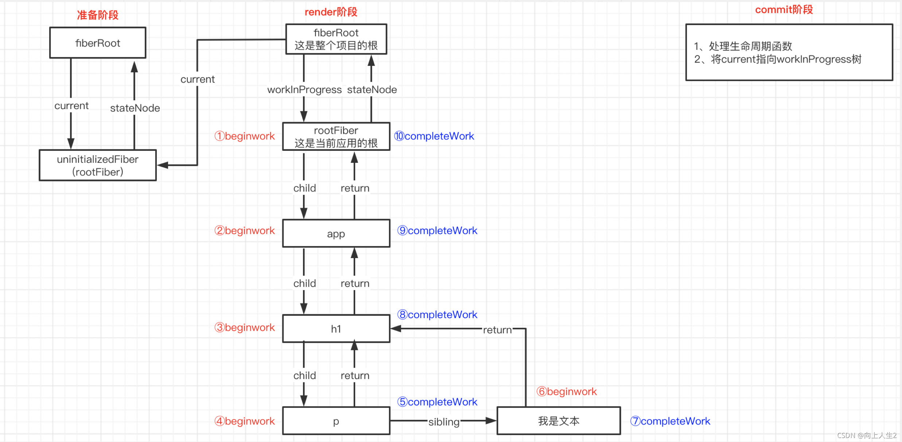

### render 的作用

render 阶段的主要工作是构建 `Fiber` 树和生成 `effectList`

react 入口的两种模式会进入`performSyncWorkOnRoot` 或者 `performConcurrentWorkOnRoot`，而这两个方法分别会调用 `workLoopSync` 或者 `workLoopConcurrent`

```javascript
// legacy
function workLoopSync() {
  while (workInProgress !== null) {
    performUnitOfWork(workInProgress);
  }
}
// concurrent
function workLoopConcurrent() {
  while (workInProgress !== null && !shouldYield()) {
    performUnitOfWork(workInProgress);
  }
}
```

`workLoopConcurrent` 函数的会根据 `workInProgress` 一直循环调用 performUnitOfWork -> 也就是 beginWork，直到 next 为 null 调用 completeUnitOfWork-> completeWork。

`shouldYield` 是判断该任务单元是否超出时间片的时间(5ms)，超出会终止 while 循环，把执行权还给浏览器。

```javascript
function performUnitOfWork(unitOfWork) {
  var next;
  if ((unitOfWork.mode & ProfileMode) !== NoMode) {
    startProfilerTimer(unitOfWork);
    next = beginWork$1(current, unitOfWork, subtreeRenderLanes);
    stopProfilerTimerIfRunningAndRecordDelta(unitOfWork, true);
  } else {
    next = beginWork$1(current, unitOfWork, subtreeRenderLanes);
  }
  resetCurrentFiber();
  unitOfWork.memoizedProps = unitOfWork.pendingProps;
  if (next === null) {
    completeUnitOfWork(unitOfWork);
  } else {
    workInProgress = next;
  }
}
```

### render 阶段函数调用流程



### 整体流程图



#### 捕获阶段

从根节点 rootFiber 开始，遍历到叶子节点，每次遍历到的节点都会执行 beginWork，并且传入当前 Fiber 节点，然后创建或复用它的子 Fiber 节点，并赋值给 workInProgress.child。

#### 冒泡阶段

在捕获阶段遍历到子节点之后，会执行 completeWork 方法，执行完成之后会判断此节点的兄弟节点存不存在，如果存在就会为兄弟节点执行 completeWork，当全部兄弟节点执行完之后，会向上‘冒泡’到父节点执行 completeWork，直到 rootFiber。

#### beginWork

beginWork 主要的工作是**创建或复用 fiber 节点**， 并赋值给 workInProgress.child。

```javascript
function beginWork(
  current: Fiber | null, //当前存在于dom树中对应的Fiber树
  workInProgress: Fiber, //正在构建的Fiber树
  renderLanes: Lanes // 渲染优先级
): Fiber | null {
  // 1.update时满足条件即可复用current fiber进入bailoutOnAlreadyFinishedWork函数
  if (current !== null) {
    const oldProps = current.memoizedProps;
    const newProps = workInProgress.pendingProps;
    if (
      oldProps !== newProps ||
      hasLegacyContextChanged() ||
      (__DEV__ ? workInProgress.type !== current.type : false)
    ) {
      didReceiveUpdate = true;
    } else if (!includesSomeLane(renderLanes, updateLanes)) {
      didReceiveUpdate = false;
      switch (
        workInProgress.tag
        // ...
      ) {
      }
      return bailoutOnAlreadyFinishedWork(current, workInProgress, renderLanes);
    } else {
      didReceiveUpdate = false;
    }
  } else {
    didReceiveUpdate = false;
  }

  //2.根据tag来创建不同的fiber 最后进入reconcileChildren函数
  switch (workInProgress.tag) {
    case IndeterminateComponent:
    // ...
    case LazyComponent:
    // ...
    case FunctionComponent:
    // ...
    case ClassComponent:
    // ...
    case HostRoot:
    // ...
    case HostComponent:
    // ...
    case HostText:
    // ...
  }
}
```

参数中有 current Fiber，也就是当前真实 dom 对应的 Fiber 树，在之前介绍 Fiber 双缓存机制中，我们知道在首次渲染时除了 rootFiber 外，current 等于 null，因为首次渲染 dom 还没构建出来，在 update 时 current 不等于 null，因为 update 时 dom 树已经存在了，所以 beginWork 函数中用 current === null 来判断是 mount 还是 update 进入不同的逻辑

- mount：根据 fiber.tag 进入不同 fiber 的创建函数，最后都会调用到 reconcileChildren 创建子 Fiber
- update：在构建 workInProgress 的时候，当满足条件时，会复用 current Fiber 来进行优化，也就是进入 bailoutOnAlreadyFinishedWork 的逻辑，能复用 didReceiveUpdate 变量是 false，复用的条件是:

  1. `oldProps === newProps && workInProgress.type === current.type` 属性和 fiber 的 type 不变
  2. `!includesSomeLane(renderLanes, updateLanes)` 更新的优先级是否足够

#### completeWork

completeWork 主要工作**是处理 fiber 的 props、创建 dom、创建 effectList**

```javascript
function completeWork(
  current: Fiber | null,
  workInProgress: Fiber,
  renderLanes: Lanes,
): Fiber | null {
  const newProps = workInProgress.pendingProps;

//根据workInProgress.tag进入不同逻辑，这里我们关注HostComponent，HostComponent，其他类型之后在讲
  switch (workInProgress.tag) {
    case IndeterminateComponent:
    case LazyComponent:
    case SimpleMemoComponent:
    case HostRoot:
   	//...

    case HostComponent: {
      popHostContext(workInProgress);
      const rootContainerInstance = getRootHostContainer();
      const type = workInProgress.type;

      if (current !== null && workInProgress.stateNode != null) {
        // update时
       updateHostComponent(
          current,
          workInProgress,
          type,
          newProps,
          rootContainerInstance,
        );
      } else {
        // mount时
        const currentHostContext = getHostContext();
        // 创建fiber对应的dom节点
        const instance = createInstance(
            type,
            newProps,
            rootContainerInstance,
            currentHostContext,
            workInProgress,
          );
        // 将后代dom节点插入刚创建的dom里
        appendAllChildren(instance, workInProgress, false, false);
        // dom节点赋值给fiber.stateNode
        workInProgress.stateNode = instance;

        // 处理props和updateHostComponent类似
        if (
          finalizeInitialChildren(
            instance,
            type,
            newProps,
            rootContainerInstance,
            currentHostContext,
          )
        ) {
          markUpdate(workInProgress);
        }
     }
      return null;
    }
```

completeWork 中可以看到，这个函数做了以下几件事：

1. 根据 workInProgress.tag 进入不同函数，我们以 HostComponent 举例
2. mount 时 调用 createInstance 创建 dom，将后代 dom 节点插入刚创建的 dom 中，调用 finalizeInitialChildren 处理 props（和 updateHostComponent 处理的逻辑类似）
3. update 时调用 updateHostComponent 处理 props（包括 onClick、style、children ...），并将处理好的 props 赋值给 updatePayload,最后会保存在 workInProgress.updateQueue 上。beginWork 在 mount 时，rootFiber 存在对应的 current，所以他会执行 mountChildFibers 打上 Placement 的 effectTag，在冒泡阶段执行 completeWork 时，我们将子孙节点通过 appendAllChildren 挂载到新创建的 dom 节点上，最后就可以一次性将内存中的节点用 dom 原生方法反应到真实 dom 中。

在 beginWork 中我们知道有的节点被打上了 effectTag 的标记，有的没有，而在 commit 阶段时要遍历所有包含 effectTag 的 Fiber 来执行对应的增删改，那我们还需要从 Fiber 树中找到这些带 effectTag 的节点嘛，答案是不需要的，这里是以空间换时间，在执行 completeWork 的时候遇到了带 effectTag 的节点，会将这个节点加入一个叫 effectList 中,所以在 commit 阶段只要遍历 effectList 就可以了（rootFiber.firstEffect.nextEffect 就可以访问带 effectTag 的 Fiber 了）
